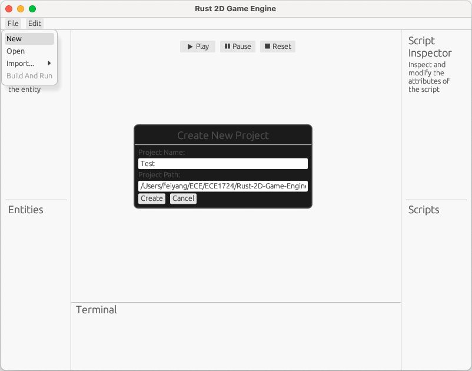
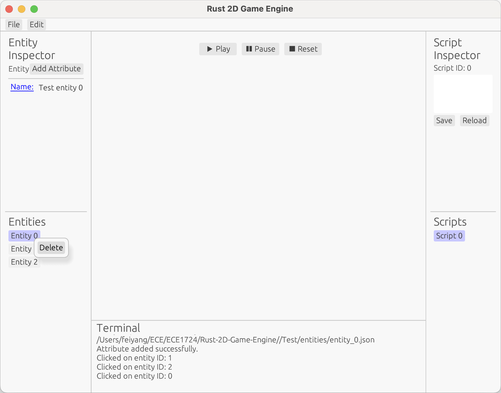
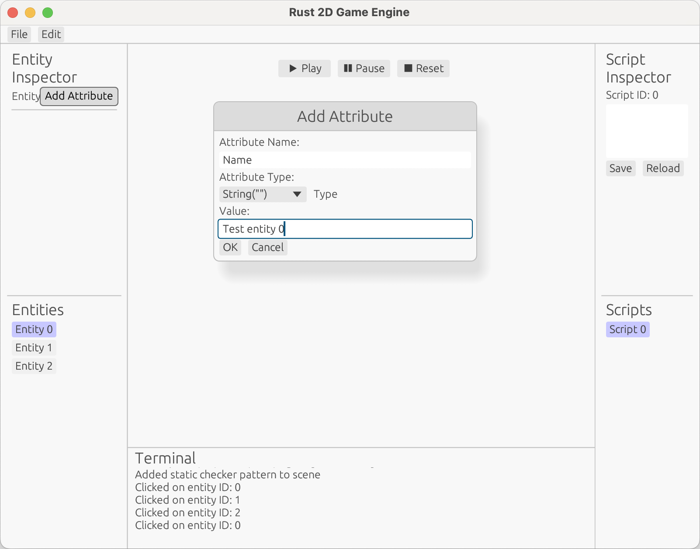
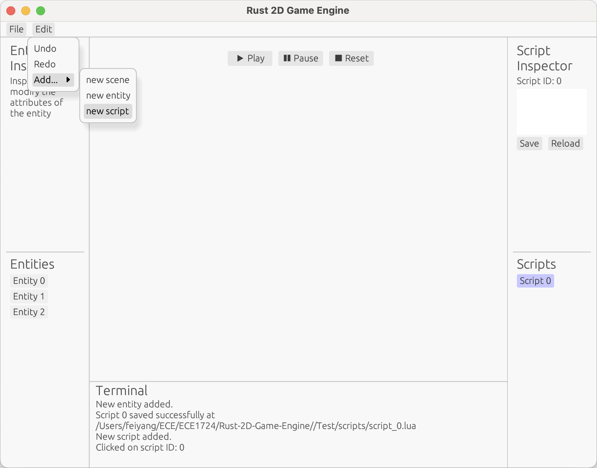
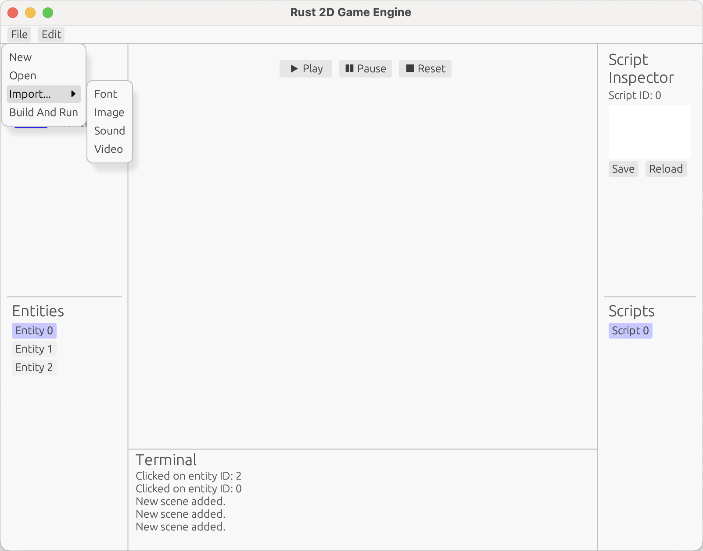

# Rust 2D Game Engine: Final Report

## Table of Contents
- [Rust 2D Game Engine: Final Report](#rust-2d-game-engine-final-report)
  - [Table of Contents](#table-of-contents)
  - [Team Members](#team-members)
  - [Motivation](#motivation)
  - [Objective](#objective)
      - [Simplicity and Usability](#simplicity-and-usability)
      - [Performance and Scalability](#performance-and-scalability)
      - [Modularity and Customization](#modularity-and-customization)
      - [Cross-Platform Compatibility](#cross-platform-compatibility)
      - [Developer Empowerment](#developer-empowerment)
  - [Features](#features)
      - [Rendering Engine](#rendering-engine)
      - [Physics Engine](#physics-engine)
      - [Entity Component System (ECS)](#entity-component-system-ecs)
      - [Script Interpreter](#script-interpreter)
      - [Audio Engine](#audio-engine)
      - [Input Handling](#input-handling)
      - [Game Project File Management](#game-project-file-management)
      - [Engine GUI](#engine-gui)
      - [Comprehensive Unit Testing](#comprehensive-unit-testing)
  - [User's Guide](#users-guide)
      - [Create new project](#create-new-project)
      - [Open project](#open-project)
      - [Create new entity](#create-new-entity)
      - [Delete entity](#delete-entity)
      - [Add attributes to entity](#add-attributes-to-entity)
      - [Create new script](#create-new-script)
      - [Delete new script](#delete-new-script)
      - [Import font, scene, audio, and video](#import-font-scene-audio-and-video)
      - [Build and Run your game](#build-and-run-your-game)
  - [Reproducibility Guide](#reproducibility-guide)
  - [Contributions](#contributions)
  - [Lessons Learned and Concluding Remarks](#lessons-learned-and-concluding-remarks)
      - [Lesson One: The Importance of Testing Suite](#lesson-one-the-importance-of-testing-suite)
      - [Lesson Two: Collaboration](#lesson-two-collaboration)
      - [Lesson Three: Modularity](#lesson-three-modularity)
      - [Concluding Remarks](#concluding-remarks)


## Team Members
> #TODO: write preferred emails

-   [Lang Sun - 1003584971 - ](https://github.com/gh0stintheshe11)
-   [Feiyang Fan - 1005146913 - feiyang.fan@mail.utoronto.ca](https://github.com/feiyangfan)
-   [Jie Peng(Frank) Chen - 997532861 - ](https://github.com/frankjc2022)

## Motivation

As a team of passionate gamers and designers, we understand the transformative power of a dedicated game engine. All three of the members in the team enjoy playing game and game design, which is our motivation to create a tool that strikes the perfect balance between simplicity and powerful features, empowering indie developers and small studios to bring their creative visions to life without being overwhelmed by unnecessary complexity.

Rust's strong performance and memory safety make it ideal for building high-efficiency applications like game engines. However, despite the growing ecosystem, the Rust community currently lacks a game engine explicitly tailored for 2D game development. While general-purpose engines like Bevy and Amethyst offer impressive functionality, their dual focus on 2D and 3D game development introduces a layer of complexity and overhead that can feel unnecessary and daunting for developers focused exclusively on 2D games.

Our project is an opportunity to address this gap while immersing ourselves in a deeply satisfying and enjoyable development process. Building a 2D game engine allows us to combine our passion for game design, Rust, and systems programming. The challenge of creating something lightweight yet robust, simple yet feature-rich, sparks our creativity and pushes our technical expertise. Knowing we might be enabling indie creators to focus on their visions without being bogged down by unnecessary complexity also brings us joy.

This engine is designed to be a "dummy-can-use" tool—intuitive enough for beginners to dive into game development while still providing advanced capabilities for experienced developers. By focusing solely on 2D, we eliminate the bloat and confusion that often come with multi-purpose engines, ensuring that every feature and optimization serves the unique needs of 2D game creators.

In essence, this project isn't just about building a game engine; it's about creating a space in the Rust ecosystem for indie developers and small studios to innovate, experiment, and succeed in the world of 2D game development.

## Objective

The primary objective of our Rust 2D Game Engine project is to create a lightweight, cross-platform engine that empowers developers to build 2D games with simplicity and efficiency. By focusing on modularity, performance, and an indie developer-friendly approach, the engine aims to provide an accessible and robust foundation for game development.

Our project emphasize:
#### Simplicity and Usability
Designing a user-friendly engine that lowers the barrier to entry for beginner game developers while supporting advanced use cases for experienced developers.

#### Performance and Scalability
Leveraging Rust's strengths in memory safety and high performance to ensure the engine is optimized for a wide range of 2D game projects, from small prototypes to larger, more complex games.

#### Modularity and Customization
Providing a flexible, modular architecture that allows developers to pick and integrate only the components they need, ensuring adaptability to different project requirements.

#### Cross-Platform Compatibility
Ensuring that games built with the engine can run seamlessly across multiple platforms, including desktop, web, and mobile environments.

#### Developer Empowerment
Streamlining the game development process by enabling rapid iteration and experimentation through intuitive tools, a Lua scripting system, and visual interfaces.

## Features

#### Rendering Engine

_A cutting-edge graphics subsystem powered by [wgpu](https://crates.io/crates/wgpu), delivering cross-platform, hardware-accelerated rendering capabilities._

-   Leverages a modern, abstracted graphics API supporting multiple backends (Vulkan, Metal, DirectX 12, WebGPU) for platform flexibility.

-   Implements a high-performance rendering pipeline optimized for 2D sprite rendering, with texture management and dynamic shader compilation.

#### Physics Engine

_A robust 2D physics simulation system built on the [rapier2d](https://crates.io/crates/rapier2d) library, delivering realistic and responsive environmental interactions._

-   Integrates advanced physics calculations with support for collision detection, response, and physical simulations.

-   Offers rigid body dynamics, including dynamic and static body creation with customizable physical properties like mass, friction, and restitution.

-   Supports diverse collider geometries (spherical, cuboid, capsule) to accommodate varied game design requirements, from simple arcade-style to more intricate physics scenarios.

#### Entity Component System (ECS)

_An innovative architectural pattern designed for maximum flexibility, performance, and scalability in game entity management._

-   Implements a data-oriented design that separates game logic from data, enabling rapid feature development and minimal computational overhead.

-   Provides memory-efficient entity creation and management, capable of handling thousands of game objects with minimal performance degradation.

-   Offers seamless component composition, allowing developers to construct complex game behaviors through modular, reusable components.

#### Script Interpreter

_A powerful scripting integration layer enabling dynamic game logic extension and runtime behavior modification._

-   Seamlessly embeds Lua scripting via the [rlua](https://crates.io/crates/rlua) crate, allowing developers to write game logic, event handlers, and complex behaviors without recompiling the core engine.

-   Provides robust bidirectional data exchange between Rust and Lua, with error handling and safe memory management.

-   Supports hot-reloading of scripts, enabling rapid iteration and live modifications during game development.

#### Audio Engine

_A low-latency, high-fidelity audio processing system designed for immersive soundscapes and precise audio control._

-   Utilizes the [rodio](https://crates.io/crates/rodio) crate to deliver efficient audio stream management across multiple formats and playback scenarios.

-   Supports complex audio features like spatial sound, volume attenuation, and seamless music and sound effect transitions.

-   Ensures minimal audio latency, critical for maintaining synchronization with game events and player interactions.

#### Input Handling

_A responsive, platform-agnostic input management system that ensures smooth and intuitive player interactions._

-   Built with the [winit](https://crates.io/crates/winit) crate to provide device support, handling inputs from keyboards, mice, touchscreens, and game controllers.

-   Implements advanced input mapping and processing with low latency, supporting complex input combinations and gestures.

-   Offers configurable input schemes and easy integration with the ECS for flexible control mechanisms.

#### Game Project File Management

_An asset and project management system designed for streamlined game development workflows._

-   Provides robust file handling capabilities for game assets, configuration files, and persistent game states.

-   Supports project lifecycle management: creation, loading, saving, and cross-platform project building.

-   Implements intelligent asset tracking and dependency resolution to simplify project maintenance.

#### Engine GUI

_An intuitive, real-time development interface powered by [egui](https://crates.io/crates/egui), transforming game development into a more interactive and efficient process._

-   Offers a context-aware inspector for real-time modification of game components, entities, and system parameters.

-   Enables live debugging, performance profiling, and immediate visual feedback without interrupting the development workflow.

-   Provides customizable views and layouts, allowing developers to tailor the interface to their specific project needs and preferences.

#### Comprehensive Unit Testing

_A rigorous testing framework ensuring the reliability, performance, and correctness of each engine component._

-   Implements an extensive test suite covering critical aspects of the game engine, with dedicated test modules for each major subsystem.

-   The rendering engine tests ([`render_engine_test.rs`](tests/render_engine_test.rs)) provide comprehensive validation, including:
    -   Renderer initialization and device request
    -   Texture and sprite creation
    -   Shader compilation
    -   Error handling
    -   Performance under high rendering loads

-   Leverages Rust's built-in testing framework to provide automated, repeatable tests that can be run during continuous integration.

-   Covers edge cases and potential failure modes to ensure robust and predictable engine behavior across different hardware and configurations.

## User's Guide

In Rust, to integrate our Rendering Engine in your game:

```rust
use rust_2d_game_engine::render_engine::{RenderEngine, Sprite};

// Create renderer
let mut renderer = RenderEngine::new();

// Create sprites
let sprites = vec![
    Sprite {
        position: (100.0, 100.0),
        size: (50.0, 50.0),
        rotation: 0.0,
        texture_coords: (0.0, 0.0, 1.0, 1.0),
    },
    // Add more sprites as needed
];

// In the game loop
renderer.render_frame(&sprites).expect("Failed to render frame");
```

#### Create new project

To create a new project, click on `File`->`New`->enter your project name and path you wish to save it in->press `Create`.


#### Open project
To open a project, click on `File`->`Open`->enter your project path.

#### Create new entity
`Edit`->`Add...`->`New entity`


#### Delete entity
Right click on the entity you wish to delete, then click on `Delete`.


#### Add attributes to entity
Select an entity, then click on `Add attribute` at the top left panel.
Enter attribute name, select attribute types, and enter attribute value. Click on `Save`


#### Create new script
`Edit`->`Add...`->`New script`. Select the script you just created at the bottom right panel. Then at the top right panel, input your Lua script.


#### Delete new script
Similar to delete an entity, right click the script you wish to delete and click on `Delete`

#### Import font, scene, audio, and video
`File`->`Import...`


#### Build and Run your game
`File`->`Build and Run`

## Reproducibility Guide

> Reproducibility Guide: What are the commands needed to set up the runtime environment, if any, and to build the project, so that its features can be used by a user or a developer? Note: The instructor will follow the steps you have included in this section, step-by-step, with no deviation. The instructor has access to a Ubuntu Linux server and a macOS Sonoma laptop computer.

Run `cargo run` in the terminal at the root directory of our project if you wish to use the debug version. Otherwise, run `cargo build --release` and execute the generated `target/release/rust-2d-game-engine` executable.

## Contributions

**Lang Sun**:

-   [Rendering Engine](#rendering-engine)
-   [Physics Engine](#physics-engine)
-   [Input Handling](#input-handling)

**Feiyang Fan**:

-   [Entity Component System (ECS)](#ecs)
-   [Audio Engine](#audio-engine)

**Frank Chen**:

-   [Script Interpreter](#script-interpreter)
-   [Game Project File Management](#game-project-file-management)
-   [Engine GUI](#engine-gui)

## Lessons Learned and Concluding Remarks

#### Lesson One: The Importance of Testing Suite
- Our extensive unit testing framework revealed critical insights into engine reliability and performance.
- We learned that thorough testing across different scenarios is crucial for creating a robust game development tool.
- The test suite not only caught potential issues but also served as a living documentation of the engine's capabilities.

#### Lesson Two: Collaboration
- The project was as much about technical development as it was about team collaboration and shared passion.
- We discovered the power of combining individual skills towards a common, innovative goal.
- The journey of creating the engine was as valuable as the end product itself.

#### Lesson Three: Modularity
- Our modular approach to the engine's architecture proved critical in maintaining flexibility and extensibility.
- We learned that well-designed, loosely coupled components allow for easier maintenance, testing, and future enhancements.

#### Concluding Remarks

Our Rust 2D Game Engine represents a promising first step into the world of specialized game development tools in Rust. While currently in its early prototype stage, the project has already demonstrated some good potential in addressing the unique needs of 2D game developers within the Rust ecosystem.

We have successfully laid a robust foundation, implementing core systems like the rendering engine, physics simulation, entity component system, and scripting support. The modular architecture and focus on performance and usability set the groundwork for a tool that could genuinely empower indie developers and small studios.

However, we recognize that this is just the beginning of our journey. The current iteration, while functional, is a proof of concept that requires continued refinement, expansion, and community feedback. Our roadmap includes:

- Expanding the feature set to support more complex game development scenarios
- Further implement the `Undo` and `Redo` functionality with state management
- Improving documentation and developer tools
- Increasing cross-platform compatibility
- Continuously optimizing performance and reliability

We are excited about the potential of this project and view it as an evolving platform. Our passion for game development, Rust, and creating accessible tools drives us to continue improving and expanding the engine.

