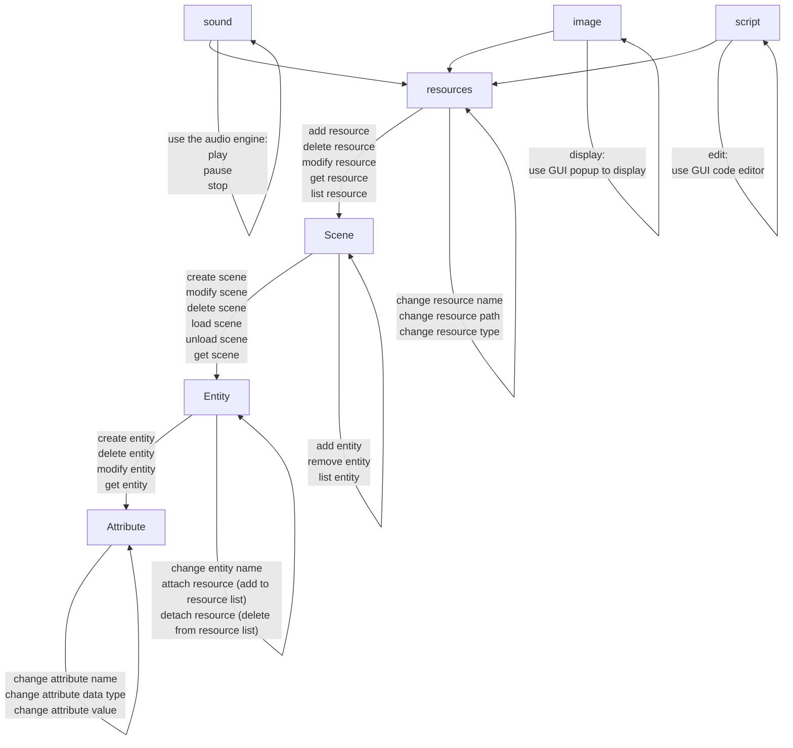

# Rust 2D Game Engine

## Table of Contents

- [Entity Component System](#ecs-entity-component-system)
- [Render Engine](#render-engine)
- [Physics Engine](#physics-engine)
- [Input Handler](#input-handling)
- [Audio Engine](#audio-engine)
- [Script Interpreter](#script_interpreter)
- [Game Project File Management](#file_system)
- [Engine GUI](#gui)

## [Render Engine](/src/render_engine.rs)

The Rendering Engine is a crucial component of our 2D game engine, responsible for handling all graphical output. It utilizes [`wgpu`](https://github.com/gfx-rs/wgpu), a cross-platform, safe, and modern graphics API, to provide efficient and flexible rendering capabilities.

### Features

- Hardware-accelerated rendering using `wgpu`
- Support for multiple graphics backends (Vulkan, Metal, DX12, WebGPU)
- 2D sprite rendering
- Texture creation and management
- Shader compilation and usage
- High-performance rendering pipeline

### Implementation Details

The `RenderEngine` struct encapsulates the core rendering functionality:

- `texture_view`: A view into the render texture
- `device`: The logical graphics and compute device
- `queue`: The command queue for the device
- `pipeline`: The render pipeline for 2D sprites
- `vertex_buffer`: Buffer for sprite vertices
- `index_buffer`: Buffer for sprite indices

Key methods include:

- `new()`: Initializes the rendering engine, setting up the device, queue, and render pipeline
- `render_frame(&mut self, sprites: &[Sprite])`: Renders a frame with the given sprites

The engine uses `wgpu` to:
- Create an instance with support for all available backends
- Request a high-performance adapter
- Set up a device and command queue
- Create buffers and pipeline for sprite rendering
- Manage shader compilation and execution

### Unit Tests

The unit test suite in [`render_engine_test.rs`](tests/render_engine_test.rs) verifies various aspects of the rendering engine:

1. **Initialization** - `test_renderer_initialization`:
   - Ensures the renderer can be created without errors

2. **Texture Creation** - `test_texture_creation`:
   - Verifies correct texture dimensions

3. **Render Frame Execution** - `test_render_frame_executes`:
   - Checks that the `render_frame` method runs without errors with sprites

4. **Instance Initialization** - `test_instance_initialization`:
   - Tests the creation of a `wgpu` instance

5. **Device Request** - `test_request_device`:
   - Verifies the ability to request a graphics device

6. **Error Handling** - `test_error_handling_in_renderer`:
   - Ensures the renderer handles errors gracefully

7. **Shader Compilation** - `test_shader_compilation`:
   - Tests the ability to compile WGSL shaders

8. **High Load Rendering** - `test_high_load_rendering`:
   - Stress tests the renderer with multiple render calls

9. **Sprite Creation** - `test_sprite_creation`:
   - Verifies sprite creation and properties

10. **Multiple Sprites** - `test_multiple_sprites_rendering`:
    - Tests rendering multiple sprites in a single frame

### Usage

To use the Rendering Engine in your game:

```rust
use rust_2d_game_engine::render_engine::{RenderEngine, Sprite};

// Create renderer
let mut renderer = RenderEngine::new();

// Create sprites
let sprites = vec![
    Sprite {
        position: (100.0, 100.0),
        size: (50.0, 50.0),
        rotation: 0.0,
        texture_coords: (0.0, 0.0, 1.0, 1.0),
    },
    // Add more sprites as needed
];

// In the game loop
renderer.render_frame(&sprites).expect("Failed to render frame");
```

### Development Roadmap

#### ✅ Phase 0: Core Rendering Foundation (Completed)
- [x] Basic WGPU setup
  - Instance and device initialization
  - Pipeline creation
  - Basic shader implementation
- [x] Basic sprite rendering
  - Vertex and index buffer management
  - Basic sprite structure (position, size, rotation)
  - Simple white rectangle rendering

#### Phase 1: Core Rendering Enhancements
- [ ] Add texture loading and management
  - Load image files (PNG, JPEG)
  - Texture atlas support
  - Resource management system
- [ ] Implement basic camera system
  - 2D viewport management
  - Basic transformations (pan, zoom)
  - Screen-to-world coordinate conversion

#### Phase 2: Animation and Visual Effects
- [ ] Implement sprite sheets and animations
  - Frame-based animation system
  - Animation state management
  - Support for multiple animation sequences
- [ ] Add sprite batching for performance
  - Batch similar sprites together
  - Reduce draw calls
  - GPU memory optimization

#### Phase 3: Advanced Features
- [ ] Implement z-ordering/layers
  - Multiple render layers
  - Depth management
  - Layer-based rendering
- [ ] Add text rendering
  - Font loading and management
  - Unicode support
  - Text styling options

#### Phase 4: Polish and Effects
- [ ] Add particle system
  - Particle emitters
  - Particle life cycle management
  - Particle rendering optimizations
- [ ] Advanced camera features
  - Camera shake
  - Smooth following
  - Screen effects (fade, flash)

> [!IMPORTANT]
> While the basic sprite rendering is implemented, features like textures, batching, and advanced transformations are still to be added.

## [Physics Engine](/src/physics_engine.rs)

The Physics Engine is a core component of our 2D game engine, providing realistic physical simulations for game objects. It utilizes the [rapier2d](https://github.com/dimforge/rapier), a powerful 2D physics engine for Rust, to handle complex physics calculations and interactions.

### Features

- Gravity simulation
- Dynamic and static rigid body creation
- Collision detection and handling
- Custom physical properties for objects (mass, friction, restitution)
- Support for various collider shapes (ball, cuboid, capsule)

### Implementation Details

The `PhysicsEngine` struct encapsulates all necessary components for physics simulation:

- `PhysicsPipeline`: Manages the overall physics simulation process
- `RigidBodySet` and `ColliderSet`: Store rigid bodies and their colliders
- `IslandManager`, `BroadPhase`, and `NarrowPhase`: Handle collision detection
- `ImpulseJointSet` and `MultibodyJointSet`: Manage object constraints
- `CCDSolver`: Handles continuous collision detection
- `QueryPipeline`: Allows for spatial queries

Key methods include:

- `new()`: Initializes the physics engine with default settings
- `step()`: Advances the physics simulation by one time step
- `add_rigid_body()`: Adds a new rigid body to the simulation
- `handle_collisions()`: Detects and processes collisions between objects

### Unit Tests

The test suite in [`physics_engine_test.rs`](tests/physics_engine_test.rs) verifies various aspects of the physics simulation:

1. **Initialization** - `test_initialization`:
   - Checks correct gravity setting and empty initial state

2. **Rigid Body Addition**:
   - `test_add_dynamic_rigid_body_with_collider`: Verifies dynamic body creation
   - `test_add_static_rigid_body_with_collider`: Checks static body creation
   - `test_add_invalid_rigid_body`: Ensures invalid bodies are not added

3. **Gravity Simulation** - `test_simulation_under_gravity`:
   - Confirms objects fall under gravity

4. **Collision Detection** - `test_collision_detection`:
   - Verifies collisions between dynamic and static bodies

5. **Multiple Body Simulation** - `test_multiple_bodies_falling`:
   - Tests behavior of multiple dynamic bodies

6. **Collider Shapes** - `test_different_collider_shapes`:
   - Checks various collider shapes (ball, cuboid, capsule)

7. **Custom Properties** - `test_rigid_body_with_custom_properties`:
   - Tests bodies with custom mass and restitution

8. **Collision Events** - `test_collision_events`:
   - Ensures collision events are properly detected and reported

### Usage

To use the Physics Engine:

1. Create an instance of `PhysicsEngine` using `PhysicsEngine::new()`.
2. Add rigid bodies to the simulation with `add_rigid_body()`.
3. Call `step()` in your game loop to advance the physics simulation.
4. Use `handle_collisions()` to detect and respond to collisions.

Example:
```rust
use rust_2d_game_engine::physics_engine::PhysicsEngine;

let mut physics_engine = PhysicsEngine::new();

// Add a dynamic body
physics_engine.add_rigid_body([0.0, 5.0], true);

// In the game loop
physics_engine.step();
physics_engine.handle_collisions();
```

> [!WARNING]
> Need to handle potential errors, as adding bodies or stepping the simulation may fail in certain conditions.

## [ECS Entity Component System](/src/ecs.rs)

ECS system diagram:



## [Script Interpreter](/src/script_interpreter.rs)

The Script Interpreter is a crucial component of our 2D game engine, enabling the integration of `lua` scripting capabilities, which is a simple and popular choice in the game industry. It utilizes [rlua](https://github.com/Kampfkarren/rlua), a high-level Lua binding for Rust, to provide a seamless interface between Rust and Lua.

### Features

- Run Lua scripts within the Rust environment
- Pass data between Rust and Lua
- Execute complex Lua scripts for game logic
- Handle Lua errors gracefully

### Implementation Details

The core of the script interpreter is the [`run_lua_script`](/src/script_interpreter.rs#L4) function in [`script_interpreter.rs`](/src/script_interpreter.rs), which initializes a new Lua context and executes the provided Lua script.

### Unit Tests

The test suite in [`script_interpreter_test.rs`](tests/script_interpreter_test.rs) verifies various aspects of the Lua integration:

1. **Simple Script Execution** - `test_run_simple_script` :

   - Runs a basic Lua script that performs addition, ensuring basic Lua scripts can be executed without errors.

2. **Error Handling** - `test_run_script_with_error`:

   - Verifies that Lua handles undefined variables correctly by treating them as `nil`.

3. **Math Operations** - `test_lua_math_operations`:

   - Verifies complex mathematical operations can be performed accurately in Lua.

4. **Data Passing (Rust to Lua)** - `test_pass_data_to_lua`:

   - Demonstrates passing data from Rust to Lua.

5. **Data Returning (Lua to Rust)** - `test_return_data_from_lua`:

   - Shows how to call Lua functions from Rust and retrieve results.

6. **Complex Script Execution** - `test_complex_script`:

   - Tests a more complex script involving object manipulation and function definitions.

7. **Error Handling in Lua** - `test_handle_error_in_lua_script`:

   - Verifies Lua's behavior with potential runtime errors, such as division by zero.

### Usage

To use the Script Interpreter for game logic:

- Use `run_lua_script(script)` to execute Lua code.
- For more complex interactions, use the `rlua::Lua` context directly to set globals, call functions, or retrieve values.

Example:

```rust
use rust_2d_game_engine::script_interpreter;

let script = r#"
    function greet(name)
        return "Hello, " .. name .. "!"
    end
"#;

script_interpreter::run_lua_script(script).expect("Failed to run script");
```

Further interaction with the script can be done using `rlua` directly.

## [Audio Engine](/src/audio_engine.rs)

The Audio Engine is a crucial component of our 2D game engine, responsible for handling sound playback. It utilizes [rodio](https://github.com/RustAudio/rodio), a pure Rust audio playback library, to manage audio streams and control sound output.

### Features

- Simple audio playback from file
- Pause and resume functionality
- Ability to check if audio is currently playing

### Implementation Details

The `AudioEngine` struct is the core of our audio system. It contains:

- An `OutputStream` for audio output
- An `OutputStreamHandle` for creating new sounds
- A `Sink` for controlling audio playback

Key methods include:

- `new()`: Initializes the audio engine with default output stream and sink.
- `play_sound(file_path: &str)`: Loads and plays an audio file from the given path.
- `is_playing()`: Checks if audio is currently playing.
- `pause()`: Pauses the current audio playback.
- `resume()`: Resumes paused audio playback.

The engine uses `BufReader` and `Decoder` from the `rodio` crate to efficiently read and decode audio files.

### Error Handling

The `play_sound` method returns a `Result`, allowing for graceful error handling if the file is not found or cannot be decoded.

### Unit Tests

The unit tests ([`audio_engine_test.rs`](tests/audio_engine_test.rs)) thoroughly verify the functionality of the `AudioEngine`:

1. **Initialization Test**:

   - Ensures the audio engine initializes correctly with an empty sink.

2. **Play Sound Test**:

   - Verifies that a sound file can be successfully loaded and played.
   - Checks that the engine correctly reports when audio is playing.
   - Confirms that the audio stops playing when explicitly stopped.

3. **Is Playing Test**:
   - Checks the initial state (not playing).
   - Verifies correct state after playing a sound.
   - Tests pause functionality and ensures the engine reports correct state.
   - Checks resume functionality.
   - Verifies correct state after stopping the audio.

These tests use a constant `TEST_AUDIO_FILE` path, which should point to a valid audio file in the test environment.

### Usage

To use the `AudioEngine` for game audio:

1. Create an instance of `AudioEngine` using `AudioEngine::new()`.
2. Use `play_sound(file_path)` to play audio files.
3. Control playback with `pause()` and `resume()`.
4. Check playback status with `is_playing()`.

## [Input Handling](/src/input_handler.rs)

Using [winit](https://github.com/rust-windowing/winit) for the game input handling.

- [x] initial implementation

> [!NOTE]
> Will add more script languages in the future if have time, such as C# and python.

## [Game Project File Management](/src/project_manager.rs)

A game engine should be able to display and manage the game project files.

- [x] create a new project
- [x] open a project
- [ ] save a project
- [ ] build a project

> [!NOTE]
> Not sure if project files need to be saved manually for now, since the project is directly modified in the engine.

## [Engine GUI](/src/engine_gui.rs)

Using [egui](https://github.com/emilk/egui) for the engine GUI.

- [x] initial implementation

