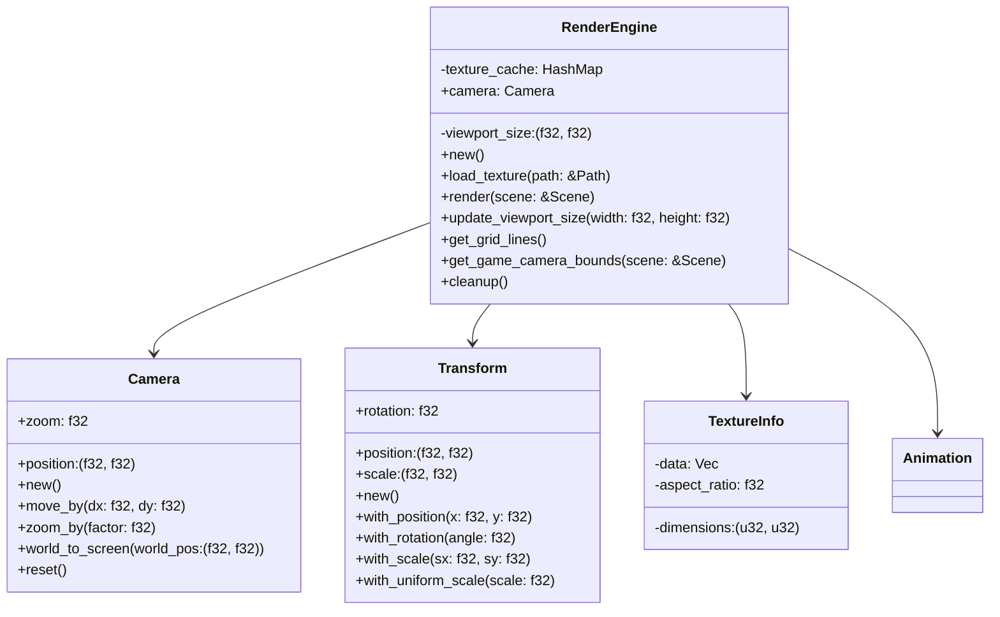
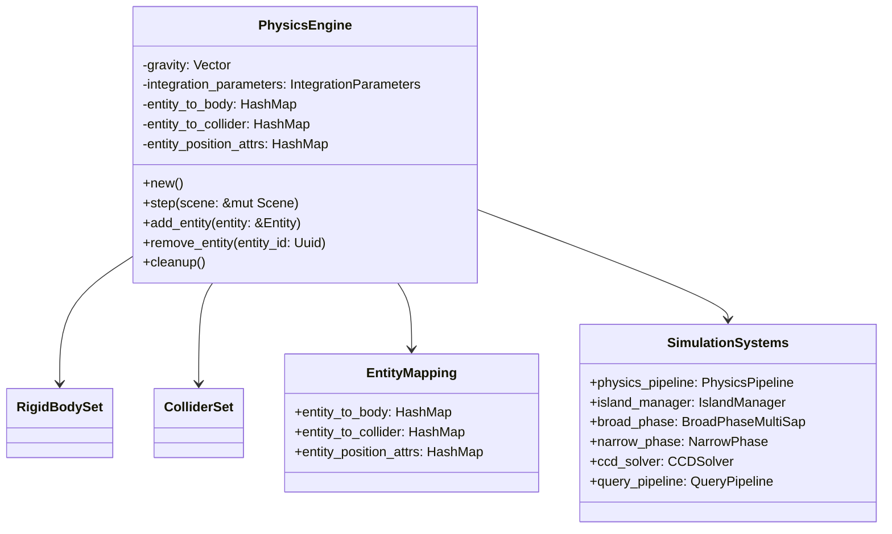
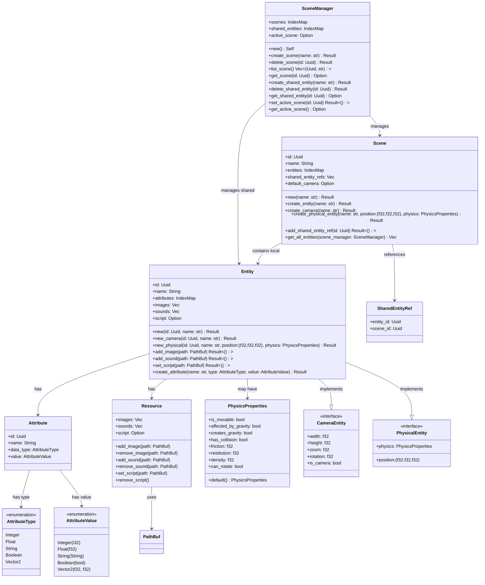
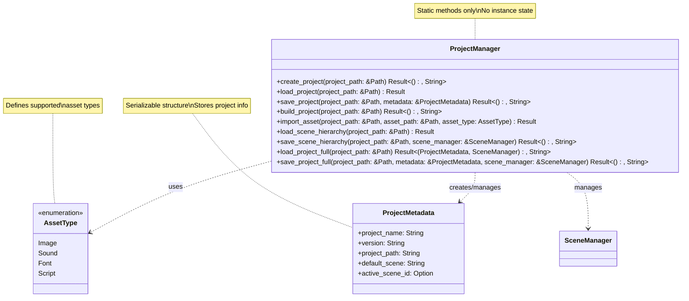

# Rust 2D Game Engine

## Team Members

- [Lang Sun - 1003584971 - lang.sun@mail.utoronto.ca](https://github.com/gh0stintheshe11)
- [Feiyang Fan - 1005146913 - feiyang.fan@mail.utoronto.ca](https://github.com/feiyangfan)
- [Jie Peng(Frank) Chen - 997532861 - jp.chen@mail.utoronto.ca](https://github.com/frankjc2022)

## Motivation

As a team of passionate gamers and designers, we understand the transformative power of a dedicated game engine. All three of the members in the team enjoy playing game and game design, which is our motivation to create a tool that strikes the perfect balance between simplicity and powerful features, empowering indie developers and small studios to bring their creative visions to life without being overwhelmed by unnecessary complexity.

Rust's strong performance and memory safety make it ideal for building high-efficiency applications like game engines. However, despite the growing ecosystem, the Rust community currently lacks a game engine explicitly tailored for 2D game development. While general-purpose engines like Bevy and Amethyst offer impressive functionality, their dual focus on 2D and 3D game development introduces a layer of complexity and overhead that can feel unnecessary and daunting for developers focused exclusively on 2D games.

Our project is an opportunity to address this gap while immersing ourselves in a deeply satisfying and enjoyable development process. Building a 2D game engine allows us to combine our passion for game design, Rust, and systems programming. The challenge of creating something lightweight yet robust, simple yet feature-rich, sparks our creativity and pushes our technical expertise. Knowing we might be enabling indie creators to focus on their visions without being bogged down by unnecessary complexity also brings us joy.

This engine is designed to be a "dummy-can-use" tool—intuitive enough for beginners to dive into game development while still providing advanced capabilities for experienced developers. By focusing solely on 2D, we eliminate the bloat and confusion that often come with multi-purpose engines, ensuring that every feature and optimization serves the unique needs of 2D game creators.

## Objective

The primary objective of our Rust 2D Game Engine project is to create a lightweight, cross-platform engine that empowers developers to build 2D games with simplicity and efficiency. By focusing on modularity, performance, and an indie developer-friendly approach, the engine aims to provide an accessible and robust foundation for game development.

Our project emphasize:

- Designing a user-friendly engine that lowers the barrier to entry for beginner game developers while supporting advanced use cases for experienced developers.

- Leveraging Rust's strengths in memory safety and high performance to ensure the engine is optimized for a wide range of 2D game projects, from small prototypes to larger, more complex games.

- Providing a flexible, modular architecture that allows developers to pick and integrate only the components they need, ensuring adaptability to different project requirements.

- Ensuring that games built with the engine can run seamlessly across multiple platforms, including desktop, web, and mobile environments.

- Streamlining the game development process by enabling rapid iteration and experimentation through intuitive tools, a Lua scripting system, and visual interfaces.

## Features

### [Rendering Engine](/src/render_engine.rs)

_The Rendering Engine is a sophisticated component responsible for all graphical output in our 2D game engine. It provides efficient texture management, camera controls, and advanced rendering features with robust memory management._

#### Core Components Overview



#### Key Features

##### 1. Advanced Camera System
```rust
let mut camera = Camera::new();

// Pan camera
camera.move_by(10.0, 5.0);

// Zoom with clamping (0.1x to 10.0x)
camera.zoom_by(2.0);

// Convert world coordinates to screen space
let screen_pos = camera.world_to_screen((15.0, 10.0));

// Reset camera to default state
camera.reset();
```

##### 2. Efficient Texture Management
```rust
// Load and cache texture with UUID based on path
let texture_id = render_engine.load_texture(Path::new("sprites/player.png"))?;

// Access texture information
if let Some(texture_info) = render_engine.get_texture_info(&texture_id) {
    let dimensions = texture_info.dimensions;
    let aspect_ratio = texture_info.aspect_ratio;
}

// Memory management
render_engine.cleanup_direct_textures();  // Clear all textures
render_engine.unload_texture(path);       // Remove specific texture
let memory_usage = render_engine.get_memory_usage();  // Monitor memory usage
```

##### 3. Transform System
```rust
let transform = Transform::new()
    .with_position(10.0, 20.0)
    .with_rotation(1.5)
    .with_scale(2.0, 3.0);

// Uniform scaling
let uniform_transform = Transform::new()
    .with_uniform_scale(2.0);
```

##### 4. Scene Rendering
```rust
// Update viewport size
render_engine.update_viewport_size(800.0, 600.0);

// Render scene with z-ordering
let render_queue = render_engine.render(&scene);

// Generate editor grid
let grid_lines = render_engine.get_grid_lines();

// Get game camera bounds
let camera_bounds = render_engine.get_game_camera_bounds(&scene);
```

#### Technical Details

##### 1. Texture Caching
- Uses SHA-256 hashing for deterministic UUID generation from file paths
- Implements efficient texture info caching with dimensions and aspect ratio
- Provides memory usage monitoring and cleanup utilities

##### 2. Viewport Management
- Supports dynamic viewport resizing
- Implements efficient culling for off-screen objects
- Maintains aspect ratio consistency across different screen sizes

##### 3. Camera Controls
- Smooth camera movement and zoom controls
- World-to-screen coordinate conversion
- Camera bounds visualization for editor mode

##### 4. Grid System
- Dynamic grid generation based on viewport size
- Automatic grid scaling with camera zoom
- Optional grid overlay for editor mode

#### Unit Testing

The rendering engine includes comprehensive unit tests covering:

1. Camera Operations
- Initial state verification
- Movement and zoom functionality
- Coordinate conversion accuracy
- Reset functionality

2. Render Engine Core
- Initialization checks
- Viewport management
- Transform operations
- Texture cache operations

3. Grid and Bounds
- Grid line generation
- Camera bounds calculation
- Viewport calculations

4. Memory Management
- Texture cache operations
- Memory usage tracking
- Cleanup procedures

```rust
#[test]
fn test_camera_operations() {
    let mut camera = Camera::new();
    
    camera.move_by(10.0, 5.0);
    assert_eq!(camera.position, (10.0, 5.0));
    
    camera.zoom_by(2.0);
    assert_eq!(camera.zoom, 2.0);
    
    let screen_pos = camera.world_to_screen((15.0, 10.0));
    assert_eq!(screen_pos, ((15.0 - 10.0) * 2.0, (10.0 - 5.0) * 2.0));
}
```

### [Physics Engine](/src/physics_engine.rs)

_A sophisticated 2D physics simulation system built on the [rapier2d](https://crates.io/crates/rapier2d) library, providing realistic physics interactions with advanced features like custom gravity fields and automatic collision shape detection._

#### Core Components



#### Key Features

##### 1. Intelligent Collider Generation
```rust
fn create_collider(&self, entity: &Entity, density: f32, friction: f32, restitution: f32) -> Collider {
    // Automatically determines collider shape based on sprite dimensions
    if let Ok(image_path) = entity.get_image(0) {
        if let Ok(img) = image::open(image_path) {
            let (width, height) = img.dimensions();
            
            // Use circle for square-ish sprites
            if (width as f32 / height as f32).abs() > 0.9 
               && (width as f32 / height as f32).abs() < 1.1 {
                ColliderBuilder::ball(width as f32 / 2.0)
            } else {
                // Use box for rectangular sprites
                ColliderBuilder::cuboid(width as f32 / 2.0, height as f32 / 2.0)
            }
        }
    }
}
```

##### 2. Custom Gravity Fields
```rust
// Process custom gravity fields in step()
for (_, entity1) in &scene.entities {
    if let AttributeValue::Boolean(true) = creates_gravity.value {
        // Calculate and apply gravitational forces to other entities
        let force = direction * (1.0 / (distance * distance));
        rb.add_force(force * 10.0, true);
    }
}
```

##### 3. Advanced Physics Controls
```rust
// Velocity control
physics_engine.set_velocity(&entity_id, vector![10.0, 0.0]);

// Force application
physics_engine.apply_force(&entity_id, vector![0.0, -9.81]);

// Impulse application
physics_engine.apply_impulse(&entity_id, vector![5.0, 0.0]);

// Angular motion
physics_engine.set_angular_velocity(&entity_id, 1.5);
physics_engine.apply_torque(&entity_id, 0.5);
```

#### Technical Details

##### 1. Entity Physics Properties
- Dynamic/static body type
- Gravity influence
- Collision detection
- Friction and restitution
- Density
- Rotation locking
- Custom gravity field generation

##### 2. Collision System
- Broad phase using spatial partitioning
- Narrow phase for precise collision detection
- Continuous collision detection for fast objects
- Collision event reporting
- Multiple collision shape support

##### 3. Performance Optimizations
- Efficient entity-to-physics mappings
- Cached position attribute IDs
- Optimized collision detection pipeline
- Memory-efficient cleanup system

#### Unit Testing

The comprehensive test suite verifies:

1. **Basic Functionality**
```rust
#[test]
fn test_initialization() {
    let physics_engine = PhysicsEngine::new();
    assert_eq!(physics_engine.get_time_step(), 1.0 / 60.0);
    assert!(physics_engine.is_empty());
}
```

2. **Entity Physics**
```rust
#[test]
fn test_physical_entity_creation() {
    let mut scene = Scene::new("test_scene").unwrap();
    let mut physics_engine = PhysicsEngine::new();

    let physics_props = PhysicsProperties {
        is_movable: true,
        affected_by_gravity: true,
        has_collision: true,
        ..Default::default()
    };

    let entity_id = scene.create_physical_entity(
        "test_entity",
        (0.0, 10.0, 0.0),
        physics_props
    ).unwrap();

    physics_engine.add_entity(scene.get_entity(entity_id).unwrap());
    assert!(physics_engine.has_rigid_body(&entity_id));
}
```

3. **Gravity and Collisions**
```rust
#[test]
fn test_gravity_simulation() {
    // ... test code ...
    assert!(
        final_y < initial_y - 1.0,
        "Entity should have fallen due to gravity"
    );
}

#[test]
fn test_collision_detection() {
    // ... test code ...
    assert!(collision_detected, "Collision should have been detected");
}
```

#### Usage Examples

See [Physics Engine Usage](#physics-engine-usage) in [Users Guide](#users-guide) for detailed implementation examples and best practices.


I'll help update the ECS section of the README with the latest code changes. Here's the revised version that reflects the current implementation:

### [Entity Component System (ECS)](/src/ecs.rs)

_The Entity Component System (ECS) is the core architecture of our game engine, implementing a sophisticated hierarchical design with scene management, entity handling, and component organization. It uses IndexMap for deterministic ordering and includes advanced features for camera and physics entities._

#### System Architecture



#### Core Features

##### 1. **Scene Management**
   - Hierarchical scene organization
   - Shared entity support across scenes
   - Active scene tracking
   - Default camera per scene
   - Scene-level entity management

##### 2. **Entity System**
   - Three specialized entity types:
     - Basic entities with core attributes
     - Camera entities with view properties
     - Physical entities with physics attributes
   - Protected core attributes
   - Resource attachment system
   - Type-safe attribute management

##### 3. **Resource Management**
   - Multiple resource types per entity:
     - Images (sprites, textures)
     - Sounds (effects, music)
     - Scripts (behavior)
   - Resource validation and path management
   - Clean-up handling for unused resources

##### 4. **Attribute System**
   - Type-safe attribute handling
   - Protected core attributes
   - Custom attribute support
   - Attribute modification tracking
   - Vector2 support for 2D operations

#### Implementation Details

##### 1. **Data Structures**
   - Uses `IndexMap` for deterministic ordering
   - UUID-based entity and attribute identification
   - Vector-based resource storage
   - Enum-based attribute types and values

##### 2. **Type Safety**
   - Strong type checking for attributes
   - Protected core attributes
   - Safe resource path handling
   - Error handling with Result types

##### 3. **Performance Considerations**
   - Parallel processing support via Rayon
   - Efficient entity lookup
   - Optimized resource management
   - Clean entity hierarchies

#### Testing Coverage

The ECS includes comprehensive unit tests covering:

##### 1. **Entity Management**
   - Basic entity creation and modification
   - Attribute management
   - Resource attachment
   - Position handling

##### 2. **Scene Operations**
   - Scene creation and management
   - Active scene handling
   - Shared entity references
   - Camera management

##### 3. **Specialized Entities**
   - Camera entity creation and properties
   - Physical entity attributes
   - Protected attribute handling
   - Resource management

##### 4. **Error Handling**
   - Invalid operation detection
   - Resource path validation
   - Attribute type safety
   - Protected attribute enforcement

#### Advanced Usage Examples

##### 1. Complete Game Scene Setup
```rust
// Initialize scene manager and create a game level
let mut scene_manager = SceneManager::new();
let level_id = scene_manager.create_scene("Level_1")?;
let scene = scene_manager.get_scene_mut(level_id)?;

// Setup player with physics
let player_physics = PhysicsProperties {
    is_movable: true,
    affected_by_gravity: true,
    has_collision: true,
    friction: 0.2,
    density: 1.0,
    ..Default::default()
};

let player_id = scene.create_physical_entity(
    "Player",
    (100.0, 100.0, 0.0),
    player_physics
)?;

// Add player resources
let player = scene.get_entity_mut(player_id)?;
player.add_image(PathBuf::from("assets/player/idle.png"))?;
player.add_image(PathBuf::from("assets/player/walk.png"))?;
player.add_sound(PathBuf::from("assets/sounds/jump.wav"))?;
player.set_script(PathBuf::from("scripts/player_controller.lua"))?;
```

##### 2. Advanced Camera Management
```rust
// Create and configure a camera with custom settings
let camera_id = scene.create_camera("MainCamera")?;
let camera = scene.get_entity_mut(camera_id)?;

camera.set_camera_size(1920.0, 1080.0)?;
camera.set_camera_zoom(1.5)?;
camera.set_camera_rotation(45.0)?;

// Make it the default camera for the scene
scene.default_camera = Some(camera_id);
```

##### 3. Shared Entity Implementation
```rust
// Create a shared UI element across scenes
let ui_element_id = scene_manager.create_shared_entity("HealthBar")?;
let ui_element = scene_manager.get_shared_entity_mut(ui_element_id)?;

// Add UI attributes
ui_element.create_attribute("health", AttributeType::Integer, AttributeValue::Integer(100))?;
ui_element.create_attribute("position", AttributeType::Vector2, AttributeValue::Vector2(10.0, 10.0))?;

// Share across multiple scenes
let level1_id = scene_manager.create_scene("Level1")?;
let level2_id = scene_manager.create_scene("Level2")?;

scene_manager.get_scene_mut(level1_id)?.add_shared_entity_ref(ui_element_id)?;
scene_manager.get_scene_mut(level2_id)?.add_shared_entity_ref(ui_element_id)?;
```

#### Advanced Testing Scenarios

##### 1. Resource Management Tests
```rust
#[test]
fn test_resource_management() {
    let mut scene = Scene::new("test_scene").unwrap();
    let entity_id = scene.create_entity("resource_entity").unwrap();
    let entity = scene.get_entity_mut(entity_id).unwrap();
    
    // Test image management
    let image_path = PathBuf::from("test.png");
    entity.add_image(image_path.clone()).unwrap();
    assert!(entity.has_image(&image_path));
    
    // Test sound management
    let sound_path = PathBuf::from("test.wav");
    entity.add_sound(sound_path.clone()).unwrap();
    assert!(entity.has_sound(&sound_path));
    
    // Test script management
    let script_path = PathBuf::from("test.lua");
    entity.set_script(script_path.clone()).unwrap();
    assert!(entity.has_script());
}
```

##### 2. Complex Entity Attribute Tests
```rust
#[test]
fn test_complex_attributes() {
    let mut scene = Scene::new("test_scene").unwrap();
    let entity_id = scene.create_entity("test_entity").unwrap();
    let entity = scene.get_entity_mut(entity_id).unwrap();
    
    // Test vector2 attribute
    let pos_id = entity.create_attribute(
        "position",
        AttributeType::Vector2,
        AttributeValue::Vector2(10.0, 20.0)
    ).unwrap();
    
    // Test attribute protection
    assert!(entity.delete_attribute(pos_id).is_ok());
    assert!(entity.get_attribute_by_name("x")
        .and_then(|attr| entity.delete_attribute(attr.id))
        .is_err());
}
```

#### Performance Optimization Guidelines

##### 1. **Entity Management**
```rust
// Batch entity updates for better performance
scene.update_entity_attributes(vec![
    (entity1_id, attr1_id, AttributeValue::Float(1.0)),
    (entity2_id, attr2_id, AttributeValue::Float(2.0)),
    (entity3_id, attr3_id, AttributeValue::Float(3.0)),
])?;
```

##### 2. **Resource Pooling**
```rust
// Share resources across entities
let shared_texture = PathBuf::from("shared_texture.png");
for entity_id in entity_ids {
    if let Ok(entity) = scene.get_entity_mut(entity_id) {
        entity.add_image(shared_texture.clone())?;
    }
}
```

##### 3. **Scene Optimization**
```rust
// Efficient scene querying
let entities = scene.get_all_entities(&scene_manager);
entities.par_iter().for_each(|entity| {
    // Parallel processing of entities
    // ...
});
```

#### Error Handling Best Practices

##### 1. **Resource Validation**
```rust
impl Entity {
    fn validate_resource_path(path: &PathBuf) -> Result<(), String> {
        if !path.exists() {
            return Err(format!("Resource path does not exist: {:?}", path));
        }
        Ok(())
    }
}
```

##### 2. **Attribute Safety**
```rust
impl Entity {
    fn validate_attribute_value(
        attr_type: &AttributeType,
        value: &AttributeValue
    ) -> Result<(), String> {
        match (attr_type, value) {
            (AttributeType::Integer, AttributeValue::Integer(_)) => Ok(()),
            (AttributeType::Float, AttributeValue::Float(_)) => Ok(()),
            // ... other validations
            _ => Err("Type mismatch".to_string())
        }
    }
}
```

This ECS implementation provides a robust foundation for game development while maintaining flexibility, type safety, and performance. The comprehensive test suite ensures reliability and correct behavior across all system components.


I'll help update the Script Interpreter section of the README with more technical details based on the provided code. Here's the revised version:

### [Script Interpreter](/src/script_interpreter.rs)

_The Script Interpreter provides a robust Lua scripting integration for the game engine, leveraging the [rlua](https://github.com/Kampfkarren/rlua) crate to enable safe and efficient Rust-Lua interoperability. This system allows developers to write game logic in Lua while maintaining the performance benefits of Rust._

#### Core Implementation

```rust
/// Initializes the Lua interpreter and executes a script
pub fn run_lua_script(script: &str) -> Result<()> {
    let lua = Lua::new(); // Initialize new Lua context
    lua.load(script).exec()?; // Load and execute script
    Ok(())
}
```

#### Technical Features

1. **Safe Lua Context Management**
   - Automatic memory management through RAII
   - Protected script execution with error handling
   - Isolated Lua environments for each script

2. **Bidirectional Data Flow**
   - Pass Rust data to Lua globals
   - Execute Lua functions from Rust
   - Retrieve Lua values in Rust with type safety

3. **Error Handling**
   - Graceful handling of undefined variables
   - Runtime error detection and reporting
   - Type conversion safety checks

#### Comprehensive Test Suite

The test suite provides extensive coverage of the scripting system:

##### 1. Basic Script Execution
```rust:tests/script_interpreter_test.rs
#[test]
fn test_run_simple_script() {
    let script = r#"
        x = 10
        y = 20
        result = x + y
    "#;
    assert!(script_interpreter::run_lua_script(script).is_ok());
}
```

##### 2. Nil Value Handling
```rust:tests/script_interpreter_test.rs
#[test]
fn test_run_script_with_error() {
    let lua = Lua::new();
    let script = r#"
        x = 10
        if y == nil then
            y = 0  // Default value for undefined
        end
        result = x + y
    "#;
    assert!(lua.load(script).exec().is_ok());
}
```

##### 3. Mathematical Operations
```rust:tests/script_interpreter_test.rs
#[test]
fn test_lua_math_operations() {
    let script = r#"
        result = (10 * 5) / 2 - 7
    "#;
    let lua = Lua::new();
    lua.load(script).exec().unwrap();
    let result: f64 = lua.globals().get("result").unwrap();
    assert_eq!(result, 18.0);
}
```

##### 4. Rust-to-Lua Data Transfer
```rust:tests/script_interpreter_test.rs
#[test]
fn test_pass_data_to_lua() {
    let lua = Lua::new();
    let globals = lua.globals();
    globals.set("x", 50).unwrap();
    globals.set("y", 100).unwrap();
    
    lua.load("result = x + y").exec().unwrap();
    let result: i32 = lua.globals().get("result").unwrap();
    assert_eq!(result, 150);
}
```

##### 5. Lua-to-Rust Function Calls
```rust:tests/script_interpreter_test.rs
#[test]
fn test_return_data_from_lua() {
    let lua = Lua::new();
    lua.load(r#"
        function add(a, b)
            return a + b
        end
    "#).exec().unwrap();

    let add: rlua::Function = lua.globals().get("add").unwrap();
    let result: i32 = add.call((10, 20)).unwrap();
    assert_eq!(result, 30);
}
```

##### 6. Complex Object Manipulation
```rust:tests/script_interpreter_test.rs
#[test]
fn test_complex_script() {
    let script = r#"
        obj = {
            x = 0,
            y = 0,
            vx = 1,
            vy = 1
        }

        function update_position(obj)
            obj.x = obj.x + obj.vx
            obj.y = obj.y + obj.vy
        end

        update_position(obj)
    "#;
    // ... test implementation
}
```

##### 7. Error Handling Verification
```rust:tests/script_interpreter_test.rs
#[test]
fn test_handle_error_in_lua_script() {
    let lua = Lua::new();
    let script = r#"
        function divide(a, b)
            return a / b
        end
        result = divide(10, 0)
    "#;
    // Verifies Lua's infinity handling for division by zero
}
```

#### Technical Considerations

1. **Memory Safety**
   - Lua context is automatically cleaned up when `Lua` instance is dropped
   - All Lua values are properly garbage collected
   - Safe handling of Rust-Lua value conversions

2. **Performance Optimization**
   - Single Lua context per script execution
   - Efficient value conversion between Rust and Lua
   - Minimal memory allocation overhead

3. **Error Recovery**
   - Graceful handling of runtime errors
   - Type mismatch detection
   - Protected execution of Lua code

4. **Type Safety**
   - Strong type checking for Rust-Lua conversions
   - Safe handling of nil values
   - Proper numeric type conversions

This implementation provides a robust foundation for game logic scripting while maintaining the safety guarantees of Rust.


### [Audio Engine](/src/audio_engine.rs)

_The Audio Engine is a crucial component of our 2D game engine, responsible for handling sound playback. It utilizes [rodio](https://github.com/RustAudio/rodio), a pure Rust audio playback library, to manage audio streams and control sound output._

#### Features

- Simple audio playback from file
- Pause and resume functionality
- Ability to check if audio is currently playing

#### Implementation Details

The `AudioEngine` struct is the core of our audio system. It contains:

- An `OutputStream` for audio output
- An `OutputStreamHandle` for creating new sounds
- A `Sink` for controlling audio playback

Key methods include:

- `new()`: Initializes the audio engine with default output stream and sink.
- `play_sound(file_path: &str)`: Loads and plays an audio file from the given path.
- `is_playing()`: Checks if audio is currently playing.
- `pause()`: Pauses the current audio playback.
- `resume()`: Resumes paused audio playback.

The engine uses `BufReader` and `Decoder` from the `rodio` crate to efficiently read and decode audio files.

#### Error Handling

The `play_sound` method returns a `Result`, allowing for graceful error handling if the file is not found or cannot be decoded.

#### Unit Tests

The unit tests ([`audio_engine_test.rs`](tests/audio_engine_test.rs)) thoroughly verify the functionality of the `AudioEngine`:

1. **Initialization Test**:

   - Ensures the audio engine initializes correctly with an empty sink.

2. **Play Sound Test**:

   - Verifies that a sound file can be successfully loaded and played.
   - Checks that the engine correctly reports when audio is playing.
   - Confirms that the audio stops playing when explicitly stopped.

3. **Is Playing Test**:
   - Checks the initial state (not playing).
   - Verifies correct state after playing a sound.
   - Tests pause functionality and ensures the engine reports correct state.
   - Checks resume functionality.
   - Verifies correct state after stopping the audio.

These tests use a constant `TEST_AUDIO_FILE` path, which should point to a valid audio file in the test environment.

#### Usage

See [Game Audio](#game-audio) in [Users Guide](#users-guide).

### [Input Handling](/src/input_handler.rs)

_A responsive, platform-agnostic input management system that ensures smooth and intuitive player interactions._

- Built with the [winit](https://crates.io/crates/winit) crate to provide device support, handling inputs from keyboards, mice, touchscreens, and game controllers.

- Implements advanced input mapping and processing with low latency, supporting complex input combinations and gestures.

- Offers configurable input schemes and easy integration with the ECS for flexible control mechanisms.

### [Project Manager](/src/project_manager.rs)

_The Project Manager handles game project creation, loading, saving, building, and asset importing. It provides a structured way to manage game projects and their assets._

#### Project Structure

```
game_project/
├── assets/
│   ├── images/    # PNG, JPG, JPEG, GIF
│   ├── sounds/    # WAV, MP3, OGG
│   ├── fonts/     # TTF, OTF
│   └── scripts/   # LUA scripts
├── scenes/        # Scene data files
├── src/          # Rust source files
│   └── main.rs
├── Cargo.toml
└── project.json
```

#### Core Features



#### Usage

See [Project Manager Usage](#project-manager-usage) in [Users Guide](#users-guide).

#### Supported Asset Types

##### Images

- Formats: PNG, JPG, JPEG, GIF
- Directory: `assets/images/`

##### Sounds

- Formats: WAV, MP3, OGG
- Directory: `assets/sounds/`

##### Fonts

- Formats: TTF, OTF
- Directory: `assets/fonts/`

##### Scripts

- Formats: LUA
- Directory: `assets/scripts/`

#### Technical Details

##### Project Metadata

Stores essential project information in `project.json`:

- Project name
- Version
- Project path
- Default scene
- Active scene ID (UUID)

##### Scene Management

- Serializes scene hierarchy to `scenes/scene_manager.json`
- Tracks active scene across sessions
- Maintains scene relationships and shared entities

##### Asset Management

- Automatic file type validation
- Duplicate file detection
- Organized asset directory structure
- Clear error messages for invalid imports

##### Build Process

- Compiles Rust code with `cargo build --release`
- Copies assets to target directory
- Creates a ready-to-run game executable

#### Best Practices

1. **Asset Organization**

   - Use appropriate file formats for each asset type
   - Keep assets in their designated directories
   - Avoid duplicate file names

2. **Project Structure**

   - Maintain clean directory hierarchy
   - Follow the recommended file organization
   - Handle asset import errors gracefully

3. **Scene Management**
   - Save scene changes frequently
   - Use meaningful scene names
   - Track active scene properly

### Engine GUI

_An intuitive, real-time development interface powered by [egui](https://crates.io/crates/egui), transforming game development into a more interactive and efficient process._

- Offers a context-aware inspector for real-time modification of game components, entities, and system parameters.

- Enables live debugging, performance profiling, and immediate visual feedback without interrupting the development workflow.

- Provides customizable views and layouts, allowing developers to tailor the interface to their specific project needs and preferences.

#### Menu

- Project Management:
  - Create, load, and work with projects.
  - Automatic saving
- Customization Options:
  - Dark Mode
  - Show or hide panels
  - Debug Overlay
- File Import
- Editor Switching

#### Scene

- Scene Organization:
  - Add Scenes, Entities, Resources, and preset attributes like cameras or physics.
  - Entity/Resource addition
- Context Menu Management:
  - Right-click Scenes to rename, delete, or manage attached resources.
  - Ensure resources are not attached to any entity before deletion; otherwise, deletion is restricted.
  - Right-click Entities to attach/detach multiple resources or rename them.
  - Right-click Resources to detach or rename them.
- Resource Highlights:
  - Selecting a resource highlights all instances with the same ID across the project.
- Tree Structure:
  - Organize and view items in a collapsible tree format, sorted alphabetically.
- Filter entities by name for quick navigation.
- Clicking any Scene, Entity, or Resource displays its details in the Inspector Panel.

#### File Panel

- File Navigation:
  - View all files within the project folder in a collapsible tree structure, sorted alphabetically.
  - Select any file to view its details in the Inspector Panel.
- Context Menu Actions:
  - Right-click files to delete them.
- Filtering:
  - Quickly filter files by name to locate specific items.

#### Inspector Panel

- Entity Customization:
  - Modify entity data or add new attributes directly.
- Resource Management:
  - Link resources to specific files seamlessly.

### Comprehensive Unit Testing

_A rigorous testing framework ensuring the reliability, performance, and correctness of each engine component._

- Implements an extensive test suite covering critical aspects of the game engine, with dedicated test modules for each major subsystem.

## User's Guide

### In Rust

#### Integrate our Rendering Engine in your game:

```rust
use rust_2d_game_engine::render_engine::{RenderEngine, Sprite};

// Create renderer
let mut renderer = RenderEngine::new();

// Create sprites
let sprites = vec![
    Sprite {
        position: (100.0, 100.0),
        size: (50.0, 50.0),
        rotation: 0.0,
        texture_coords: (0.0, 0.0, 1.0, 1.0),
    },
    // Add more sprites as needed
];

// In the game loop
renderer.render_frame(&sprites).expect("Failed to render frame");
```

#### Physics Engine Usage

To use the Physics Engine:

1. Create an instance of `PhysicsEngine` using `PhysicsEngine::new()`.
2. Add rigid bodies to the simulation with `add_rigid_body()`.
3. Call `step()` in your game loop to advance the physics simulation.
4. Use `handle_collisions()` to detect and respond to collisions.

Example:

```rust
use rust_2d_game_engine::physics_engine::PhysicsEngine;

let mut physics_engine = PhysicsEngine::new();

// Add a dynamic body
physics_engine.add_rigid_body([0.0, 5.0], true);

// In the game loop
physics_engine.step();
physics_engine.handle_collisions();
```

#### Creating and Using Shared Entities with ECS

```rust
// Create a shared entity in the scene manager
let player_id = scene_manager.create_shared_entity("Player");

// Reference the shared entity in a scene
scene.add_shared_entity_ref(player_id);

// Access the shared entity through the scene
if let Some(player) = scene.get_shared_entity_ref(scene_manager, player_id) {
    // Use the shared entity
}
```

#### Creating a Player Character with ECS

```rust
// Create entity
let player_id = scene.create_entity("Player");
let player = scene.get_entity_mut(player_id).unwrap();

// Add components
player.create_attribute("position", Vector2(0.0, 0.0));
player.create_attribute("health", Integer(100));
player.create_attribute("speed", Float(5.0));

// Add resources
let sprite_id = scene.create_resource("player_sprite", "player.png", ResourceType::Image);
player.attach_resource(sprite_id);
```

#### Creating an Interactive Object with ECS

```rust
// Create a collectible item
let coin_id = scene.create_entity("Coin");
let coin = scene.get_entity_mut(coin_id).unwrap();

// Add components
coin.create_attribute("position", Vector2(100.0, 100.0));
coin.create_attribute("is_collected", Boolean(false));
coin.create_attribute("value", Integer(10));

// Add resources
let coin_sprite = scene.create_resource("coin_sprite", "coin.png", ResourceType::Image);
let collect_sound = scene.create_resource("collect_sound", "collect.wav", ResourceType::Sound);
coin.attach_resource(coin_sprite);
coin.attach_resource(collect_sound);
```

#### Script Interpreter for Game Logic

To use the Script Interpreter for game logic:

- Use `run_lua_script(script)` to execute Lua code.
- For more complex interactions, use the `rlua::Lua` context directly to set globals, call functions, or retrieve values.

Example:

```rust
use rust_2d_game_engine::script_interpreter;

let script = r#"
    function greet(name)
        return "Hello, " .. name .. "!"
    end
"#;

script_interpreter::run_lua_script(script).expect("Failed to run script");
```

Further interaction with the script can be done using `rlua` directly.

#### Game Audio

To use the `AudioEngine` for game audio:

1. Create an instance of `AudioEngine` using `AudioEngine::new()`.
2. Use `play_sound(file_path)` to play audio files.
3. Control playback with `pause()` and `resume()`.
4. Check playback status with `is_playing()`.

#### Project Manager Usage

##### Project Creation and Management

```rust
// Create a new game project
let project_path = Path::new("path/to/my_game");
ProjectManager::create_project(project_path)?;

// Load project with scene hierarchy
let (metadata, scene_manager) = ProjectManager::load_project_full(project_path)?;

// Save project with scene hierarchy
ProjectManager::save_project_full(project_path, &metadata, &scene_manager)?;
```

##### Asset Import

```rust
// Import an image
let image_path = Path::new("path/to/sprite.png");
let relative_path = ProjectManager::import_asset(
    project_path,
    image_path,
    AssetType::Image
)?;

// Import a sound
let sound_path = Path::new("path/to/effect.wav");
let relative_path = ProjectManager::import_asset(
    project_path,
    sound_path,
    AssetType::Sound
)?;
```

##### Scene Management

```rust
// Load scene hierarchy
let scene_manager = ProjectManager::load_scene_hierarchy(project_path)?;

// Make changes to scenes...

// Save scene hierarchy
ProjectManager::save_scene_hierarchy(project_path, &scene_manager)?;
```

##### Build System

```rust
// Build the project
ProjectManager::build_project(project_path)?;
```

### GUI

#### Create new project

To create a new project, click on `File`->`New Project`->enter your project name and path you wish to save it in->press `Create`.


#### Open project

To open a project, click on `File`->`Open Project`->enter your project path.

#### Save project

To save a project, click on `File`->`Save Project`->enter your project path.

#### Dark/Light mode

`View` -> `View` -> `Appearance`

#### Panel customization

`View` -> `Panels`

#### Debug overlay

`View` -> `Debug Overlay`

#### Create new scene

Top left Scene panel ->`+`-> select `Scene` -> enter name and click `Create`


#### Scene camera control
Right click and hold to move around. Middle mouse button to zoom in and out.

#### Create new entity/camera/physics

Top left Scene panel ->`+`-> select `Entity`/`Camera`/`Physics` -> enter name and click `Create` (There must be at least one scene first)


#### Create new resource(image/sound/script)


#### Import new resources(image/sound/script)


#### Edit/rename/delete entity

Right click on the entity you wish to edit.


#### Add/Edit metadatas

Select an entity/resource, then click on `Add Metadata` at the right inspector panel.
Enter name, select types, and enter value. Click on `Save`


#### Editor
At the top right corner, click on `Editor` to switch to editor view


#### Build and Run your game

`Project`->`Build Project`

## Reproducibility Guide

Run `cargo run` in the terminal at the root directory of our project if you wish to use the debug version. Otherwise, run `cargo build --release` and execute the generated `target/release/rust-2d-game-engine` executable.

## Contributions

**Lang Sun**:

- [Rendering Engine](#rendering-engine)
- [Physics Engine](#physics-engine)
- [Input Handling](#input-handling)

**Feiyang Fan**:

- [Entity Component System (ECS)](#ecs)
- [Audio Engine](#audio-engine)

**Frank Chen**:

- [Script Interpreter](#script-interpreter)
- [Game Project File Management](#game-project-file-management)
- [Engine GUI](#engine-gui)

## Lessons Learned and Concluding Remarks

### Lesson One: The Importance of Testing Suite

- Our extensive unit testing framework revealed critical insights into engine reliability and performance.
- We learned that thorough testing across different scenarios is crucial for creating a robust game development tool.
- The test suite not only caught potential issues but also served as a living documentation of the engine's capabilities.

### Lesson Two: Collaboration

- The project was as much about technical development as it was about team collaboration and shared passion.
- We discovered the power of combining individual skills towards a common, innovative goal.
- The journey of creating the engine was as valuable as the end product itself.

### Lesson Three: Modularity

- Our modular approach to the engine's architecture proved critical in maintaining flexibility and extensibility.
- We learned that well-designed, loosely coupled components allow for easier maintenance, testing, and future enhancements.

### Concluding Remarks

Our Rust 2D Game Engine represents a promising first step into the world of specialized game development tools in Rust. While currently in its early prototype stage, the project has already demonstrated some good potential in addressing the unique needs of 2D game developers within the Rust ecosystem.

We have successfully laid a robust foundation, implementing core systems like the rendering engine, physics simulation, entity component system, and scripting support. The modular architecture and focus on performance and usability set the groundwork for a tool that could genuinely empower indie developers and small studios.

However, we recognize that this is just the beginning of our journey. The current iteration, while functional, is a proof of concept that requires continued refinement, expansion, and community feedback. Our roadmap includes:

- Expanding the feature set to support more complex game development scenarios
- Improving documentation and developer tools
- Increasing cross-platform compatibility
- Continuously optimizing performance and reliability

We are excited about the potential of this project and view it as an evolving platform. Our passion for game development, Rust, and creating accessible tools drives us to continue improving and expanding the engine.
