# Rust 2D Game Engine

## Table of Contents

- [Team Members](#team-members)
- [Motivation](#motivation)
- [Objective](#objective)
- [Features](#features)
  - [Rendering Engine](#rendering-engine)
  - [Physics Engine](#physics-engine)
  - [Entity Component System (ECS)](#entity-component-system-ecs)
  - [Script Interpreter](#script-interpreter)
  - [Audio Engine](#audio-engine)
  - [Input Handler](#input-handler)
  - [Project Manager](#project-manager)
  - [Engine GUI](#engine-gui)
- [User's Guide](#users-guide)
- [Reproducibility Guide](#reproducibility-guide)
- [Video Demo](#video-demo)
- [Contributions](#contributions)
- [Remarks](#remarks)

## Team Members

- [Lang Sun - 1003584971 - lang.sun@mail.utoronto.ca](https://github.com/gh0stintheshe11)
- [Feiyang Fan - 1005146913 - feiyang.fan@mail.utoronto.ca](https://github.com/feiyangfan)
- [Jie Peng(Frank) Chen - 997532861 - jp.chen@mail.utoronto.ca](https://github.com/frankjc2022)

## Motivation

As a team of passionate gamers and designers, we understand the transformative power of a dedicated game engine. All three of the members in the team enjoy playing game and game design, which is our motivation to create a tool that strikes the perfect balance between simplicity and powerful features, empowering indie developers and small studios to bring their creative visions to life without being overwhelmed by unnecessary complexity.

Rust's strong performance and memory safety make it ideal for building high-efficiency applications like game engines. However, despite the growing ecosystem, the Rust community currently lacks a game engine explicitly tailored for 2D game development. While general-purpose engines like Bevy and Amethyst offer impressive functionality, their dual focus on 2D and 3D game development introduces a layer of complexity and overhead that can feel unnecessary and daunting for developers focused exclusively on 2D games.

Our project is an opportunity to address this gap while immersing ourselves in a deeply satisfying and enjoyable development process. Building a 2D game engine allows us to combine our passion for game design, Rust, and systems programming. The challenge of creating something lightweight yet robust, simple yet feature-rich, sparks our creativity and pushes our technical expertise. Knowing we might be enabling indie creators to focus on their visions without being bogged down by unnecessary complexity also brings us joy.

This engine is designed to be a "dummy-can-use" tool—intuitive enough for beginners to dive into game development while still providing advanced capabilities for experienced developers. By focusing solely on 2D, we eliminate the bloat and confusion that often come with multi-purpose engines, ensuring that every feature and optimization serves the unique needs of 2D game creators.

## Objective

The primary objective of our Rust 2D Game Engine project is to create a lightweight, cross-platform engine that empowers developers to build 2D games with simplicity and efficiency. By focusing on modularity, performance, and an indie developer-friendly approach, the engine aims to provide an accessible and robust foundation for game development.

Our project emphasize:

- Designing a user-friendly engine that lowers the barrier to entry for beginner game developers while supporting advanced use cases for experienced developers.

- Leveraging Rust's strengths in memory safety and high performance to ensure the engine is optimized for a wide range of 2D game projects, from small prototypes to larger, more complex games.

- Providing a flexible, modular architecture that allows developers to pick and integrate only the components they need, ensuring adaptability to different project requirements.

- Ensuring that games built with the engine can run seamlessly across multiple platforms, including desktop, web, and mobile environments.

- Streamlining the game development process by enabling rapid iteration and experimentation through intuitive tools, a Lua scripting system, and visual interfaces.

> [!Warning]
> Due to time constraint and the complexity of the project, the current state of the engine still contains many bugs and lacks some features. However, most of the core features are implemented and can be used as a reference for building 2D games, which is a solid start for continuous development.

## Features

### [Rendering Engine](/src/render_engine.rs)

_The Rendering Engine is a sophisticated component responsible for all graphical output in our 2D game engine. It provides efficient texture management, camera controls, and advanced rendering features with robust memory management._

#### System Architecture

##### Class Diagram
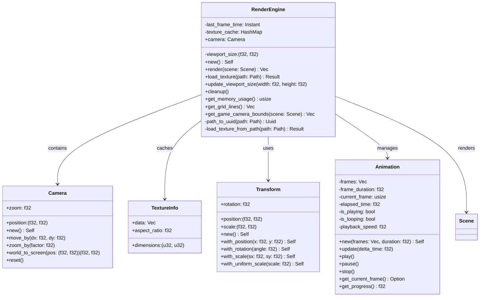
```mermaid
classDiagram
    RenderEngine --> Camera : contains
    RenderEngine --> TextureInfo : caches
    RenderEngine --> Transform : uses
    RenderEngine --> Animation : manages
    RenderEngine --> Scene : renders

    class RenderEngine {
        -viewport_size: (f32, f32)
        -last_frame_time: Instant
        -texture_cache: HashMap<Uuid, TextureInfo>
        +camera: Camera
        +new() Self
        +render(scene: Scene) Vec<RenderCommand>
        +load_texture(path: Path) Result<Uuid>
        +update_viewport_size(width: f32, height: f32)
        +cleanup()
        +get_memory_usage() usize
        +get_grid_lines() Vec<Line>
        +get_game_camera_bounds(scene: Scene) Vec<Line>
        -path_to_uuid(path: Path) Uuid
        -load_texture_from_path(path: Path) Result<TextureInfo>
    }

    class Camera {
        +position: (f32, f32)
        +zoom: f32
        +new() Self
        +move_by(dx: f32, dy: f32)
        +zoom_by(factor: f32)
        +world_to_screen(pos: (f32, f32)) (f32, f32)
        +reset()
    }

    class TextureInfo {
        +data: Vec<u8>
        +dimensions: (u32, u32)
        +aspect_ratio: f32
    }

    class Transform {
        +position: (f32, f32)
        +rotation: f32
        +scale: (f32, f32)
        +new() Self
        +with_position(x: f32, y: f32) Self
        +with_rotation(angle: f32) Self
        +with_scale(sx: f32, sy: f32) Self
        +with_uniform_scale(scale: f32) Self
    }

    class Animation {
        -frames: Vec<TextureInfo>
        -frame_duration: f32
        -current_frame: usize
        -elapsed_time: f32
        -is_playing: bool
        -is_looping: bool
        -playback_speed: f32
        +new(frames: Vec<TextureInfo>, duration: f32) Self
        +update(delta_time: f32)
        +play()
        +pause()
        +stop()
        +get_current_frame() Option<TextureInfo>
        +get_progress() f32
    }
```

##### System Diagram

```mermaid
graph TB
    subgraph RenderingSystem["Rendering System"]
        direction TB
        
        subgraph Core["Core Components"]
            engine[RenderEngine]
            camera[Camera]
            cache["Texture Cache"]
            transform["Transform System"]
        end

        subgraph TextureManagement["Texture Management"]
            loading["Texture Loading"]
            caching["Texture Caching"]
            memory["Memory Management"]
            uuid["UUID Generation"]
        end

        subgraph RenderPipeline["Render Pipeline"]
            scene["Scene Processing"]
            culling["Viewport Culling"]
            ordering["Z-Order Sorting"]
            transform_calc["Transform Calculation"]
            camera_transform["Camera Transform"]
        end

        subgraph Animation["Animation System"]
            frames["Frame Management"]
            timing["Animation Timing"]
            playback["Playback Control"]
            state["Animation State"]
        end

        subgraph Debug["Debug Rendering"]
            grid["Grid System"]
            bounds["Camera Bounds"]
            viewport["Viewport Display"]
        end
    end

    scene --> transform_calc
    transform_calc --> camera_transform
    camera_transform --> culling
    culling --> ordering

    loading --> uuid
    loading --> caching
    caching --> memory

    frames --> timing
    timing --> playback
    playback --> state

    engine --> cache
    engine --> camera
    engine --> transform

    classDef core fill:#f9f,stroke:#333,stroke-width:2px
    classDef pipeline fill:#bbf,stroke:#333,stroke-width:1px
    classDef management fill:#fbb,stroke:#333,stroke-width:1px
    classDef debug fill:#bfb,stroke:#333,stroke-width:1px

    class Core core
    class RenderPipeline pipeline
    class TextureManagement management
    class Debug debug
```

#### Key Features

##### 1. Advanced Camera System
```rust
let mut camera = Camera::new();

// Pan camera
camera.move_by(10.0, 5.0);

// Zoom with clamping (0.1x to 10.0x)
camera.zoom_by(2.0);

// Convert world coordinates to screen space
let screen_pos = camera.world_to_screen((15.0, 10.0));

// Reset camera to default state
camera.reset();
```

##### 2. Efficient Texture Management
```rust
// Load and cache texture with UUID based on path
let texture_id = render_engine.load_texture(Path::new("sprites/player.png"))?;

// Access texture information
if let Some(texture_info) = render_engine.get_texture_info(&texture_id) {
    let dimensions = texture_info.dimensions;
    let aspect_ratio = texture_info.aspect_ratio;
}

// Memory management
render_engine.cleanup_direct_textures();  // Clear all textures
render_engine.unload_texture(path);       // Remove specific texture
let memory_usage = render_engine.get_memory_usage();  // Monitor memory usage
```

##### 3. Transform System
```rust
let transform = Transform::new()
    .with_position(10.0, 20.0)
    .with_rotation(1.5)
    .with_scale(2.0, 3.0);

// Uniform scaling
let uniform_transform = Transform::new()
    .with_uniform_scale(2.0);
```

##### 4. Scene Rendering
```rust
// Update viewport size
render_engine.update_viewport_size(800.0, 600.0);

// Render scene with z-ordering
let render_queue = render_engine.render(&scene);

// Generate editor grid
let grid_lines = render_engine.get_grid_lines();

// Get game camera bounds
let camera_bounds = render_engine.get_game_camera_bounds(&scene);
```

#### Technical Details

##### 1. Texture Caching
- Uses SHA-256 hashing for deterministic UUID generation from file paths
- Implements efficient texture info caching with dimensions and aspect ratio
- Provides memory usage monitoring and cleanup utilities

##### 2. Viewport Management
- Supports dynamic viewport resizing
- Implements efficient culling for off-screen objects
- Maintains aspect ratio consistency across different screen sizes

##### 3. Camera Controls
- Smooth camera movement and zoom controls
- World-to-screen coordinate conversion
- Camera bounds visualization for editor mode

##### 4. Grid System
- Dynamic grid generation based on viewport size
- Automatic grid scaling with camera zoom
- Optional grid overlay for editor mode

#### Unit Testing

The rendering engine includes comprehensive unit tests covering:

1. Camera Operations
- Initial state verification
- Movement and zoom functionality
- Coordinate conversion accuracy
- Reset functionality

2. Render Engine Core
- Initialization checks
- Viewport management
- Transform operations
- Texture cache operations

3. Grid and Bounds
- Grid line generation
- Camera bounds calculation
- Viewport calculations

4. Memory Management
- Texture cache operations
- Memory usage tracking
- Cleanup procedures

```rust
#[test]
fn test_camera_operations() {
    let mut camera = Camera::new();
    
    camera.move_by(10.0, 5.0);
    assert_eq!(camera.position, (10.0, 5.0));
    
    camera.zoom_by(2.0);
    assert_eq!(camera.zoom, 2.0);
    
    let screen_pos = camera.world_to_screen((15.0, 10.0));
    assert_eq!(screen_pos, ((15.0 - 10.0) * 2.0, (10.0 - 5.0) * 2.0));
}
```

### [Physics Engine](/src/physics_engine.rs)

_A sophisticated 2D physics simulation system built on the [rapier2d](https://crates.io/crates/rapier2d) library, providing realistic physics interactions with advanced features like custom gravity fields and automatic collision shape detection._

#### System Architecture

##### Class Diagram
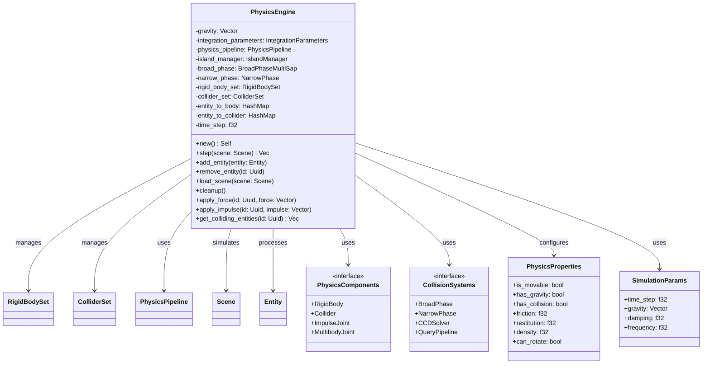
```mermaid
classDiagram
    PhysicsEngine --> RigidBodySet : manages
    PhysicsEngine --> ColliderSet : manages
    PhysicsEngine --> PhysicsPipeline : uses
    PhysicsEngine --> Scene : simulates
    PhysicsEngine --> Entity : processes

    class PhysicsEngine {
        -gravity: Vector<Real>
        -integration_parameters: IntegrationParameters
        -physics_pipeline: PhysicsPipeline
        -island_manager: IslandManager
        -broad_phase: BroadPhaseMultiSap
        -narrow_phase: NarrowPhase
        -rigid_body_set: RigidBodySet
        -collider_set: ColliderSet
        -entity_to_body: HashMap<Uuid, RigidBodyHandle>
        -entity_to_collider: HashMap<Uuid, ColliderHandle>
        -time_step: f32
        
        +new() Self
        +step(scene: Scene) Vec<Updates>
        +add_entity(entity: Entity)
        +remove_entity(id: Uuid)
        +load_scene(scene: Scene)
        +cleanup()
        +apply_force(id: Uuid, force: Vector)
        +apply_impulse(id: Uuid, impulse: Vector)
        +get_colliding_entities(id: Uuid) Vec<Uuid>
    }

    class PhysicsComponents {
        <<interface>>
        +RigidBody
        +Collider
        +ImpulseJoint
        +MultibodyJoint
    }

    class CollisionSystems {
        <<interface>>
        +BroadPhase
        +NarrowPhase
        +CCDSolver
        +QueryPipeline
    }

    class PhysicsProperties {
        +is_movable: bool
        +has_gravity: bool
        +has_collision: bool
        +friction: f32
        +restitution: f32
        +density: f32
        +can_rotate: bool
    }

    class SimulationParams {
        +time_step: f32
        +gravity: Vector
        +damping: f32
        +frequency: f32
    }

    PhysicsEngine --> PhysicsComponents : uses
    PhysicsEngine --> CollisionSystems : uses
    PhysicsEngine --> PhysicsProperties : configures
    PhysicsEngine --> SimulationParams : uses
```

##### System Diagram

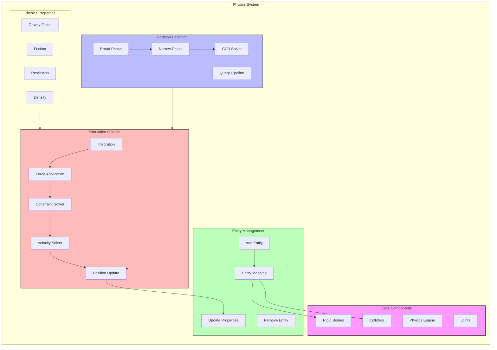
```mermaid
graph TB
    subgraph PhysicsSystem["Physics System"]
        direction TB
        
        subgraph Core["Core Components"]
            engine[Physics Engine]
            bodies[Rigid Bodies]
            colliders[Colliders]
            joints[Joints]
        end

        subgraph CollisionDetection["Collision Detection"]
            broad[Broad Phase]
            narrow[Narrow Phase]
            ccd[CCD Solver]
            query[Query Pipeline]
        end

        subgraph Simulation["Simulation Pipeline"]
            integration[Integration]
            forces[Force Application]
            constraints[Constraint Solver]
            velocity[Velocity Solver]
            position[Position Update]
        end

        subgraph EntityManagement["Entity Management"]
            add[Add Entity]
            remove[Remove Entity]
            update[Update Properties]
            mapping[Entity Mapping]
        end

        subgraph Properties["Physics Properties"]
            gravity[Gravity Fields]
            friction[Friction]
            restitution[Restitution]
            density[Density]
        end
    end

    add --> mapping
    mapping --> bodies
    mapping --> colliders

    broad --> narrow
    narrow --> ccd
    
    integration --> forces
    forces --> constraints
    constraints --> velocity
    velocity --> position

    Properties --> Simulation
    CollisionDetection --> Simulation
    Simulation --> position
    position --> update

    classDef core fill:#f9f,stroke:#333,stroke-width:2px
    classDef detection fill:#bbf,stroke:#333,stroke-width:1px
    classDef simulation fill:#fbb,stroke:#333,stroke-width:1px
    classDef management fill:#bfb,stroke:#333,stroke-width:1px

    class Core core
    class CollisionDetection detection
    class Simulation simulation
    class EntityManagement management
```

#### Key Features

##### 1. Intelligent Collider Generation
```rust
fn create_collider(&self, entity: &Entity, density: f32, friction: f32, restitution: f32) -> Collider {
    // Automatically determines collider shape based on sprite dimensions
    if let Ok(image_path) = entity.get_image(0) {
        if let Ok(img) = image::open(image_path) {
            let (width, height) = img.dimensions();
            
            // Use circle for square-ish sprites
            if (width as f32 / height as f32).abs() > 0.9 
               && (width as f32 / height as f32).abs() < 1.1 {
                ColliderBuilder::ball(width as f32 / 2.0)
            } else {
                // Use box for rectangular sprites
                ColliderBuilder::cuboid(width as f32 / 2.0, height as f32 / 2.0)
            }
        }
    }
}
```

##### 2. Custom Gravity Fields
```rust
// Process custom gravity fields in step()
for (_, entity1) in &scene.entities {
    if let AttributeValue::Boolean(true) = creates_gravity.value {
        // Calculate and apply gravitational forces to other entities
        let force = direction * (1.0 / (distance * distance));
        rb.add_force(force * 10.0, true);
    }
}
```

##### 3. Advanced Physics Controls
```rust
// Velocity control
physics_engine.set_velocity(&entity_id, vector![10.0, 0.0]);

// Force application
physics_engine.apply_force(&entity_id, vector![0.0, -9.81]);

// Impulse application
physics_engine.apply_impulse(&entity_id, vector![5.0, 0.0]);

// Angular motion
physics_engine.set_angular_velocity(&entity_id, 1.5);
physics_engine.apply_torque(&entity_id, 0.5);
```

#### Technical Details

##### 1. Entity Physics Properties
- Dynamic/static body type
- Gravity influence
- Collision detection
- Friction and restitution
- Density
- Rotation locking
- Custom gravity field generation

##### 2. Collision System
- Broad phase using spatial partitioning
- Narrow phase for precise collision detection
- Continuous collision detection for fast objects
- Collision event reporting
- Multiple collision shape support

##### 3. Performance Optimizations
- Efficient entity-to-physics mappings
- Cached position attribute IDs
- Optimized collision detection pipeline
- Memory-efficient cleanup system

#### Unit Testing

The comprehensive test suite verifies:

1. **Basic Functionality**
```rust
#[test]
fn test_initialization() {
    let physics_engine = PhysicsEngine::new();
    assert_eq!(physics_engine.get_time_step(), 1.0 / 60.0);
    assert!(physics_engine.is_empty());
}
```

2. **Entity Physics**
```rust
#[test]
fn test_physical_entity_creation() {
    let mut scene = Scene::new("test_scene").unwrap();
    let mut physics_engine = PhysicsEngine::new();

    let physics_props = PhysicsProperties {
        is_movable: true,
        affected_by_gravity: true,
        has_collision: true,
        ..Default::default()
    };

    let entity_id = scene.create_physical_entity(
        "test_entity",
        (0.0, 10.0, 0.0),
        physics_props
    ).unwrap();

    physics_engine.add_entity(scene.get_entity(entity_id).unwrap());
    assert!(physics_engine.has_rigid_body(&entity_id));
}
```

3. **Gravity and Collisions**
```rust
#[test]
fn test_gravity_simulation() {
    // ... test code ...
    assert!(
        final_y < initial_y - 1.0,
        "Entity should have fallen due to gravity"
    );
}

#[test]
fn test_collision_detection() {
    // ... test code ...
    assert!(collision_detected, "Collision should have been detected");
}
```

#### Usage Examples

See [Physics Engine Usage](#physics-engine-usage) in [Users Guide](#users-guide) for detailed implementation examples and best practices.

### [Entity Component System (ECS)](/src/ecs.rs)

_The Entity Component System (ECS) is the core architecture of our game engine, implementing a sophisticated hierarchical design with scene management, entity handling, and component organization. It uses IndexMap for deterministic ordering and includes advanced features for camera and physics entities._

#### System Architecture

##### Class Diagram

```mermaid
classDiagram
    SceneManager --> Scene : manages
    SceneManager --> Entity : manages shared
    Scene --> Entity : contains local
    Scene --> SharedEntityRef : references
    Entity --> Attribute : has
    Entity --> Resource : has
    Entity --> PhysicsProperties : may have

    class SceneManager {
        +scenes: IndexMap<Uuid, Scene>
        +shared_entities: IndexMap<Uuid, Entity>
        +active_scene: Option<Uuid>
        +new() Self
        +create_scene(name: str) Result<Uuid>
        +delete_scene(id: Uuid) Result<bool>
        +list_scene() Vec<(Uuid, str)>
        +get_scene(id: Uuid) Option<Scene>
        +create_shared_entity(name: str) Result<Uuid>
        +delete_shared_entity(id: Uuid) Result<bool>
        +get_shared_entity(id: Uuid) Option<Entity>
        +set_active_scene(id: Uuid) Result<()>
        +get_active_scene() Option<Scene>
    }

    class Scene {
        +id: Uuid
        +name: String
        +entities: IndexMap<Uuid, Entity>
        +shared_entity_refs: Vec<Uuid>
        +default_camera: Option<Uuid>
        +new(name: str) Result<Scene>
        +create_entity(name: str) Result<Uuid>
        +create_camera(name: str) Result<Uuid>
        +create_physical_entity(name: str, position: (f32,f32,f32), physics: PhysicsProperties) Result<Uuid>
        +add_shared_entity_ref(id: Uuid) Result<()>
        +get_all_entities(scene_manager: SceneManager) Vec<Entity>
    }

    class Entity {
        +id: Uuid
        +name: String
        +attributes: IndexMap<Uuid, Attribute>
        +images: Vec<PathBuf>
        +sounds: Vec<PathBuf>
        +script: Option<PathBuf>
        +new(id: Uuid, name: str) Result<Entity>
        +new_camera(id: Uuid, name: str) Result<Entity>
        +new_physical(id: Uuid, name: str, position: (f32,f32,f32), physics: PhysicsProperties) Result<Entity>
        +add_image(path: PathBuf) Result<()>
        +add_sound(path: PathBuf) Result<()>
        +set_script(path: PathBuf) Result<()>
        +create_attribute(name: str, type: AttributeType, value: AttributeValue) Result<Uuid>
    }

    class Resource {
        +images: Vec<PathBuf>
        +sounds: Vec<PathBuf>
        +script: Option<PathBuf>
        +add_image(path: PathBuf)
        +remove_image(path: PathBuf)
        +add_sound(path: PathBuf)
        +remove_sound(path: PathBuf)
        +set_script(path: PathBuf)
        +remove_script()
    }

    class Attribute {
        +id: Uuid
        +name: String
        +data_type: AttributeType
        +value: AttributeValue
    }

    class AttributeType {
        <<enumeration>>
        Integer
        Float
        String
        Boolean
        Vector2
    }

    class AttributeValue {
        <<enumeration>>
        Integer(i32)
        Float(f32)
        String(String)
        Boolean(bool)
        Vector2(f32, f32)
    }

    class PhysicsProperties {
        +is_movable: bool
        +affected_by_gravity: bool
        +creates_gravity: bool
        +has_collision: bool
        +friction: f32
        +restitution: f32
        +density: f32
        +can_rotate: bool
        +default() PhysicsProperties
    }

    class SharedEntityRef {
        +entity_id: Uuid
        +scene_id: Uuid
    }

    %% Special Entity Types
    class CameraEntity {
        <<interface>>
        +width: f32
        +height: f32
        +zoom: f32
        +rotation: f32
        +is_camera: bool
    }

    class PhysicalEntity {
        <<interface>>
        +position: (f32,f32,f32)
        +physics: PhysicsProperties
    }

    Entity --|> CameraEntity : implements
    Entity --|> PhysicalEntity : implements
    Attribute --> AttributeType : has type
    Attribute --> AttributeValue : has value
    Resource --> PathBuf : uses
```

##### System Diagram
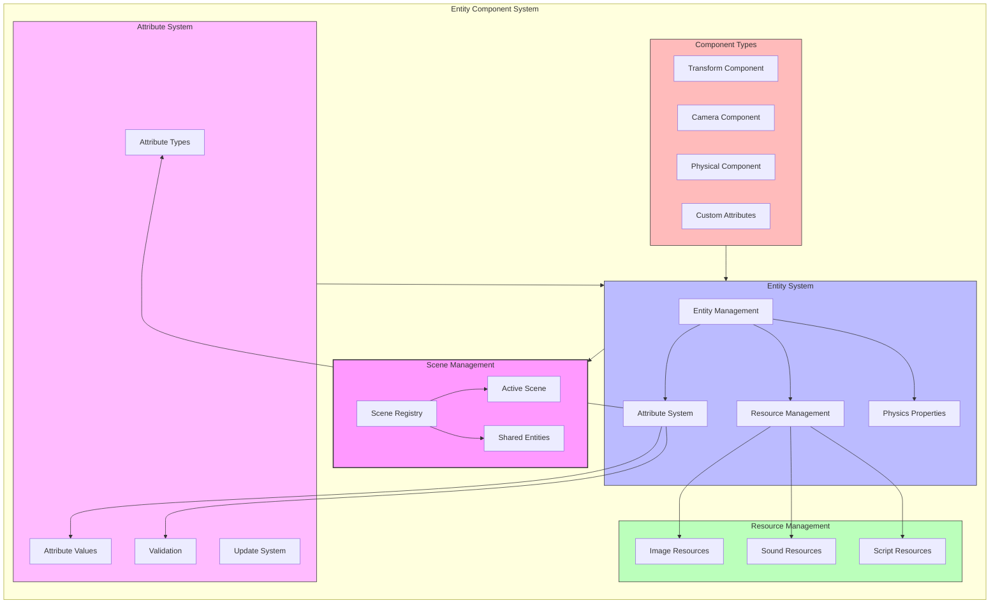
```mermaid
graph TB
    subgraph ECS["Entity Component System"]
        direction TB
        
        subgraph SceneManagement["Scene Management"]
            scenes[Scene Registry]
            active[Active Scene]
            shared[Shared Entities]
        end

        subgraph EntitySystem["Entity System"]
            entity[Entity Management]
            attributes[Attribute System]
            resources[Resource Management]
            physics[Physics Properties]
        end

        subgraph Components["Component Types"]
            transform[Transform Component]
            camera[Camera Component]
            physical[Physical Component]
            custom[Custom Attributes]
        end

        subgraph ResourceSystem["Resource Management"]
            images[Image Resources]
            sounds[Sound Resources]
            scripts[Script Resources]
        end

        subgraph AttributeSystem["Attribute System"]
            types[Attribute Types]
            values[Attribute Values]
            validation[Validation]
            updates[Update System]
        end
    end

    scenes --> active
    scenes --> shared
    
    entity --> attributes
    entity --> resources
    entity --> physics
    
    attributes --> types
    attributes --> values
    attributes --> validation
    
    resources --> images
    resources --> sounds
    resources --> scripts

    Components --> EntitySystem
    AttributeSystem --> EntitySystem
    EntitySystem --> SceneManagement

    classDef management fill:#f9f,stroke:#333,stroke-width:2px
    classDef entity fill:#bbf,stroke:#333,stroke-width:1px
    classDef component fill:#fbb,stroke:#333,stroke-width:1px
    classDef resource fill:#bfb,stroke:#333,stroke-width:1px
    classDef attribute fill:#fbf,stroke:#333,stroke-width:1px

    class SceneManagement management
    class EntitySystem entity
    class Components component
    class ResourceSystem resource
    class AttributeSystem attribute
```

#### Core Features

##### 1. **Scene Management**
   - Hierarchical scene organization
   - Shared entity support across scenes
   - Active scene tracking
   - Default camera per scene
   - Scene-level entity management

##### 2. **Entity System**
   - Three specialized entity types:
     - Basic entities with core attributes
     - Camera entities with view properties
     - Physical entities with physics attributes
   - Protected core attributes
   - Resource attachment system
   - Type-safe attribute management

##### 3. **Resource Management**
   - Multiple resource types per entity:
     - Images (sprites, textures)
     - Sounds (effects, music)
     - Scripts (behavior)
   - Resource validation and path management
   - Clean-up handling for unused resources

##### 4. **Attribute System**
   - Type-safe attribute handling
   - Protected core attributes
   - Custom attribute support
   - Attribute modification tracking
   - Vector2 support for 2D operations

#### Implementation Details

##### 1. **Data Structures**
   - Uses `IndexMap` for deterministic ordering
   - UUID-based entity and attribute identification
   - Vector-based resource storage
   - Enum-based attribute types and values

##### 2. **Type Safety**
   - Strong type checking for attributes
   - Protected core attributes
   - Safe resource path handling
   - Error handling with Result types

##### 3. **Performance Considerations**
   - Parallel processing support via Rayon
   - Efficient entity lookup
   - Optimized resource management
   - Clean entity hierarchies

#### Testing Coverage

The ECS includes comprehensive unit tests covering:

##### 1. **Entity Management**
   - Basic entity creation and modification
   - Attribute management
   - Resource attachment
   - Position handling

##### 2. **Scene Operations**
   - Scene creation and management
   - Active scene handling
   - Shared entity references
   - Camera management

##### 3. **Specialized Entities**
   - Camera entity creation and properties
   - Physical entity attributes
   - Protected attribute handling
   - Resource management

##### 4. **Error Handling**
   - Invalid operation detection
   - Resource path validation
   - Attribute type safety
   - Protected attribute enforcement

#### Advanced Usage Examples

##### 1. Complete Game Scene Setup
```rust
// Initialize scene manager and create a game level
let mut scene_manager = SceneManager::new();
let level_id = scene_manager.create_scene("Level_1")?;
let scene = scene_manager.get_scene_mut(level_id)?;

// Setup player with physics
let player_physics = PhysicsProperties {
    is_movable: true,
    affected_by_gravity: true,
    has_collision: true,
    friction: 0.2,
    density: 1.0,
    ..Default::default()
};

let player_id = scene.create_physical_entity(
    "Player",
    (100.0, 100.0, 0.0),
    player_physics
)?;

// Add player resources
let player = scene.get_entity_mut(player_id)?;
player.add_image(PathBuf::from("assets/player/idle.png"))?;
player.add_image(PathBuf::from("assets/player/walk.png"))?;
player.add_sound(PathBuf::from("assets/sounds/jump.wav"))?;
player.set_script(PathBuf::from("scripts/player_controller.lua"))?;
```

##### 2. Advanced Camera Management
```rust
// Create and configure a camera with custom settings
let camera_id = scene.create_camera("MainCamera")?;
let camera = scene.get_entity_mut(camera_id)?;

camera.set_camera_size(1920.0, 1080.0)?;
camera.set_camera_zoom(1.5)?;
camera.set_camera_rotation(45.0)?;

// Make it the default camera for the scene
scene.default_camera = Some(camera_id);
```

##### 3. Shared Entity Implementation
```rust
// Create a shared UI element across scenes
let ui_element_id = scene_manager.create_shared_entity("HealthBar")?;
let ui_element = scene_manager.get_shared_entity_mut(ui_element_id)?;

// Add UI attributes
ui_element.create_attribute("health", AttributeType::Integer, AttributeValue::Integer(100))?;
ui_element.create_attribute("position", AttributeType::Vector2, AttributeValue::Vector2(10.0, 10.0))?;

// Share across multiple scenes
let level1_id = scene_manager.create_scene("Level1")?;
let level2_id = scene_manager.create_scene("Level2")?;

scene_manager.get_scene_mut(level1_id)?.add_shared_entity_ref(ui_element_id)?;
scene_manager.get_scene_mut(level2_id)?.add_shared_entity_ref(ui_element_id)?;
```

#### Advanced Testing Scenarios

##### 1. Resource Management Tests
```rust
#[test]
fn test_resource_management() {
    let mut scene = Scene::new("test_scene").unwrap();
    let entity_id = scene.create_entity("resource_entity").unwrap();
    let entity = scene.get_entity_mut(entity_id).unwrap();
    
    // Test image management
    let image_path = PathBuf::from("test.png");
    entity.add_image(image_path.clone()).unwrap();
    assert!(entity.has_image(&image_path));
    
    // Test sound management
    let sound_path = PathBuf::from("test.wav");
    entity.add_sound(sound_path.clone()).unwrap();
    assert!(entity.has_sound(&sound_path));
    
    // Test script management
    let script_path = PathBuf::from("test.lua");
    entity.set_script(script_path.clone()).unwrap();
    assert!(entity.has_script());
}
```

##### 2. Complex Entity Attribute Tests
```rust
#[test]
fn test_complex_attributes() {
    let mut scene = Scene::new("test_scene").unwrap();
    let entity_id = scene.create_entity("test_entity").unwrap();
    let entity = scene.get_entity_mut(entity_id).unwrap();
    
    // Test vector2 attribute
    let pos_id = entity.create_attribute(
        "position",
        AttributeType::Vector2,
        AttributeValue::Vector2(10.0, 20.0)
    ).unwrap();
    
    // Test attribute protection
    assert!(entity.delete_attribute(pos_id).is_ok());
    assert!(entity.get_attribute_by_name("x")
        .and_then(|attr| entity.delete_attribute(attr.id))
        .is_err());
}
```

#### Performance Optimization Guidelines

##### 1. **Entity Management**
```rust
// Batch entity updates for better performance
scene.update_entity_attributes(vec![
    (entity1_id, attr1_id, AttributeValue::Float(1.0)),
    (entity2_id, attr2_id, AttributeValue::Float(2.0)),
    (entity3_id, attr3_id, AttributeValue::Float(3.0)),
])?;
```

##### 2. **Resource Pooling**
```rust
// Share resources across entities
let shared_texture = PathBuf::from("shared_texture.png");
for entity_id in entity_ids {
    if let Ok(entity) = scene.get_entity_mut(entity_id) {
        entity.add_image(shared_texture.clone())?;
    }
}
```

##### 3. **Scene Optimization**
```rust
// Efficient scene querying
let entities = scene.get_all_entities(&scene_manager);
entities.par_iter().for_each(|entity| {
    // Parallel processing of entities
    // ...
});
```

#### Error Handling Best Practices

##### 1. **Resource Validation**
```rust
impl Entity {
    fn validate_resource_path(path: &PathBuf) -> Result<(), String> {
        if !path.exists() {
            return Err(format!("Resource path does not exist: {:?}", path));
        }
        Ok(())
    }
}
```

##### 2. **Attribute Safety**
```rust
impl Entity {
    fn validate_attribute_value(
        attr_type: &AttributeType,
        value: &AttributeValue
    ) -> Result<(), String> {
        match (attr_type, value) {
            (AttributeType::Integer, AttributeValue::Integer(_)) => Ok(()),
            (AttributeType::Float, AttributeValue::Float(_)) => Ok(()),
            // ... other validations
            _ => Err("Type mismatch".to_string())
        }
    }
}
```

This ECS implementation provides a robust foundation for game development while maintaining flexibility, type safety, and performance. The comprehensive test suite ensures reliability and correct behavior across all system components.


### [Script Interpreter](/src/lua_scripting.rs)

_The Script Interpreter provides a robust Lua scripting integration for the game engine, leveraging the [rlua](https://crates.io/crates/rlua) crate to enable safe and efficient Rust-Lua interoperability. This system allows developers to write game logic in Lua while maintaining the performance benefits of Rust._

#### Core Implementation

```rust
/// Initializes the Lua interpreter and executes a script
pub fn run_lua_script(script: &str) -> Result<()> {
    let lua = Lua::new(); // Initialize new Lua context
    lua.load(script).exec()?; // Load and execute script
    Ok(())
}
```

#### Technical Features

1. **Safe Lua Context Management**
   - Automatic memory management through RAII
   - Protected script execution with error handling
   - Isolated Lua environments for each script

2. **Bidirectional Data Flow**
   - Pass Rust data to Lua globals
   - Execute Lua functions from Rust
   - Retrieve Lua values in Rust with type safety

3. **Error Handling**
   - Graceful handling of undefined variables
   - Runtime error detection and reporting
   - Type conversion safety checks

#### Comprehensive Test Suite

The test suite provides extensive coverage of the scripting system:

##### 1. Basic Script Execution
```rust:tests/script_interpreter_test.rs
#[test]
fn test_run_simple_script() {
    let script = r#"
        x = 10
        y = 20
        result = x + y
    "#;
    assert!(script_interpreter::run_lua_script(script).is_ok());
}
```

##### 2. Nil Value Handling
```rust:tests/script_interpreter_test.rs
#[test]
fn test_run_script_with_error() {
    let lua = Lua::new();
    let script = r#"
        x = 10
        if y == nil then
            y = 0  // Default value for undefined
        end
        result = x + y
    "#;
    assert!(lua.load(script).exec().is_ok());
}
```

##### 3. Mathematical Operations
```rust:tests/script_interpreter_test.rs
#[test]
fn test_lua_math_operations() {
    let script = r#"
        result = (10 * 5) / 2 - 7
    "#;
    let lua = Lua::new();
    lua.load(script).exec().unwrap();
    let result: f64 = lua.globals().get("result").unwrap();
    assert_eq!(result, 18.0);
}
```

##### 4. Rust-to-Lua Data Transfer
```rust:tests/script_interpreter_test.rs
#[test]
fn test_pass_data_to_lua() {
    let lua = Lua::new();
    let globals = lua.globals();
    globals.set("x", 50).unwrap();
    globals.set("y", 100).unwrap();
    
    lua.load("result = x + y").exec().unwrap();
    let result: i32 = lua.globals().get("result").unwrap();
    assert_eq!(result, 150);
}
```

##### 5. Lua-to-Rust Function Calls
```rust:tests/script_interpreter_test.rs
#[test]
fn test_return_data_from_lua() {
    let lua = Lua::new();
    lua.load(r#"
        function add(a, b)
            return a + b
        end
    "#).exec().unwrap();

    let add: rlua::Function = lua.globals().get("add").unwrap();
    let result: i32 = add.call((10, 20)).unwrap();
    assert_eq!(result, 30);
}
```

##### 6. Complex Object Manipulation
```rust:tests/script_interpreter_test.rs
#[test]
fn test_complex_script() {
    let script = r#"
        obj = {
            x = 0,
            y = 0,
            vx = 1,
            vy = 1
        }

        function update_position(obj)
            obj.x = obj.x + obj.vx
            obj.y = obj.y + obj.vy
        end

        update_position(obj)
    "#;
    // ... test implementation
}
```

##### 7. Error Handling Verification
```rust:tests/script_interpreter_test.rs
#[test]
fn test_handle_error_in_lua_script() {
    let lua = Lua::new();
    let script = r#"
        function divide(a, b)
            return a / b
        end
        result = divide(10, 0)
    "#;
    // Verifies Lua's infinity handling for division by zero
}
```

#### Technical Considerations

1. **Memory Safety**
   - Lua context is automatically cleaned up when `Lua` instance is dropped
   - All Lua values are properly garbage collected
   - Safe handling of Rust-Lua value conversions

2. **Performance Optimization**
   - Single Lua context per script execution
   - Efficient value conversion between Rust and Lua
   - Minimal memory allocation overhead

3. **Error Recovery**
   - Graceful handling of runtime errors
   - Type mismatch detection
   - Protected execution of Lua code

4. **Type Safety**
   - Strong type checking for Rust-Lua conversions
   - Safe handling of nil values
   - Proper numeric type conversions

This implementation provides a robust foundation for game logic scripting while maintaining the safety guarantees of Rust.

#### Entity-Specific Updates and Examples

Each entity in the game can have an associated Lua script. These scripts provide an `update(scene_id, entity_id)` entry function that is executed every frame. The `scene_id` represents the active scene, and the `entity_id` identifies the entity the script is attached to.

#### Key Features of the Scripting System
- **Entity-Specific Updates**
  - The `update()` function is called every frame for each entity with a script attached.
- **Predefined Lua Functions**
  - Developers can modify entities, attributes, and physics using predefined Lua functions, such as:
    - `add_entity`, `remove_entity`
    - `set_x`, `set_y`, `set_z`
    - `create_attribute_float`, `create_attribute_bool`
    - `set_velocity`
- **Dynamic Entity Behavior**:
  - Scripts can dynamically generate, manipulate, or remove entities during gameplay.

#### Example: Bird Movement Script
This simple script, attached to a bird entity, sets its velocity every frame.

```lua
function update(scene_id, entity_id)
    set_velocity(entity_id, 10.0, 0.0)
end
```

#### Example: Pipe Generation Script
The following script is attached to the background entity. It dynamically generates pipes that move from right to left and cleans up off-screen pipes.

```lua
-- Generate random name for pipes
function generate_random_name(prefix)
    local random_number = math.random(1, 100000)
    return prefix .. tostring(random_number)
end

-- Create predefined attributes for physics entity
function create_physics_attributes(scene_id, entity_id, x, y)
    create_attribute_vector2(scene_id, entity_id, "position", x, y)
    create_attribute_bool(scene_id, entity_id, "is_movable", true)
    create_attribute_bool(scene_id, entity_id, "has_gravity", true)
    create_attribute_bool(scene_id, entity_id, "creates_gravity", false)
    create_attribute_bool(scene_id, entity_id, "has_collision", true)
    create_attribute_bool(scene_id, entity_id, "can_rotate", true)
    create_attribute_float(scene_id, entity_id, "friction", 0.5)
    create_attribute_float(scene_id, entity_id, "restitution", 0.0)
    create_attribute_float(scene_id, entity_id, "density", 1.0)
end

-- Create pipe entity
function create_pipe(scene_id, pipe_name_prefix, x, y, image_path, script_path)
    local pipe_name = generate_random_name(pipe_name_prefix)
    local entity_id = add_entity(scene_id, pipe_name)
    set_position(scene_id, entity_id, x, y)
    add_image(entity_id, image_path)
    set_script(entity_id, script_path)
    return entity_id
end

-- Clean up off-screen pipes
function cleanup_pipes(scene_id)
    local entities = list_entities_name_x_y(scene_id)
    for i = 1, #entities do
        local entity = entities[i]
        if string.sub(entity.name, 1, 9) == "top_pipe_" and entity.x < -30 then
            remove_entity(scene_id, entity.id)
            remove_entity_from_physics_engine(entity.id)
        end
        if string.sub(entity.name, 1, 12) == "bottom_pipe_" and entity.x < -30 then
            remove_entity(scene_id, entity.id)
            remove_entity_from_physics_engine(entity.id)
        end
    end
end

-- Main entry point
function update(scene_id, entity_id)
    if math.random() < 0.05 then
        local random_x = math.random(300, 400)
        local random_top_y = math.random(-200, -50)
        local random_bottom_y = math.random(50, 150)

        local top_pipe_id = create_pipe(
            scene_id, "top_pipe_", random_x, random_top_y,
            "assets/images/top_pipe.png", "assets/scripts/top_pipe1.lua"
        )
        local bottom_pipe_id = create_pipe(
            scene_id, "bottom_pipe_", random_x, random_bottom_y,
            "assets/images/bottom_pipe.png", "assets/scripts/bottom_pipe1.lua"
        )

        create_physics_attributes(scene_id, top_pipe_id, random_x, random_top_y)
        create_physics_attributes(scene_id, bottom_pipe_id, random_x, random_bottom_y)
        add_entity_to_physics_engine(top_pipe_id)
        add_entity_to_physics_engine(bottom_pipe_id)
        set_velocity(top_pipe_id, -10.0, 0.0)
        set_velocity(bottom_pipe_id, -10.0, 0.0)
        cleanup_pipes(scene_id)
    end
end
```

These examples demonstrate the flexibility and power of the Lua scripting system, enabling developers to define dynamic behaviors and interactions in their game projects.


### [Audio Engine](/src/audio_engine.rs)

_The Audio Engine is a robust and feature-rich audio management system built on top of [rodio](https://crates.io/crates/rodio) for the 2D game engine. It provides comprehensive audio playback capabilities with sound caching, entity-based sound management, and detailed playback control._

#### System Architecture

##### Class Diagram

```mermaid
classDiagram
    AudioEngine --> OutputStream : uses
    AudioEngine --> OutputStreamHandle : uses
    AudioEngine --> Sink : manages
    AudioEngine --> SoundCache : contains
    AudioEngine --> DurationCache : contains
    AudioEngine --> Scene : loads from
    AudioEngine --> Entity : loads from

    class AudioEngine {
        -stream: OutputStream
        -stream_handle: OutputStreamHandle
        -active_sounds: HashMap<Uuid, Sink>
        -sound_cache: HashMap<Uuid, Vec<u8>>
        -immediate_sink: Option<Sink>
        -duration_cache: HashMap<Uuid, f32>
        
        +new() Self
        +load_sound(path: Path) Result<Uuid>
        +play_sound(path: Path) Result<Uuid>
        +play_sound_immediate(path: Path) Result<()>
        +stop(sound_id: Uuid) Result<()>
        +pause(sound_id: Uuid) Result<()>
        +resume(sound_id: Uuid) Result<()>
        +update()
        +cleanup()
    }

    class SoundCache {
        <<interface>>
        +insert(id: Uuid, data: Vec<u8>)
        +get(id: Uuid) Option<Vec<u8>>
        +remove(id: Uuid)
        +clear()
    }

    class DurationCache {
        <<interface>>
        +insert(id: Uuid, duration: f32)
        +get(id: Uuid) Option<f32>
        +remove(id: Uuid)
        +clear()
    }

    class PlaybackControl {
        <<interface>>
        +stop()
        +pause()
        +resume()
        +is_playing() bool
        +is_paused() bool
        +is_stopped() bool
    }

    class LoadOperations {
        <<interface>>
        +load_entity_sounds(entity: Entity)
        +load_scene_sounds(scene: Scene)
        +unload_sound(path: Path)
    }

    class MemoryManagement {
        <<interface>>
        +cleanup()
        +clear_cache()
        +get_memory_usage() usize
    }

    class MetadataOperations {
        <<interface>>
        +get_audio_duration(path: Path) Result<f32>
        -path_to_uuid(path: Path) Uuid
    }

    class StatusTracking {
        <<interface>>
        +list_playing_sounds() Vec<Uuid>
        +update()
        +stop_all()
    }

    AudioEngine --|> PlaybackControl : implements
    AudioEngine --|> LoadOperations : implements
    AudioEngine --|> MemoryManagement : implements
    AudioEngine --|> MetadataOperations : implements
    AudioEngine --|> StatusTracking : implements

    class Sink {
        <<external>>
        +append(source: Source)
        +play()
        +pause()
        +stop()
        +is_paused() bool
        +empty() bool
    }

    class OutputStream {
        <<external>>
        +try_default() Result<(Self, OutputStreamHandle)>
    }

    class OutputStreamHandle {
        <<external>>
        +play_raw(source: Source)
    }

    class Scene {
        <<external>>
        +entities: IndexMap<Uuid, Entity>
    }

    class Entity {
        <<external>>
        +sounds: Vec<PathBuf>
    }
```

##### System Diagram
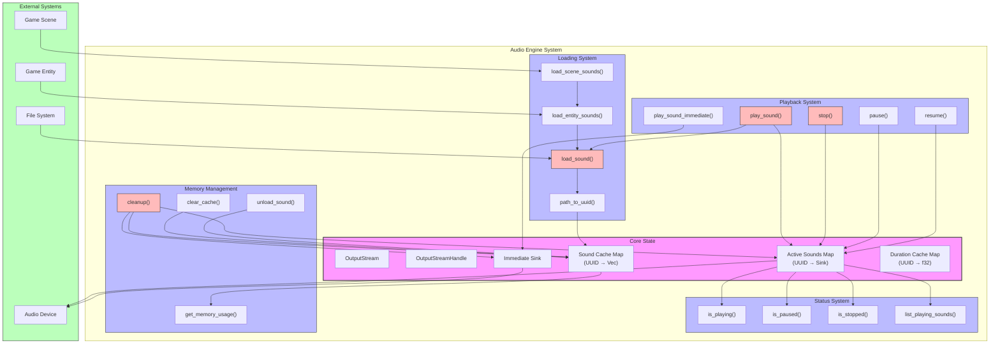
```mermaid
graph TB
    subgraph AudioEngine["Audio Engine System"]
        direction TB
        
        subgraph Core["Core State"]
            stream["OutputStream"]
            handle["OutputStreamHandle"]
            active["Active Sounds Map<br>(UUID → Sink)"]
            cache["Sound Cache Map<br>(UUID → Vec<u8>)"]
            immediate["Immediate Sink"]
            duration["Duration Cache Map<br>(UUID → f32)"]
        end

        subgraph Loading["Loading System"]
            load_sound["load_sound()"]
            load_entity["load_entity_sounds()"]
            load_scene["load_scene_sounds()"]
            path_uuid["path_to_uuid()"]
        end

        subgraph Playback["Playback System"]
            play["play_sound()"]
            play_imm["play_sound_immediate()"]
            stop["stop()"]
            pause["pause()"]
            resume["resume()"]
        end

        subgraph Status["Status System"]
            is_playing["is_playing()"]
            is_paused["is_paused()"]
            is_stopped["is_stopped()"]
            list_playing["list_playing_sounds()"]
        end

        subgraph Memory["Memory Management"]
            cleanup["cleanup()"]
            clear_cache["clear_cache()"]
            unload["unload_sound()"]
            get_usage["get_memory_usage()"]
        end
    end

    subgraph External["External Systems"]
        FileSystem["File System"]
        AudioDevice["Audio Device"]
        Scene["Game Scene"]
        Entity["Game Entity"]
    end

    %% Loading Flow
    FileSystem --> load_sound
    load_sound --> path_uuid
    path_uuid --> cache
    Entity --> load_entity
    Scene --> load_scene
    load_entity --> load_sound
    load_scene --> load_entity

    %% Playback Flow
    play --> load_sound
    play --> active
    play_imm --> immediate
    stop --> active
    pause --> active
    resume --> active

    %% Status Flow
    active --> is_playing
    active --> is_paused
    active --> is_stopped
    active --> list_playing

    %% Memory Management Flow
    cleanup --> active
    cleanup --> cache
    cleanup --> immediate
    clear_cache --> cache
    unload --> cache
    cache --> get_usage

    %% Output Flow
    active --> AudioDevice
    immediate --> AudioDevice

    classDef core fill:#f9f,stroke:#333,stroke-width:2px
    classDef operation fill:#bbf,stroke:#333,stroke-width:1px
    classDef external fill:#bfb,stroke:#333,stroke-width:1px
    classDef flow fill:#fbb,stroke:#333,stroke-width:1px

    class Core core
    class Loading,Playback,Status,Memory operation
    class External external
    class load_sound,play,stop,cleanup flow
```

#### Core Features

- **Sound Management**
  - Efficient sound caching using UUID-based identification
  - Memory-conscious sound loading and unloading
  - Support for both immediate and controlled playback
  - Duration caching for audio metadata

- **Playback Control**
  - Individual sound control (play, pause, resume, stop)
  - Global playback management
  - Multiple simultaneous sound streams
  - Immediate sound playback with auto-interruption

- **Resource Management**
  - Automatic memory management and cleanup
  - Cache control and memory usage tracking
  - Scene-based sound loading
  - Entity-based sound management

#### Technical Implementation

##### Core Components

```rust
pub struct AudioEngine {
    stream: OutputStream,
    stream_handle: OutputStreamHandle,
    active_sounds: HashMap<Uuid, Sink>,
    sound_cache: HashMap<Uuid, Vec<u8>>,
    immediate_sink: Option<Sink>,
    duration_cache: HashMap<Uuid, f32>,
}
```

##### Key Systems

1. **Sound Identification**
   - Uses SHA-256 hashing to generate deterministic UUIDs from file paths
   - Ensures consistent sound identification across sessions

2. **Caching System**
   - Two-tier caching system:
     - Sound data cache (`sound_cache`)
     - Duration metadata cache (`duration_cache`)
   - Optimized for memory efficiency with selective loading/unloading

3. **Playback Management**
   - Supports two playback modes:
     - Standard playback with unique identifiers
     - Immediate playback with automatic interruption
   - Thread-safe playback control using `rodio::Sink`

#### API Reference

##### Loading Operations
```rust
fn load_sound(&mut self, path: &Path) -> Result<Uuid, String>
fn load_entity_sounds(&mut self, entity: &Entity) -> Result<(), String>
fn load_scene_sounds(&mut self, scene: &Scene) -> Result<(), String>
```

##### Playback Operations
```rust
fn play_sound(&mut self, path: &Path) -> Result<Uuid, String>
fn play_sound_immediate(&mut self, path: &Path) -> Result<(), String>
fn stop_immediate(&mut self)
```

##### Control Operations
```rust
fn stop(&mut self, sound_id: Uuid) -> Result<(), String>
fn pause(&mut self, sound_id: Uuid) -> Result<(), String>
fn resume(&mut self, sound_id: Uuid) -> Result<(), String>
```

##### Status Operations
```rust
fn is_playing(&self, sound_id: Uuid) -> bool
fn is_paused(&self, sound_id: Uuid) -> bool
fn is_stopped(&self, sound_id: Uuid) -> bool
fn list_playing_sounds(&self) -> Vec<Uuid>
```

##### Resource Management
```rust
fn cleanup(&mut self)
fn clear_cache(&mut self)
fn unload_sound(&mut self, path: &Path)
fn get_memory_usage(&self) -> usize
```

#### Testing

The audio engine includes comprehensive unit tests covering:
- Engine initialization
- Sound playback functionality
- Playback controls (pause, resume, stop)
- Immediate playback mode
- Resource cleanup and management

Test suite requirements:
- Test audio file: "tests/level-up-22268.mp3"
- Proper audio output device configuration
- Sufficient system resources for audio playback

#### Dependencies

- `rodio`: Audio playback and streaming
- `lofty`: Audio metadata extraction
- `uuid`: Unique sound identification
- `sha2`: Path-to-UUID generation
- Standard Rust libraries (`std::fs`, `std::io`, `std::collections`)

#### Performance Considerations

1. **Memory Management**
   - Implements smart caching to balance memory usage
   - Provides explicit cache control methods
   - Tracks memory usage through `get_memory_usage()`

2. **Resource Cleanup**
   - Automatic cleanup of completed sounds
   - Manual cleanup methods for explicit resource management
   - Scene-based resource management

3. **Thread Safety**
   - Uses `rodio`'s thread-safe `Sink` implementation
   - Supports concurrent audio playback
   - Safe handling of multiple sound streams

### [Input Handler](/src/input_handler.rs)

_The Input Handler system provides a robust input management solution that handles keyboard, mouse, and modifier inputs while supporting different input contexts (Engine UI and Game)._

> [!CAUTION]
> Input Handler and Game Runtime are complex systems that are not fully developed and tested. There WILL BE system braking bugs.

#### Core Features

- Context-based input handling (Engine UI vs Game)
- Keyboard input tracking (pressed and just pressed states)
- Mouse button and position tracking
- Scroll input detection
- Modifier keys support (Ctrl, Shift, Alt, Cmd)
- Delta movement calculations for mouse and scroll

#### System Architecture

##### Class Diagram
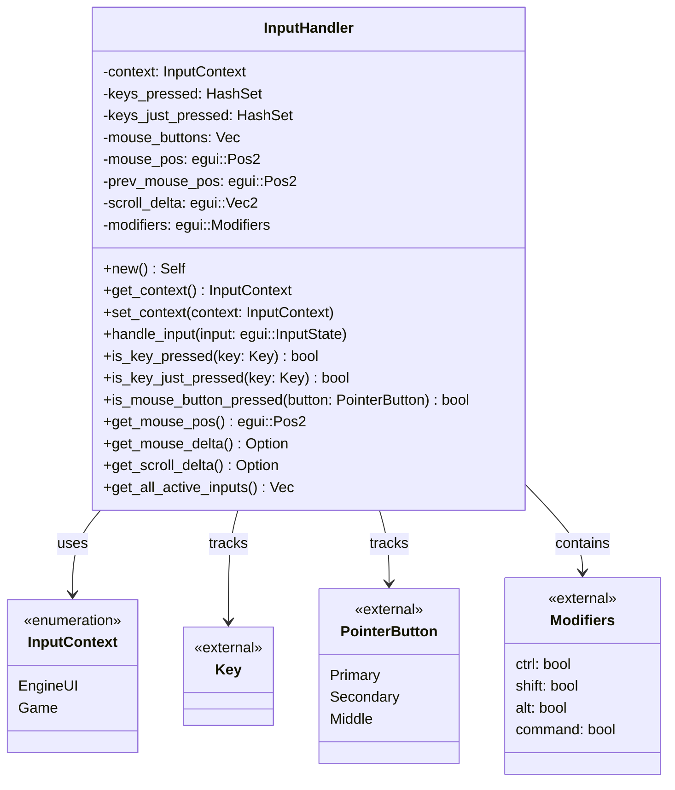
```mermaid
classDiagram
    class InputHandler {
        -context: InputContext
        -keys_pressed: HashSet<Key>
        -keys_just_pressed: HashSet<Key>
        -mouse_buttons: Vec<PointerButton>
        -mouse_pos: egui::Pos2
        -prev_mouse_pos: egui::Pos2
        -scroll_delta: egui::Vec2
        -modifiers: egui::Modifiers
        
        +new() Self
        +get_context() InputContext
        +set_context(context: InputContext)
        +handle_input(input: egui::InputState)
        +is_key_pressed(key: Key) bool
        +is_key_just_pressed(key: Key) bool
        +is_mouse_button_pressed(button: PointerButton) bool
        +get_mouse_pos() egui::Pos2
        +get_mouse_delta() Option<egui::Vec2>
        +get_scroll_delta() Option<egui::Vec2>
        +get_all_active_inputs() Vec<String>
    }

    class InputContext {
        <<enumeration>>
        EngineUI
        Game
    }

    class Key {
        <<external>>
    }

    class PointerButton {
        <<external>>
        Primary
        Secondary
        Middle
    }

    class Modifiers {
        <<external>>
        ctrl: bool
        shift: bool
        alt: bool
        command: bool
    }

    InputHandler --> InputContext : uses
    InputHandler --> Key : tracks
    InputHandler --> PointerButton : tracks
    InputHandler --> Modifiers : contains
```

##### System Diagram
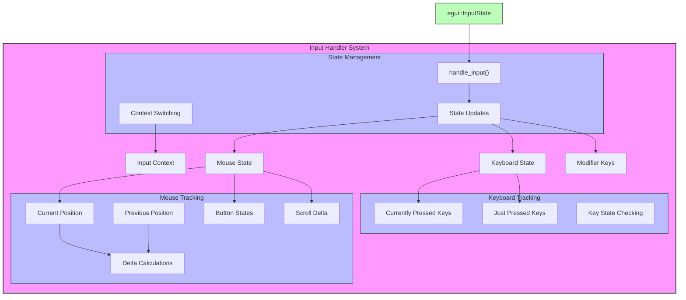
```mermaid
graph TB
    subgraph InputHandler["Input Handler System"]
        context["Input Context"]
        keyboard["Keyboard State"]
        mouse["Mouse State"]
        modifiers["Modifier Keys"]
        
        subgraph KeyboardTracking["Keyboard Tracking"]
            keys_pressed["Currently Pressed Keys"]
            keys_just_pressed["Just Pressed Keys"]
            key_check["Key State Checking"]
        end
        
        subgraph MouseTracking["Mouse Tracking"]
            pos["Current Position"]
            prev_pos["Previous Position"]
            buttons["Button States"]
            scroll["Scroll Delta"]
            delta_calc["Delta Calculations"]
        end
        
        subgraph StateManagement["State Management"]
            handle_input["handle_input()"]
            state_update["State Updates"]
            context_switch["Context Switching"]
        end
    end

    egui_input["egui::InputState"] --> handle_input
    handle_input --> state_update
    
    state_update --> keyboard
    state_update --> mouse
    state_update --> modifiers
    
    keyboard --> keys_pressed
    keyboard --> keys_just_pressed
    
    mouse --> pos
    mouse --> buttons
    mouse --> scroll
    
    pos --> delta_calc
    prev_pos --> delta_calc
    
    context_switch --> context

    classDef core fill:#f9f,stroke:#333,stroke-width:2px
    classDef tracking fill:#bbf,stroke:#333,stroke-width:1px
    classDef external fill:#bfb,stroke:#333,stroke-width:1px
    
    class InputHandler core
    class KeyboardTracking,MouseTracking,StateManagement tracking
    class egui_input external
```

#### Key Components

1. **Input Context Management**
   - Supports switching between Engine UI and Game contexts
   - Context-aware input handling
   - Debug logging for context changes

2. **Keyboard Input Tracking**
   - Maintains sets of currently pressed keys
   - Tracks newly pressed keys each frame
   - Supports modifier key combinations

3. **Mouse Input Tracking**
   - Tracks mouse button states (Primary, Secondary, Middle)
   - Records current and previous mouse positions
   - Calculates mouse movement delta
   - Handles scroll input

4. **State Management**
   - Frame-by-frame state updates
   - Efficient state storage using HashSet
   - Delta calculations for continuous inputs

#### Usage

```rust
let mut input_handler = InputHandler::new();

// Update input state each frame
input_handler.handle_input(&egui_input_state);

// Check input states
if input_handler.is_key_pressed(Key::Space) {
    // Handle space key press
}

if let Some(delta) = input_handler.get_mouse_delta() {
    // Handle mouse movement
}

// Get all active inputs
let active_inputs = input_handler.get_all_active_inputs();
```

#### Performance Considerations

- Uses HashSet for efficient key state lookups
- Minimal memory footprint with optimized state storage
- Delta calculations only performed when requested
- Context switching with minimal overhead

#### Integration with egui

The system is built to work seamlessly with egui's input system:
- Direct integration with `egui::InputState`
- Compatible with egui's pointer and key handling
- Supports egui's modifier key system


### [Project Manager](/src/project_manager.rs)

_The Project Manager handles game project creation, loading, saving, building, and asset importing. It provides a structured way to manage game projects and their assets._


#### System Architecture

##### Class Diagram
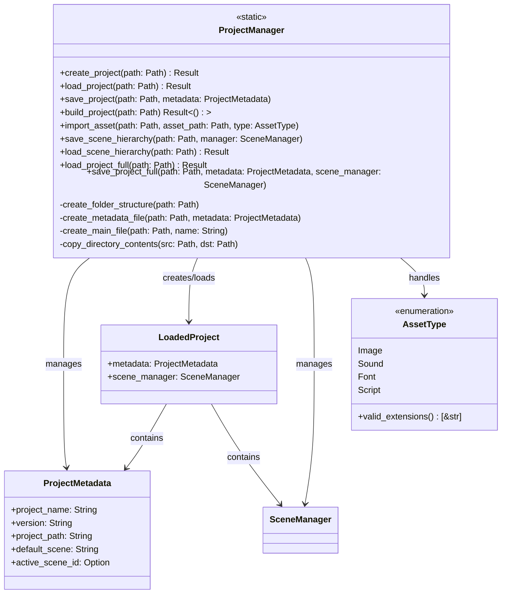
```mermaid
classDiagram
    ProjectManager --> ProjectMetadata : manages
    ProjectManager --> LoadedProject : creates/loads
    ProjectManager --> SceneManager : manages
    ProjectManager --> AssetType : handles
    LoadedProject --> ProjectMetadata : contains
    LoadedProject --> SceneManager : contains

    class ProjectManager {
        <<static>>
        +create_project(path: Path) Result<LoadedProject>
        +load_project(path: Path) Result<ProjectMetadata>
        +save_project(path: Path, metadata: ProjectMetadata)
        +build_project(path: Path) Result<()>
        +import_asset(path: Path, asset_path: Path, type: AssetType)
        +save_scene_hierarchy(path: Path, manager: SceneManager)
        +load_scene_hierarchy(path: Path) Result<SceneManager>
        +load_project_full(path: Path) Result<LoadedProject>
        +save_project_full(path: Path, metadata: ProjectMetadata, scene_manager: SceneManager)
        -create_folder_structure(path: Path)
        -create_metadata_file(path: Path, metadata: ProjectMetadata)
        -create_main_file(path: Path, name: String)
        -copy_directory_contents(src: Path, dst: Path)
    }

    class ProjectMetadata {
        +project_name: String
        +version: String
        +project_path: String
        +default_scene: String
        +active_scene_id: Option<Uuid>
    }

    class LoadedProject {
        +metadata: ProjectMetadata
        +scene_manager: SceneManager
    }

    class AssetType {
        <<enumeration>>
        Image
        Sound
        Font
        Script
        +valid_extensions() [&str]
    }
```

##### System Diagram
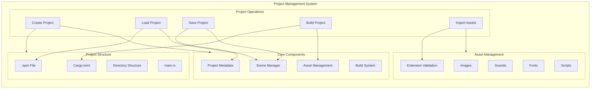
```mermaid
graph TB
    subgraph ProjectSystem["Project Management System"]
        direction TB
        
        subgraph Core["Core Components"]
            metadata["Project Metadata"]
            scenes["Scene Manager"]
            assets["Asset Management"]
            build["Build System"]
        end

        subgraph FileStructure["Project Structure"]
            project[".epm File"]
            folders["Directory Structure"]
            cargo["Cargo.toml"]
            main["main.rs"]
        end

        subgraph AssetManagement["Asset Management"]
            images["Images"]
            sounds["Sounds"]
            fonts["Fonts"]
            scripts["Scripts"]
            validation["Extension Validation"]
        end

        subgraph Operations["Project Operations"]
            create["Create Project"]
            load["Load Project"]
            save["Save Project"]
            build_op["Build Project"]
            import["Import Assets"]
        end
    end

    create --> FileStructure
    create --> Core
    
    load --> project
    load --> scenes
    
    save --> metadata
    save --> scenes
    
    build_op --> cargo
    build_op --> assets
    
    import --> AssetManagement
    import --> validation

    classDef core fill:#f9f,stroke:#333,stroke-width:2px
    classDef structure fill:#bbf,stroke:#333,stroke-width:1px
    classDef operations fill:#fbb,stroke:#333,stroke-width:1px
```

#### Key Features

1. **Project Management**
   - Project creation with standardized structure
   - Metadata management
   - Scene hierarchy handling
   - Full project loading/saving

2. **Asset Management**
   - Supported asset types:
     - Images (png, jpg, jpeg, gif)
     - Sounds (wav, mp3, ogg)
     - Fonts (ttf, otf)
     - Scripts (lua)
   - Asset validation and organization
   - Automatic directory management

3. **Build System**
   - Cargo integration
   - Asset copying to build directory
   - Release build support

#### Project Structure
```
project_root/
├── project.epm
├── Cargo.toml
├── src/
│   └── main.rs
├── assets/
│   ├── images/
│   ├── sounds/
│   ├── fonts/
│   └── scripts/
└── scenes/
    └── scene_manager.json
```

> [!TIP]
> The .epm (engine project metadata) file is a simple JSON file that contains the project metadata. It is used as a unique identifier for the project manager to load and save the project.

#### Usage Examples

```rust
// Create new project
let project = ProjectManager::create_project(path)?;

// Load existing project
let loaded = ProjectManager::load_project_full(path)?;

// Import asset
ProjectManager::import_asset(
    project_path,
    asset_path,
    AssetType::Image
)?;

// Build project
ProjectManager::build_project(project_path)?;
```

#### Error Handling

- Comprehensive error checking for file operations
- Validation of project structure
- Asset type verification
- Build process error handling

#### Performance Considerations

- Lazy loading of assets
- Efficient file copying during builds
- Minimal memory footprint for project metadata
- Optimized scene serialization

### Engine GUI

_An intuitive, real-time development interface powered by [egui](https://crates.io/crates/egui), transforming game development into a more interactive and efficient process._

- Offers a context-aware inspector for real-time modification of game components, entities, and system parameters.

- Enables live debugging, performance profiling, and immediate visual feedback without interrupting the development workflow.

- Provides customizable views and layouts, allowing developers to tailor the interface to their specific project needs and preferences.

Overview of the GUI:

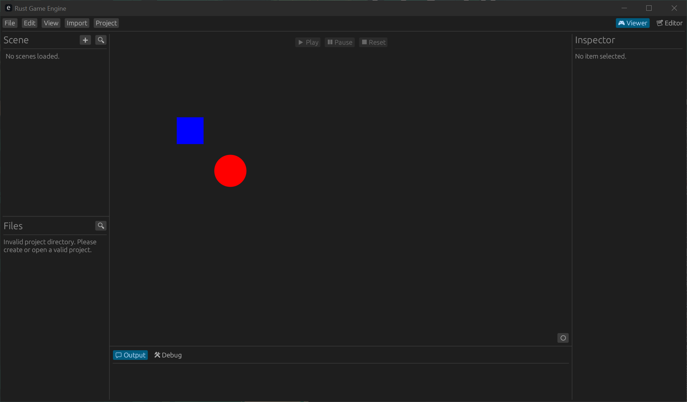
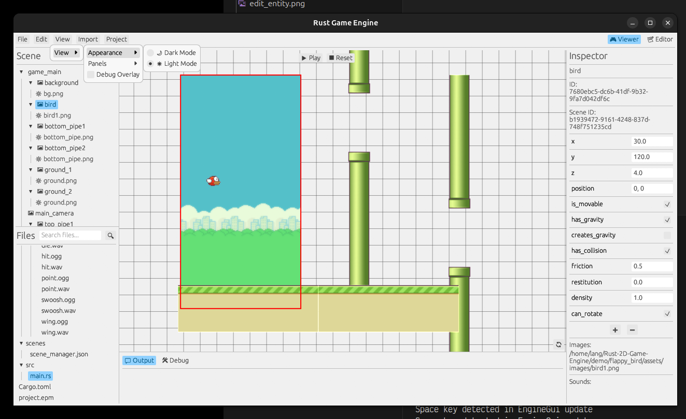

> [!IMPORTANT]
> YES, we DID make a flappy bird game in the engine :)

#### Menu

- Project Management:

  - Create, load, and work with projects.<br>

    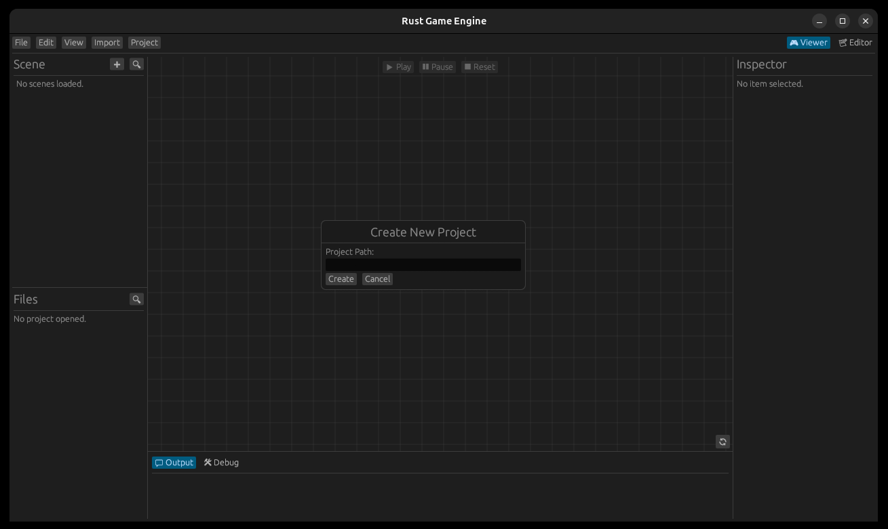

  - Automatic saving

- Customization Options: <br>

    

  - Dark Mode
  - Show or hide panels
  - Debug Overlay <br>

    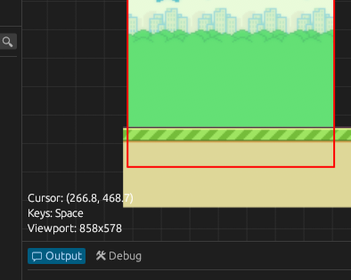

- File Import

    

- Editor Switching

    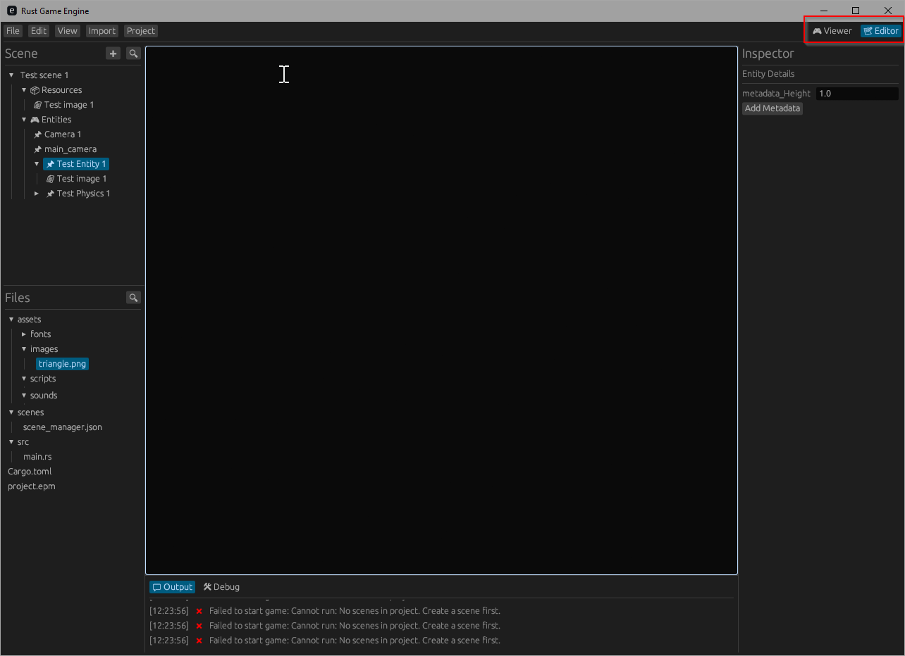

#### Scene

- Scene Organization:
  - Manage Scenes, Entities, and predefined entities like cameras or physics.
- Context Menu Management:
  - Right-click Scenes to rename, delete, or set current scene as active.
  - Right-click Entities to rename/delete or attach/detach multiple resources.
- Tree Structure:
  - Organize and view items in a collapsible tree format, sorted alphabetically.
- Filter entities by name for quick navigation.
- Clicking any Scene, Entity, or Resource displays its details in the Inspector Panel.

    <a href="modify_scene">
    
    </a>
    <a href="modify_entity">
    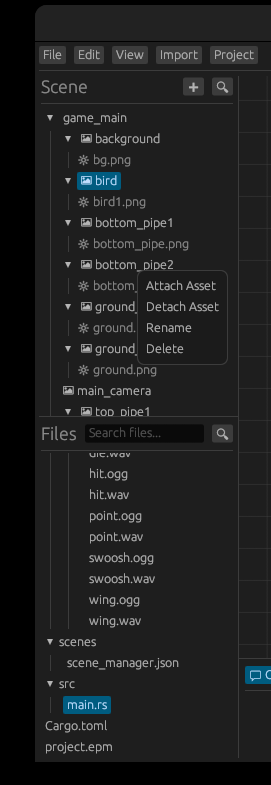
    </a>
    <a href="new_scene">
    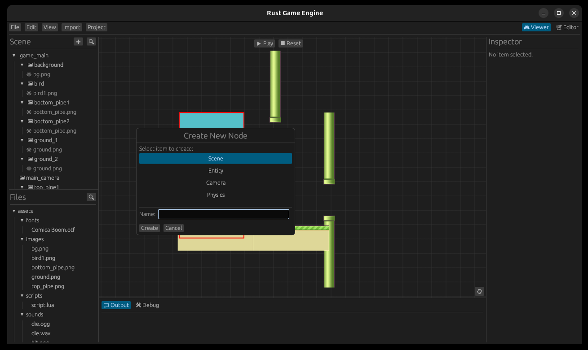
    </a>

#### File Panel

- File Navigation:
  - View all files within the project folder in a collapsible tree structure, sorted alphabetically.
  - Select any file to view its details in the Inspector Panel.
- Context Menu Actions:
  - Right-click files to delete them.
- Filtering:
  - Quickly filter files by name to locate specific items.

#### Inspector Panel

- Entity Customization:
  - Modify entity data or add new attributes directly.

    <a href="Edit Attributes">
    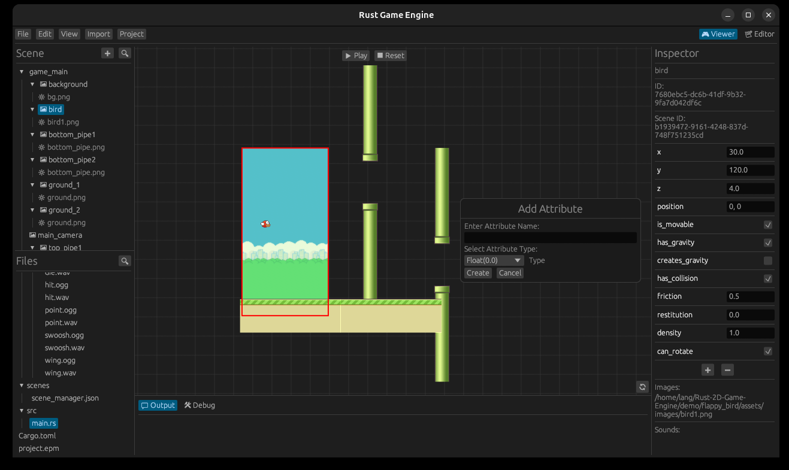
    </a>
    <a href="Remove Attributes">
    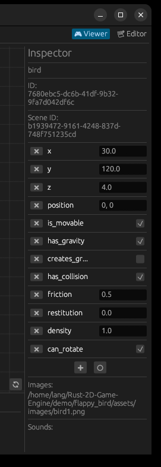
    </a>

- Resource Preview:
  - Preview images, sounds, fonts, scripts and thier metadata in the Inspector Panel.
  - Use optimized lib for fast metadata preview

    <a href="final_report_assets/inspector_preview.png">
    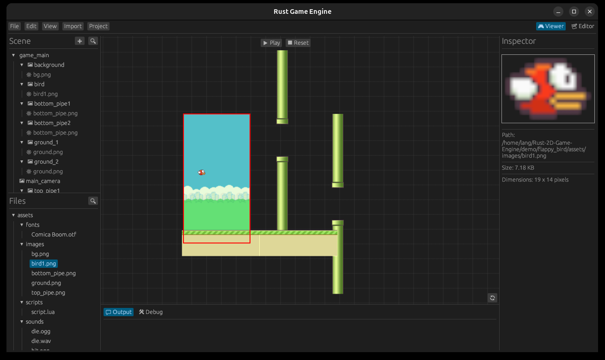
    </a>
    <a href="final_report_assets/inspector_sound.png">
    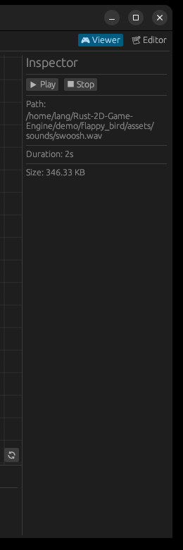
    </a>

## User's Guide

> [!WARNING]
> The engine has gone through many changes since this user guide was written. Some UI and feature are deprecated. Please refer to the code for the latest information.

### In Rust

#### Integrate our Rendering Engine in your game:

```rust
use rust_2d_game_engine::render_engine::{RenderEngine, Sprite};

// Create renderer
let mut renderer = RenderEngine::new();

// Create sprites
let sprites = vec![
    Sprite {
        position: (100.0, 100.0),
        size: (50.0, 50.0),
        rotation: 0.0,
        texture_coords: (0.0, 0.0, 1.0, 1.0),
    },
    // Add more sprites as needed
];

// In the game loop
renderer.render_frame(&sprites).expect("Failed to render frame");
```

#### Physics Engine Usage

To use the Physics Engine:

1. Create an instance of `PhysicsEngine` using `PhysicsEngine::new()`.
2. Add rigid bodies to the simulation with `add_rigid_body()`.
3. Call `step()` in your game loop to advance the physics simulation.
4. Use `handle_collisions()` to detect and respond to collisions.

Example:

```rust
use rust_2d_game_engine::physics_engine::PhysicsEngine;

let mut physics_engine = PhysicsEngine::new();

// Add a dynamic body
physics_engine.add_rigid_body([0.0, 5.0], true);

// In the game loop
physics_engine.step();
physics_engine.handle_collisions();
```

#### Creating and Using Shared Entities with ECS

```rust
// Create a shared entity in the scene manager
let player_id = scene_manager.create_shared_entity("Player");

// Reference the shared entity in a scene
scene.add_shared_entity_ref(player_id);

// Access the shared entity through the scene
if let Some(player) = scene.get_shared_entity_ref(scene_manager, player_id) {
    // Use the shared entity
}
```

#### Creating a Player Character with ECS

```rust
// Create entity
let player_id = scene.create_entity("Player");
let player = scene.get_entity_mut(player_id).unwrap();

// Add components
player.create_attribute("position", Vector2(0.0, 0.0));
player.create_attribute("health", Integer(100));
player.create_attribute("speed", Float(5.0));

// Add resources
let sprite_id = scene.create_resource("player_sprite", "player.png", ResourceType::Image);
player.attach_resource(sprite_id);
```

#### Creating an Interactive Object with ECS

```rust
// Create a collectible item
let coin_id = scene.create_entity("Coin");
let coin = scene.get_entity_mut(coin_id).unwrap();

// Add components
coin.create_attribute("position", Vector2(100.0, 100.0));
coin.create_attribute("is_collected", Boolean(false));
coin.create_attribute("value", Integer(10));

// Add resources
let coin_sprite = scene.create_resource("coin_sprite", "coin.png", ResourceType::Image);
let collect_sound = scene.create_resource("collect_sound", "collect.wav", ResourceType::Sound);
coin.attach_resource(coin_sprite);
coin.attach_resource(collect_sound);
```

#### Script Interpreter for Game Logic

To use the Script Interpreter for game logic:

- Use `run_lua_script(script)` to execute Lua code.
- For more complex interactions, use the `rlua::Lua` context directly to set globals, call functions, or retrieve values.

Example:

```rust
use rust_2d_game_engine::script_interpreter;

let script = r#"
    function greet(name)
        return "Hello, " .. name .. "!"
    end
"#;

script_interpreter::run_lua_script(script).expect("Failed to run script");
```

Further interaction with the script can be done using `rlua` directly.

#### Game Audio

To use the `AudioEngine` for game audio:

1. Create an instance of `AudioEngine` using `AudioEngine::new()`.
2. Use `play_sound(file_path)` to play audio files.
3. Control playback with `pause()` and `resume()`.
4. Check playback status with `is_playing()`.

#### Project Manager Usage

##### Project Creation and Management

```rust
// Create a new game project
let project_path = Path::new("path/to/my_game");
ProjectManager::create_project(project_path)?;

// Load project with scene hierarchy
let (metadata, scene_manager) = ProjectManager::load_project_full(project_path)?;

// Save project with scene hierarchy
ProjectManager::save_project_full(project_path, &metadata, &scene_manager)?;
```

##### Asset Import

```rust
// Import an image
let image_path = Path::new("path/to/sprite.png");
let relative_path = ProjectManager::import_asset(
    project_path,
    image_path,
    AssetType::Image
)?;

// Import a sound
let sound_path = Path::new("path/to/effect.wav");
let relative_path = ProjectManager::import_asset(
    project_path,
    sound_path,
    AssetType::Sound
)?;
```

##### Scene Management

```rust
// Load scene hierarchy
let scene_manager = ProjectManager::load_scene_hierarchy(project_path)?;

// Make changes to scenes...

// Save scene hierarchy
ProjectManager::save_scene_hierarchy(project_path, &scene_manager)?;
```

##### Build System

```rust
// Build the project
ProjectManager::build_project(project_path)?;
```

### GUI

#### Create new project

To create a new project, click on `File`->`New Project`->enter your project name and path you wish to save it in->press `Create`.


#### Open project

To open a project, click on `File`->`Open Project`->enter your project path.

#### Save project

To save a project, click on `File`->`Save Project`->enter your project path.

#### Dark/Light mode

`View` -> `View` -> `Appearance`

#### Panel customization

`View` -> `Panels`

#### Debug overlay

`View` -> `Debug Overlay`

#### Create new scene

Top left Scene panel ->`+`-> select `Scene` -> enter name and click `Create`


#### Scene camera control
Right click and hold to move around. Middle mouse button to zoom in and out.

#### Create new entity/camera/physics

Top left Scene panel ->`+`-> select `Entity`/`Camera`/`Physics` -> enter name and click `Create` (There must be at least one scene first)
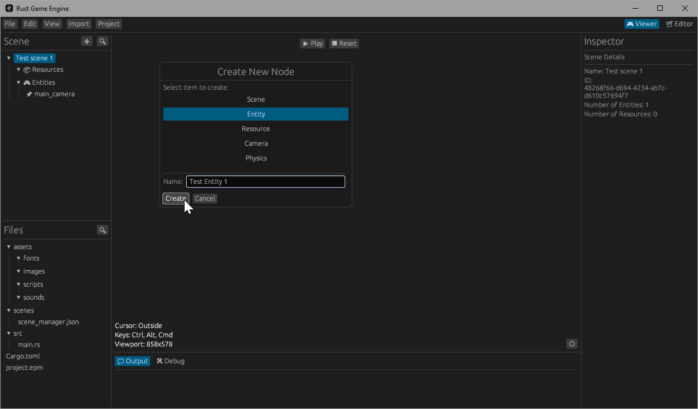

#### Create new resource(image/sound/script)

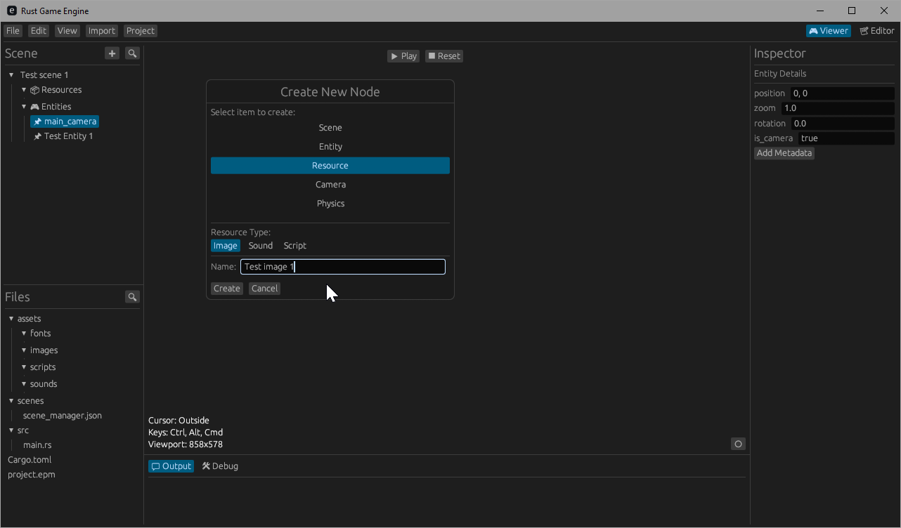

#### Import new resources(image/sound/script)


#### Edit/rename/delete entity

Right click on the entity you wish to edit.
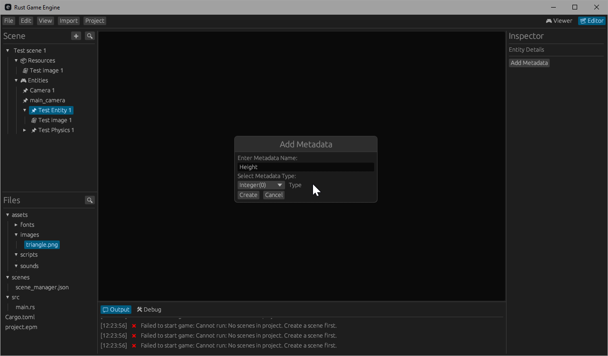

#### Add/Edit metadatas

Select an entity/resource, then click on `Add Metadata` at the right inspector panel.
Enter name, select types, and enter value. Click on `Save`

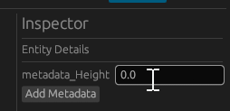

#### Editor
At the top right corner, click on `Editor` to switch to editor view


#### Build and Run your game

`Project`->`Build Project`

## Reproducibility Guide

Run `cargo run` in the terminal at the root directory of our project if you wish to use the debug version. Otherwise, run `cargo build --release` and execute the generated `target/release/rust-2d-game-engine` executable.

## Video Demo

This video demonstrates the features and functionality of our game engine from a user perspective. Explore the GUI, menu options, and core functionalities in action.

[](https://www.youtube.com/watch?v=s1RrM8L6vfk)

[Download the video demo here.](final_report_assets/demo_v3.mp4)

To run our Flappy Bird demo project, click on **File -> Open Project** and enter the demo project path. The demo project is already included under `demo/flappy_bird`. 

**Example Path:**  
`/Users/Frank/Documents/school_work/Rust-2D-Game-Engine/demo/flappy_bird/`

## Contributions

**Lang Sun**:

- [Entity Component System (ECS)](#ecs)
- [Rendering Engine](#rendering-engine)
- [Physics Engine](#physics-engine)
- [Input Handler](#input-handler)
- [Project Manager](#project-manager)
- [Engine GUI](#engine-gui)
- [Audio Engine](#audio-engine)
- [Script Interpreter](#script-interpreter)

**Feiyang Fan**:

- [Entity Component System (ECS)](#ecs)
- [Audio Engine](#audio-engine)
- [Script Interpreter](#script-interpreter)

**Frank Chen**:

- [Entity Component System (ECS)](#ecs)
- [Project Manager](#project-manager)
- [Engine GUI](#engine-gui)

## Remarks

### Lesson One: The Importance of Testing Suite

- Our extensive unit testing framework revealed critical insights into engine reliability and performance.
- We learned that thorough testing across different scenarios is crucial for creating a robust game development tool.
- The test suite not only caught potential issues but also served as a living documentation of the engine's capabilities.

### Lesson Two: Collaboration

- The project was as much about technical development as it was about team collaboration and shared passion.
- We discovered the power of combining individual skills towards a common, innovative goal.
- The journey of creating the engine was as valuable as the end product itself.

### Lesson Three: Modularity

- Our modular approach to the engine's architecture proved critical in maintaining flexibility and extensibility.
- We learned that well-designed, loosely coupled components allow for easier maintenance, testing, and future enhancements.

### Concluding Remarks

Our Rust 2D Game Engine represents a promising first step into the world of specialized game development tools in Rust. While currently in its early prototype stage, the project has already demonstrated some good potential in addressing the unique needs of 2D game developers within the Rust ecosystem.

We have successfully laid a robust foundation, implementing core systems like the rendering engine, physics simulation, entity component system, and scripting support. The modular architecture and focus on performance and usability set the groundwork for a tool that could genuinely empower indie developers and small studios.

However, we recognize that this is just the beginning of our journey. The current iteration, while functional, is a proof of concept that requires continued refinement, expansion, and community feedback. Our roadmap includes:

- Expanding the feature set to support more complex game development scenarios
- Improving documentation and developer tools
- Increasing cross-platform compatibility
- Continuously optimizing performance and reliability

We are excited about the potential of this project and view it as an evolving platform. Our passion for game development, Rust, and creating accessible tools drives us to continue improving and expanding the engine.

> [!NOTE]
> "Your ego is writing checks your body can't cash". Well, I say if your ego never write checks, your body will never know how to cash. This project is ambitious and a bit over the head, but it is because it is pushing the limits, that I have learned things I never thought I could. I will keep developing this engine as a hobby project. - Lang
