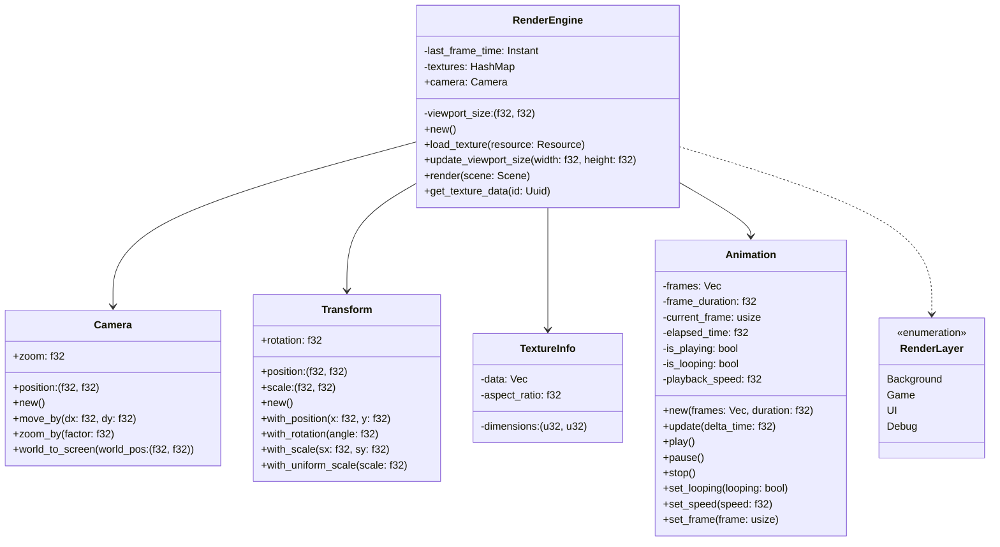
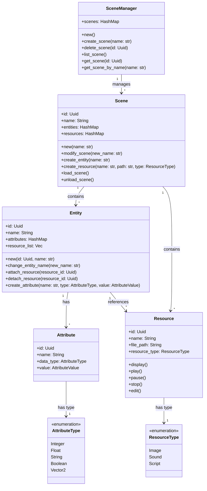
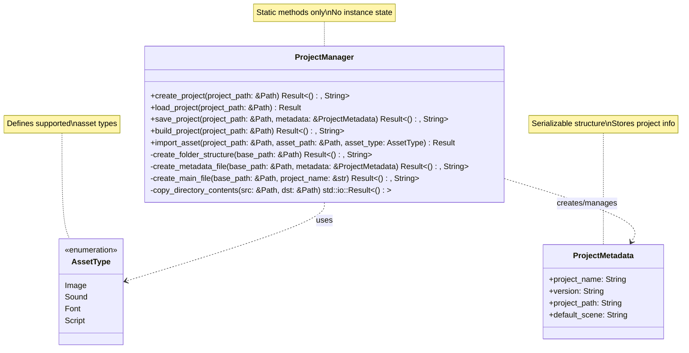

# Rust 2D Game Engine

## Table of Contents

- [Entity Component System](#ecs-entity-component-system)
- [Render Engine](#render-engine)
- [Physics Engine](#physics-engine)
- [Input Handler](#input-handling)
- [Audio Engine](#audio-engine)
- [Script Interpreter](#script_interpreter)
- [Game Project File Management](#file_system)
- [Engine GUI](#gui)

## [Render Engine](/src/render_engine.rs)

The Rendering Engine is a crucial component of our 2D game engine, responsible for handling all graphical output. It utilizes [`wgpu`](https://github.com/gfx-rs/wgpu), a cross-platform, safe, and modern graphics API, to provide efficient and flexible rendering capabilities.

### Core Components



#### Setting up a Basic Scene
```rust
// Initialize engine
let mut render_engine = RenderEngine::new();

// Set up camera
render_engine.camera.move_by(0.0, 0.0);  // Center camera
render_engine.camera.zoom_by(1.0);       // Default zoom

// Load and position a sprite
let sprite_id = render_engine.load_texture(&player_resource)?;
let transform = Transform::new()
    .with_position(100.0, 100.0)
    .with_uniform_scale(1.0);
```

#### Camera System
The camera system provides viewport control with:
- Pan/move functionality
- Zoom control (0.1x to 10.0x)
- World-to-screen coordinate conversion
```rust
// Smooth camera follow
let player_pos = player.get_position();
camera.move_by(
    (player_pos.0 - camera.position.0) * 0.1,  // Smooth X follow
    (player_pos.1 - camera.position.1) * 0.1   // Smooth Y follow
);

// Zoom to fit scene
camera.zoom_by(0.8);  // Zoom out
camera.zoom_by(1.2);  // Zoom in
```

#### Transform System
Handles object positioning and manipulation:
- Position (x, y coordinates)
- Rotation (in radians)
- Scale (width, height multipliers)
```rust
// Create and modify transform
let mut transform = Transform::new()
    .with_position(100.0, 100.0)
    .with_rotation(0.0)
    .with_scale(1.0, 1.0);

// Scale sprite without modifying original image
transform.scale = (0.5, 0.5);  // Half size
transform.scale = (2.0, 2.0);  // Double size

// Rotate sprite
transform.rotation = std::f32::consts::PI * 0.5;  // 90 degrees
```

#### Layer System
Manages rendering order with four predefined layers:
- Background (0)
- Game (1)
- UI (2)
- Debug (3)
```rust
// Create entities in different layers
let background = Entity::new()
    .with_sprite(background_texture)
    .with_layer(RenderLayer::Background);

let player = Entity::new()
    .with_sprite(player_texture)
    .with_layer(RenderLayer::Game);

let health_bar = Entity::new()
    .with_sprite(ui_texture)
    .with_layer(RenderLayer::UI);
```

#### Texture Management
- Supports PNG and JPEG formats
- Maintains original dimensions and aspect ratios
- Efficient texture data storage and retrieval

#### Animation Support
Optional animation system with:
- Frame-based animation
- Playback controls (play/pause/stop)
- Looping options
- Variable playback speed
- Frame selection
```rust
// Create and control animation
let mut player_animation = Animation::new(walk_frames, 1.0/12.0);  // 12 FPS

// Basic controls
player_animation.play();      // Start playing
player_animation.pause();     // Pause at current frame
player_animation.stop();      // Stop and reset to first frame

// Advanced controls
player_animation.set_looping(true);   // Loop animation
player_animation.set_speed(2.0);      // Play at double speed
player_animation.set_frame(3);        // Jump to specific frame
```

### Features

✅ **Implemented**
- Basic image rendering
- Camera controls
- Transform system
- Layer-based rendering
- Viewport management
- Basic animation support

🚧 **Planned**
- Sprite sheet support
- Advanced animation features
- Shader effects
- Particle systems

### Technical Details

- Uses `image` crate for texture loading
- UUID-based resource management
- Efficient visibility culling
- Automatic layer sorting
- Transform-aware rendering

## [Physics Engine](/src/physics_engine.rs)

The Physics Engine is a core component of our 2D game engine, providing realistic physical simulations for game objects. It utilizes the [rapier2d](https://github.com/dimforge/rapier), a powerful 2D physics engine for Rust, to handle complex physics calculations and interactions.

### Features

- Gravity simulation
- Dynamic and static rigid body creation
- Collision detection and handling
- Custom physical properties for objects (mass, friction, restitution)
- Support for various collider shapes (ball, cuboid, capsule)

### Implementation Details

The `PhysicsEngine` struct encapsulates all necessary components for physics simulation:

- `PhysicsPipeline`: Manages the overall physics simulation process
- `RigidBodySet` and `ColliderSet`: Store rigid bodies and their colliders
- `IslandManager`, `BroadPhase`, and `NarrowPhase`: Handle collision detection
- `ImpulseJointSet` and `MultibodyJointSet`: Manage object constraints
- `CCDSolver`: Handles continuous collision detection
- `QueryPipeline`: Allows for spatial queries

Key methods include:

- `new()`: Initializes the physics engine with default settings
- `step()`: Advances the physics simulation by one time step
- `add_rigid_body()`: Adds a new rigid body to the simulation
- `handle_collisions()`: Detects and processes collisions between objects

### Unit Tests

The test suite in [`physics_engine_test.rs`](tests/physics_engine_test.rs) verifies various aspects of the physics simulation:

1. **Initialization** - `test_initialization`:
   - Checks correct gravity setting and empty initial state

2. **Rigid Body Addition**:
   - `test_add_dynamic_rigid_body_with_collider`: Verifies dynamic body creation
   - `test_add_static_rigid_body_with_collider`: Checks static body creation
   - `test_add_invalid_rigid_body`: Ensures invalid bodies are not added

3. **Gravity Simulation** - `test_simulation_under_gravity`:
   - Confirms objects fall under gravity

4. **Collision Detection** - `test_collision_detection`:
   - Verifies collisions between dynamic and static bodies

5. **Multiple Body Simulation** - `test_multiple_bodies_falling`:
   - Tests behavior of multiple dynamic bodies

6. **Collider Shapes** - `test_different_collider_shapes`:
   - Checks various collider shapes (ball, cuboid, capsule)

7. **Custom Properties** - `test_rigid_body_with_custom_properties`:
   - Tests bodies with custom mass and restitution

8. **Collision Events** - `test_collision_events`:
   - Ensures collision events are properly detected and reported

### Usage

To use the Physics Engine:

1. Create an instance of `PhysicsEngine` using `PhysicsEngine::new()`.
2. Add rigid bodies to the simulation with `add_rigid_body()`.
3. Call `step()` in your game loop to advance the physics simulation.
4. Use `handle_collisions()` to detect and respond to collisions.

Example:
```rust
use rust_2d_game_engine::physics_engine::PhysicsEngine;

let mut physics_engine = PhysicsEngine::new();

// Add a dynamic body
physics_engine.add_rigid_body([0.0, 5.0], true);

// In the game loop
physics_engine.step();
physics_engine.handle_collisions();
```

> [!WARNING]
> Need to handle potential errors, as adding bodies or stepping the simulation may fail in certain conditions.

## [ECS Entity Component System](/src/ecs.rs)

The Entity Component System (ECS) is the core architecture of our game engine, providing a flexible and efficient way to create and manage game objects. It follows a composition-over-inheritance pattern, making it easy to create complex game objects without deep inheritance hierarchies.

### System Overview



ECS implementation consists of four main parts:

1. **Scene Manager**
   - Top-level controller managing multiple scenes
   - Handles scene creation, deletion, and switching
   - Maintains a unique ID for each scene
   - Example: Managing different levels, menus, or game states

2. **Scene**
   - Container for entities and resources
   - Manages the game world state
   - Handles entity and resource creation/deletion
   - Example: A game level containing players, enemies, and items

3. **Entity**
   - Basic game object container
   - Holds attributes and resource references
   - Can represent anything from players to UI elements
   - Example: A player character with position, health, and sprite

4. **Components**
   - **Attributes**: Data components (position, health, speed)
   - **Resources**: External assets (images, sounds, scripts)

### Key Features

#### 1. Hierarchical Structure
```
SceneManager
└── Scene 1 (e.g., "OpenWorld")
    ├── Entity 1 (e.g., "Player")
    │   ├── Attributes
    │   │   ├── position: Vector2(100, 100)
    │   │   └── health: Integer(100)
    │   └── Resources
    │       ├── sprite.png
    │       └── jump_sound.wav
    └── Entity 2 (e.g., "Enemy")
        └── ...
```

#### 2. Flexible Component System
- **Attributes**: Store entity-specific data
  ```rust
  // Position component
  entity.create_attribute("position", AttributeType::Vector2, Vector2(0.0, 0.0));
  
  // Health component
  entity.create_attribute("health", AttributeType::Integer, Integer(100));
  ```

#### 3. Resource Management
- **Centralized Resource Handling**: Resources are managed at the scene level
- **Reference System**: Entities reference resources by ID
- **Type Safety**: Resources are typed (Image, Sound, Script)
  ```rust
  // Create and reference a resource
  let texture_id = scene.create_resource("player", "player.png", ResourceType::Image);
  player.attach_resource(texture_id);
  ```

### Common Use Cases

#### Creating a Player Character
```rust
// Create entity
let player_id = scene.create_entity("Player");
let player = scene.get_entity_mut(player_id).unwrap();

// Add components
player.create_attribute("position", Vector2(0.0, 0.0));
player.create_attribute("health", Integer(100));
player.create_attribute("speed", Float(5.0));

// Add resources
let sprite_id = scene.create_resource("player_sprite", "player.png", ResourceType::Image);
player.attach_resource(sprite_id);
```

#### Creating an Interactive Object
```rust
// Create a collectible item
let coin_id = scene.create_entity("Coin");
let coin = scene.get_entity_mut(coin_id).unwrap();

// Add components
coin.create_attribute("position", Vector2(100.0, 100.0));
coin.create_attribute("is_collected", Boolean(false));
coin.create_attribute("value", Integer(10));

// Add resources
let coin_sprite = scene.create_resource("coin_sprite", "coin.png", ResourceType::Image);
let collect_sound = scene.create_resource("collect_sound", "collect.wav", ResourceType::Sound);
coin.attach_resource(coin_sprite);
coin.attach_resource(collect_sound);
```

### Best Practices and Tips

1. **Entity Design**
   - Keep entities focused and single-purpose
   - Use meaningful names for entities and attributes
   - Group related attributes logically

2. **Resource Management**
   - Share resources between entities when possible
   - Clean up unused resources
   - Use appropriate resource types

3. **Scene Organization**
   - Divide complex games into multiple scenes
   - Use scene transitions for level management
   - Keep scene hierarchies clean and logical

## [Script Interpreter](/src/script_interpreter.rs)

The Script Interpreter is a crucial component of our 2D game engine, enabling the integration of `lua` scripting capabilities, which is a simple and popular choice in the game industry. It utilizes [rlua](https://github.com/Kampfkarren/rlua), a high-level Lua binding for Rust, to provide a seamless interface between Rust and Lua.

### Features

- Run Lua scripts within the Rust environment
- Pass data between Rust and Lua
- Execute complex Lua scripts for game logic
- Handle Lua errors gracefully

### Implementation Details

The core of the script interpreter is the [`run_lua_script`](/src/script_interpreter.rs#L4) function in [`script_interpreter.rs`](/src/script_interpreter.rs), which initializes a new Lua context and executes the provided Lua script.

### Unit Tests

The test suite in [`script_interpreter_test.rs`](tests/script_interpreter_test.rs) verifies various aspects of the Lua integration:

1. **Simple Script Execution** - `test_run_simple_script` :

   - Runs a basic Lua script that performs addition, ensuring basic Lua scripts can be executed without errors.

2. **Error Handling** - `test_run_script_with_error`:

   - Verifies that Lua handles undefined variables correctly by treating them as `nil`.

3. **Math Operations** - `test_lua_math_operations`:

   - Verifies complex mathematical operations can be performed accurately in Lua.

4. **Data Passing (Rust to Lua)** - `test_pass_data_to_lua`:

   - Demonstrates passing data from Rust to Lua.

5. **Data Returning (Lua to Rust)** - `test_return_data_from_lua`:

   - Shows how to call Lua functions from Rust and retrieve results.

6. **Complex Script Execution** - `test_complex_script`:

   - Tests a more complex script involving object manipulation and function definitions.

7. **Error Handling in Lua** - `test_handle_error_in_lua_script`:

   - Verifies Lua's behavior with potential runtime errors, such as division by zero.

### Usage

To use the Script Interpreter for game logic:

- Use `run_lua_script(script)` to execute Lua code.
- For more complex interactions, use the `rlua::Lua` context directly to set globals, call functions, or retrieve values.

Example:

```rust
use rust_2d_game_engine::script_interpreter;

let script = r#"
    function greet(name)
        return "Hello, " .. name .. "!"
    end
"#;

script_interpreter::run_lua_script(script).expect("Failed to run script");
```

Further interaction with the script can be done using `rlua` directly.

## [Audio Engine](/src/audio_engine.rs)

The Audio Engine is a crucial component of our 2D game engine, responsible for handling sound playback. It utilizes [rodio](https://github.com/RustAudio/rodio), a pure Rust audio playback library, to manage audio streams and control sound output.

### Features

- Simple audio playback from file
- Pause and resume functionality
- Ability to check if audio is currently playing

### Implementation Details

The `AudioEngine` struct is the core of our audio system. It contains:

- An `OutputStream` for audio output
- An `OutputStreamHandle` for creating new sounds
- A `Sink` for controlling audio playback

Key methods include:

- `new()`: Initializes the audio engine with default output stream and sink.
- `play_sound(file_path: &str)`: Loads and plays an audio file from the given path.
- `is_playing()`: Checks if audio is currently playing.
- `pause()`: Pauses the current audio playback.
- `resume()`: Resumes paused audio playback.

The engine uses `BufReader` and `Decoder` from the `rodio` crate to efficiently read and decode audio files.

### Error Handling

The `play_sound` method returns a `Result`, allowing for graceful error handling if the file is not found or cannot be decoded.

### Unit Tests

The unit tests ([`audio_engine_test.rs`](tests/audio_engine_test.rs)) thoroughly verify the functionality of the `AudioEngine`:

1. **Initialization Test**:

   - Ensures the audio engine initializes correctly with an empty sink.

2. **Play Sound Test**:

   - Verifies that a sound file can be successfully loaded and played.
   - Checks that the engine correctly reports when audio is playing.
   - Confirms that the audio stops playing when explicitly stopped.

3. **Is Playing Test**:
   - Checks the initial state (not playing).
   - Verifies correct state after playing a sound.
   - Tests pause functionality and ensures the engine reports correct state.
   - Checks resume functionality.
   - Verifies correct state after stopping the audio.

These tests use a constant `TEST_AUDIO_FILE` path, which should point to a valid audio file in the test environment.

### Usage

To use the `AudioEngine` for game audio:

1. Create an instance of `AudioEngine` using `AudioEngine::new()`.
2. Use `play_sound(file_path)` to play audio files.
3. Control playback with `pause()` and `resume()`.
4. Check playback status with `is_playing()`.

## [Input Handling](/src/input_handler.rs)

Using [winit](https://github.com/rust-windowing/winit) for the game input handling.

- [x] initial implementation

> [!NOTE]
> Will add more script languages in the future if have time, such as C# and python.

## [Game Project File Management](/src/project_manager.rs)

## [Project Manager](/src/project_manager.rs)

The Project Manager handles game project creation, loading, saving, building, and asset importing. It provides a structured way to manage game projects and their assets.

### Project Structure
```
game_project/
├── assets/
│   ├── images/    # PNG, JPG, JPEG, GIF
│   ├── sounds/    # WAV, MP3, OGG
│   └── fonts/     # TTF, OTF
├── scenes/
├── scripts/       # LUA scripts
├── src/
│   └── main.rs
├── Cargo.toml
└── project.json
```

### Core Features



### Usage Examples

#### Project Creation
```rust
// Create a new game project
let project_path = Path::new("path/to/my_game");
ProjectManager::create_project(project_path)?;
```

#### Project Loading/Saving
```rust
// Load existing project
let metadata = ProjectManager::load_project(project_path)?;

// Save project changes
ProjectManager::save_project(project_path, &metadata)?;
```

#### Asset Import
```rust
// Import an image
let image_path = Path::new("path/to/sprite.png");
let relative_path = ProjectManager::import_asset(
    project_path,
    image_path,
    AssetType::Image
)?;

// Import a sound
let sound_path = Path::new("path/to/effect.wav");
let relative_path = ProjectManager::import_asset(
    project_path,
    sound_path,
    AssetType::Sound
)?;
```

#### Build System
```rust
// Build the project
ProjectManager::build_project(project_path)?;
```

### Supported Asset Types

#### Images
- Formats: PNG, JPG, JPEG, GIF
- Directory: `assets/images/`

#### Sounds
- Formats: WAV, MP3, OGG
- Directory: `assets/sounds/`

#### Fonts
- Formats: TTF, OTF
- Directory: `assets/fonts/`

#### Scripts
- Formats: LUA
- Directory: `scripts/`

### Technical Details

#### Project Metadata
Stores essential project information in `project.json`:
- Project name
- Version
- Project path
- Default scene

#### Asset Management
- Automatic file type validation
- Duplicate file detection
- Organized asset directory structure
- Clear error messages for invalid imports

#### Build Process
- Compiles Rust code with `cargo build --release`
- Copies assets to the target directory
- Creates a ready-to-run game executable

### Best Practices
1. **Asset Organization**
   - Use appropriate file formats for each asset type
   - Keep assets in their designated directories
   - Avoid duplicate file names

2. **Project Structure**
   - Maintain clean directory hierarchy
   - Follow the recommended file organization
   - Handle asset import errors gracefully

## [Engine GUI](/src/engine_gui.rs)

Using [egui](https://github.com/emilk/egui) for the engine GUI.

- [x] initial implementation

