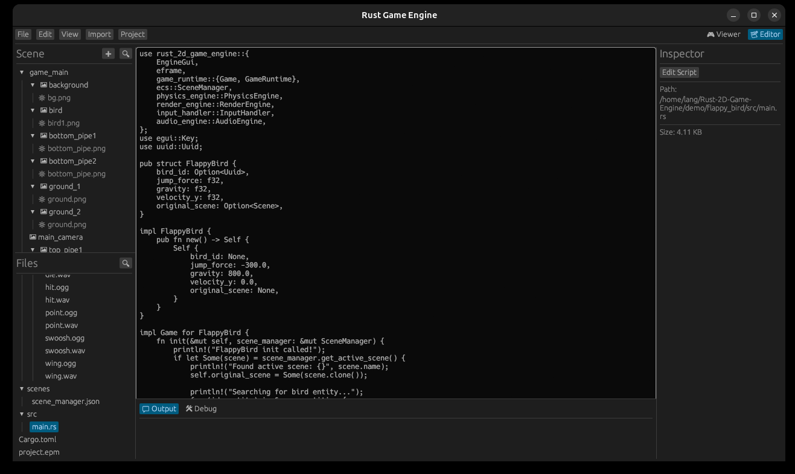

# Rust 2D Game Engine

A lightweight 2D game engine with a built-in editor, written in Rust. Scenes, entities and attributes are edited visually; game logic is written in Lua; physics is powered by rapier2d. Projects build into standalone native executables.



> Originally built as a university course project (see the [archived final report](docs/course_report.md) and [video demo](docs/course_report.md#video-demo)); now under active development to finish what we started.

## Features

| Area | What you get |
|---|---|
| Editor | Scene hierarchy, inspector, asset browser, Lua code editor, viewport click-to-select and drag-to-move, undo/redo (Ctrl+Z/Y), play/pause/reset preview, debug overlay, console |
| ECS | Scene → Entity → typed attributes data model, serialized to JSON with the project |
| Physics | rapier2d bodies/colliders auto-built from entity attributes, custom gravity fields, collision queries |
| Scripting | Lua 5.4 (mlua): per-entity `update()` scripts, hot reload while playing, safe engine bindings |
| Rendering | egui-painter sprite renderer with camera pan/zoom, texture caching, z-ordering |
| Audio | Sound playback + caching (rodio); degrades gracefully on machines without audio devices |
| Projects | New/open/save projects, asset import, one-click `cargo build` of a standalone game |

## Getting started

```bash
# Linux (Debian/Ubuntu) build dependencies
sudo apt-get install -y build-essential pkg-config libasound2-dev \
  libx11-dev libxi-dev libxcursor-dev libxrandr-dev \
  libxkbcommon-dev libgl1-mesa-dev libwayland-dev

cargo run
```

- **WSLg note:** the Wayland session can occasionally drop the connection (`Broken pipe`) on long sessions — a WSLg quirk. For stability, run through X11: `WAYLAND_DISPLAY= cargo run`
- macOS/Windows: `cargo run` (no extra system packages needed)

Try the bundled Flappy Bird demo in [`demo/flappy_bird/`](demo/flappy_bird/) — open it via `File → Open Project` (note: its asset paths are currently machine-specific; portability fixes are in progress).

## Documentation

Per-module design docs live in [`docs/`](docs/README.md):
[ECS](docs/ecs.md) ·
[Physics](docs/physics_engine.md) ·
[Rendering](docs/render_engine.md) ·
[Lua scripting](docs/lua_scripting.md) ·
[Game runtime](docs/game_runtime.md) ·
[Audio](docs/audio_engine.md) ·
[Input](docs/input_handler.md) ·
[Projects](docs/project_manager.md) ·
[Logger](docs/logger.md)

## Development

```bash
cargo test          # run the test suite
cargo clippy        # lints (warning burn-down in progress)
```

CI builds and tests every push/PR (`.github/workflows/ci.yml`); tagged releases build via `release.yml`.

## Status

The engine is functional but under heavy renovation. Recent work: critical physics/runtime bug fixes, a rewritten Lua scripting core (persistent VM, memory-safe bindings), GPU texture caching, and this documentation split. See the docs' "Known limitations" sections for what's still rough.

## License & credits

Originally built by [Lang Sun](https://github.com/gh0stintheshe11), [Feiyang Fan](https://github.com/feiyangfan) and [Frank Chen](https://github.com/frankjc2022) — see the [archived report](docs/course_report.md#contributions) for the original contribution breakdown.
