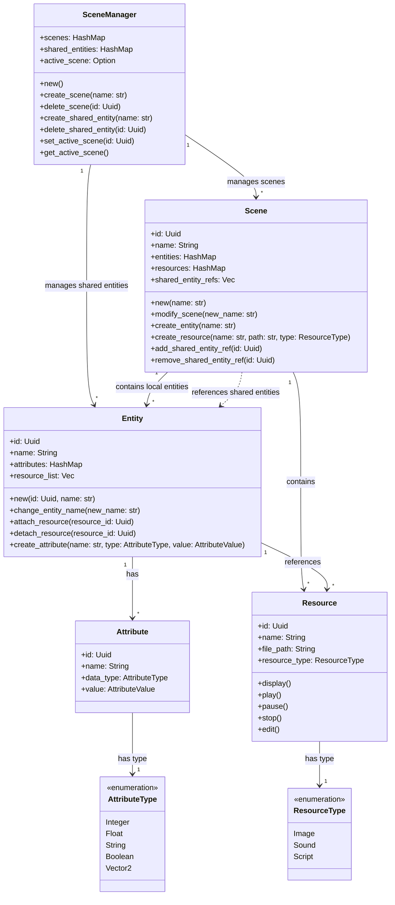

# Rust 2D Game Engine: Final Report

## Team Members

- [Lang Sun - 1003584971 ](https://github.com/gh0stintheshe11)
- [Feiyang Fan - 1005146913 - feiyang.fan@mail.utoronto.ca](https://github.com/feiyangfan)
- [Jie Peng(Frank) Chen - 997532861 - jp.chen@mail.utoronto.ca](https://github.com/frankjc2022)

## Motivation

As a team of passionate gamers and designers, we understand the transformative power of a dedicated game engine. All three of the members in the team enjoy playing game and game design, which is our motivation to create a tool that strikes the perfect balance between simplicity and powerful features, empowering indie developers and small studios to bring their creative visions to life without being overwhelmed by unnecessary complexity.

Rust's strong performance and memory safety make it ideal for building high-efficiency applications like game engines. However, despite the growing ecosystem, the Rust community currently lacks a game engine explicitly tailored for 2D game development. While general-purpose engines like Bevy and Amethyst offer impressive functionality, their dual focus on 2D and 3D game development introduces a layer of complexity and overhead that can feel unnecessary and daunting for developers focused exclusively on 2D games.

Our project is an opportunity to address this gap while immersing ourselves in a deeply satisfying and enjoyable development process. Building a 2D game engine allows us to combine our passion for game design, Rust, and systems programming. The challenge of creating something lightweight yet robust, simple yet feature-rich, sparks our creativity and pushes our technical expertise. Knowing we might be enabling indie creators to focus on their visions without being bogged down by unnecessary complexity also brings us joy.

This engine is designed to be a "dummy-can-use" tool—intuitive enough for beginners to dive into game development while still providing advanced capabilities for experienced developers. By focusing solely on 2D, we eliminate the bloat and confusion that often come with multi-purpose engines, ensuring that every feature and optimization serves the unique needs of 2D game creators.

## Objective

The primary objective of our Rust 2D Game Engine project is to create a lightweight, cross-platform engine that empowers developers to build 2D games with simplicity and efficiency. By focusing on modularity, performance, and an indie developer-friendly approach, the engine aims to provide an accessible and robust foundation for game development.

Our project emphasize:

- Designing a user-friendly engine that lowers the barrier to entry for beginner game developers while supporting advanced use cases for experienced developers.

- Leveraging Rust's strengths in memory safety and high performance to ensure the engine is optimized for a wide range of 2D game projects, from small prototypes to larger, more complex games.

- Providing a flexible, modular architecture that allows developers to pick and integrate only the components they need, ensuring adaptability to different project requirements.

- Ensuring that games built with the engine can run seamlessly across multiple platforms, including desktop, web, and mobile environments.

- Streamlining the game development process by enabling rapid iteration and experimentation through intuitive tools, a Lua scripting system, and visual interfaces.

## Features

### [Rendering Engine](/src/render_engine.rs)

_The Rendering Engine is a crucial component of our 2D game engine, responsible for handling all graphical output. It utilizes [`wgpu`](https://github.com/gfx-rs/wgpu), a cross-platform, safe, and modern graphics API, to provide efficient and flexible rendering capabilities._

#### Core Components Overview


#### Setting up a Basic Scene

```rust
// Initialize engine
let mut render_engine = RenderEngine::new();

// Set up camera
render_engine.camera.move_by(0.0, 0.0);  // Center camera
render_engine.camera.zoom_by(1.0);       // Default zoom

// Load and position a sprite
let sprite_id = render_engine.load_texture(&player_resource)?;
let transform = Transform::new()
    .with_position(100.0, 100.0)
    .with_uniform_scale(1.0);
```

#### Camera System

The camera system provides viewport control with:

- Pan/move functionality
- Zoom control (0.1x to 10.0x)
- World-to-screen coordinate conversion

```rust
// Smooth camera follow
let player_pos = player.get_position();
camera.move_by(
    (player_pos.0 - camera.position.0) * 0.1,  // Smooth X follow
    (player_pos.1 - camera.position.1) * 0.1   // Smooth Y follow
);

// Zoom to fit scene
camera.zoom_by(0.8);  // Zoom out
camera.zoom_by(1.2);  // Zoom in
```

#### Transform System

Handles object positioning and manipulation:

- Position (x, y coordinates)
- Rotation (in radians)
- Scale (width, height multipliers)

```rust
// Create and modify transform
let mut transform = Transform::new()
    .with_position(100.0, 100.0)
    .with_rotation(0.0)
    .with_scale(1.0, 1.0);

// Scale sprite without modifying original image
transform.scale = (0.5, 0.5);  // Half size
transform.scale = (2.0, 2.0);  // Double size

// Rotate sprite
transform.rotation = std::f32::consts::PI * 0.5;  // 90 degrees
```

#### Layer System

Manages rendering order with four predefined layers:

- Background (0)
- Game (1)
- UI (2)
- Debug (3)

```rust
// Create entities in different layers
let background = Entity::new()
    .with_sprite(background_texture)
    .with_layer(RenderLayer::Background);

let player = Entity::new()
    .with_sprite(player_texture)
    .with_layer(RenderLayer::Game);

let health_bar = Entity::new()
    .with_sprite(ui_texture)
    .with_layer(RenderLayer::UI);
```

#### Texture Management

- Supports PNG and JPEG formats
- Maintains original dimensions and aspect ratios
- Efficient texture data storage and retrieval

#### Animation Support

Optional animation system with:

- Frame-based animation
- Playback controls (play/pause/stop)
- Looping options
- Variable playback speed
- Frame selection

```rust
// Create and control animation
let mut player_animation = Animation::new(walk_frames, 1.0/12.0);  // 12 FPS

// Basic controls
player_animation.play();      // Start playing
player_animation.pause();     // Pause at current frame
player_animation.stop();      // Stop and reset to first frame

// Advanced controls
player_animation.set_looping(true);   // Loop animation
player_animation.set_speed(2.0);      // Play at double speed
player_animation.set_frame(3);        // Jump to specific frame
```

### [Physics Engine](/src/physics_engine.rs)

_A robust 2D physics simulation system built on the [rapier2d](https://crates.io/crates/rapier2d) library, delivering realistic and responsive environmental interactions._

- Gravity simulation

- Integrates advanced physics calculations with support for collision detection, response, and physical simulations.

- Offers rigid body dynamics, including dynamic and static body creation with customizable physical properties like mass, friction, and restitution.

- Supports diverse collider geometries (spherical, cuboid, capsule) to accommodate varied game design requirements, from simple arcade-style to more intricate physics scenarios.

#### Implementation Details

The `PhysicsEngine` struct encapsulates all necessary components for physics simulation:

- `PhysicsPipeline`: Manages the overall physics simulation process
- `RigidBodySet` and `ColliderSet`: Store rigid bodies and their colliders
- `IslandManager`, `BroadPhase`, and `NarrowPhase`: Handle collision detection
- `ImpulseJointSet` and `MultibodyJointSet`: Manage object constraints
- `CCDSolver`: Handles continuous collision detection
- `QueryPipeline`: Allows for spatial queries

Key methods include:

- `new()`: Initializes the physics engine with default settings
- `step()`: Advances the physics simulation by one time step
- `add_rigid_body()`: Adds a new rigid body to the simulation
- `handle_collisions()`: Detects and processes collisions between objects

#### Unit Tests

The test suite in [`physics_engine_test.rs`](tests/physics_engine_test.rs) verifies various aspects of the physics simulation:

1. **Initialization** - `test_initialization`:

   - Checks correct gravity setting and empty initial state

2. **Rigid Body Addition**:

   - `test_add_dynamic_rigid_body_with_collider`: Verifies dynamic body creation
   - `test_add_static_rigid_body_with_collider`: Checks static body creation
   - `test_add_invalid_rigid_body`: Ensures invalid bodies are not added

3. **Gravity Simulation** - `test_simulation_under_gravity`:

   - Confirms objects fall under gravity

4. **Collision Detection** - `test_collision_detection`:

   - Verifies collisions between dynamic and static bodies

5. **Multiple Body Simulation** - `test_multiple_bodies_falling`:

   - Tests behavior of multiple dynamic bodies

6. **Collider Shapes** - `test_different_collider_shapes`:

   - Checks various collider shapes (ball, cuboid, capsule)

7. **Custom Properties** - `test_rigid_body_with_custom_properties`:

   - Tests bodies with custom mass and restitution

8. **Collision Events** - `test_collision_events`:
   - Ensures collision events are properly detected and reported

#### Usage

See [Physics Engine Usage](#physics-engine-usage) in [Users Guide](#users-guide).

### [Entity Component System (ECS)](/src/ecs.rs)

_The Entity Component System (ECS) is the core architecture of our game engine, providing a flexible and efficient way to create and manage game objects. It follows a composition-over-inheritance pattern, making it easy to create complex game objects without deep inheritance hierarchies._

#### System Overview



ECS implementation consists of four main parts:

1. **Scene Manager**

   - Top-level controller managing multiple scenes and shared entities
   - Handles scene creation, deletion, and switching
   - Maintains shared entities accessible across scenes
   - Tracks active scene for easy access
   - Example: Managing different levels, menus, or game states

2. **Scene**

   - Container for entities, resources, and shared entity references
   - Manages the game world state
   - Can reference shared entities from the scene manager
   - Example: A game level containing players, enemies, and items

3. **Entity**

   - Can be either scene-specific or shared across scenes
   - Holds attributes and resource references
   - Can represent anything from players to UI elements
   - Example: A player character with position, health, and sprite

4. **Components**
   - **Attributes**: Data components (position, health, speed)
   - **Resources**: External assets (images, sounds, scripts)

#### Key Features

##### 1. Hierarchical Structure

```
SceneManager
├── Shared Entities
│   └── Entity 1 (e.g., "GlobalPlayer")
│       ├── Attributes
│       └── Resources
└── Scenes
    └── Scene 1 (e.g., "Level1")
        ├── Local Entities
        │   └── Entity 2 (e.g., "Enemy")
        ├── Resources
        └── Shared Entity References
```

##### 2. Flexible Component System

- **Attributes**: Store entity-specific data

  ```rust
  // Position component
  entity.create_attribute("position", AttributeType::Vector2, Vector2(0.0, 0.0));

  // Health component
  entity.create_attribute("health", AttributeType::Integer, Integer(100));
  ```

##### 3. Resource Management

- **Centralized Resource Handling**: Resources are managed at the scene level
- **Reference System**: Entities reference resources by ID
- **Type Safety**: Resources are typed (Image, Sound, Script)
  ```rust
  // Create and reference a resource
  let texture_id = scene.create_resource("player", "player.png", ResourceType::Image);
  player.attach_resource(texture_id);
  ```

#### Usage

See [Creating a Player Character](#creating-a-player-character-with-ecs), [Creating and Using Shared Entities](#creating-and-using-shared-entities-with-ecs), and [Creating an Interactive Object](#creating-an-interactive-object-with-ecs) in [Users Guide](#users-guide)

#### Best Practices and Tips

1. **Entity Design**

   - Use shared entities for objects that persist across scenes
   - Keep scene-specific entities local to their scenes
   - Use meaningful names for entities and attributes

2. **Resource Management**

   - Share resources between entities when possible
   - Clean up unused resources
   - Use appropriate resource types

3. **Scene Organization**
   - Divide complex games into multiple scenes
   - Use scene transitions for level management
   - Keep scene hierarchies clean and logical

### [Script Interpreter](/src/script_interpreter.rs)

_The Script Interpreter is a crucial component of our 2D game engine, enabling the integration of `lua` scripting capabilities, which is a simple and popular choice in the game industry. It utilizes [rlua](https://github.com/Kampfkarren/rlua), a high-level Lua binding for Rust, to provide a seamless interface between Rust and Lua._

#### Features

- Run Lua scripts within the Rust environment
- Pass data between Rust and Lua
- Execute complex Lua scripts for game logic
- Handle Lua errors gracefully

#### Implementation Details

The core of the script interpreter is the [`run_lua_script`](/src/script_interpreter.rs#L4) function in [`script_interpreter.rs`](/src/script_interpreter.rs), which initializes a new Lua context and executes the provided Lua script.

#### Unit Tests

The test suite in [`script_interpreter_test.rs`](tests/script_interpreter_test.rs) verifies various aspects of the Lua integration:

1. **Simple Script Execution** - `test_run_simple_script` :

   - Runs a basic Lua script that performs addition, ensuring basic Lua scripts can be executed without errors.

2. **Error Handling** - `test_run_script_with_error`:

   - Verifies that Lua handles undefined variables correctly by treating them as `nil`.

3. **Math Operations** - `test_lua_math_operations`:

   - Verifies complex mathematical operations can be performed accurately in Lua.

4. **Data Passing (Rust to Lua)** - `test_pass_data_to_lua`:

   - Demonstrates passing data from Rust to Lua.

5. **Data Returning (Lua to Rust)** - `test_return_data_from_lua`:

   - Shows how to call Lua functions from Rust and retrieve results.

6. **Complex Script Execution** - `test_complex_script`:

   - Tests a more complex script involving object manipulation and function definitions.

7. **Error Handling in Lua** - `test_handle_error_in_lua_script`:

   - Verifies Lua's behavior with potential runtime errors, such as division by zero.

#### Usage

See [Script Interpreter for Game Logic](#script-interpreter-for-game-logic) in [Users Guide](#users-guide).

### [Audio Engine](/src/audio_engine.rs)

_The Audio Engine is a crucial component of our 2D game engine, responsible for handling sound playback. It utilizes [rodio](https://github.com/RustAudio/rodio), a pure Rust audio playback library, to manage audio streams and control sound output._

#### Features

- Simple audio playback from file
- Pause and resume functionality
- Ability to check if audio is currently playing

#### Implementation Details

The `AudioEngine` struct is the core of our audio system. It contains:

- An `OutputStream` for audio output
- An `OutputStreamHandle` for creating new sounds
- A `Sink` for controlling audio playback

Key methods include:

- `new()`: Initializes the audio engine with default output stream and sink.
- `play_sound(file_path: &str)`: Loads and plays an audio file from the given path.
- `is_playing()`: Checks if audio is currently playing.
- `pause()`: Pauses the current audio playback.
- `resume()`: Resumes paused audio playback.

The engine uses `BufReader` and `Decoder` from the `rodio` crate to efficiently read and decode audio files.

#### Error Handling

The `play_sound` method returns a `Result`, allowing for graceful error handling if the file is not found or cannot be decoded.

#### Unit Tests

The unit tests ([`audio_engine_test.rs`](tests/audio_engine_test.rs)) thoroughly verify the functionality of the `AudioEngine`:

1. **Initialization Test**:

   - Ensures the audio engine initializes correctly with an empty sink.

2. **Play Sound Test**:

   - Verifies that a sound file can be successfully loaded and played.
   - Checks that the engine correctly reports when audio is playing.
   - Confirms that the audio stops playing when explicitly stopped.

3. **Is Playing Test**:
   - Checks the initial state (not playing).
   - Verifies correct state after playing a sound.
   - Tests pause functionality and ensures the engine reports correct state.
   - Checks resume functionality.
   - Verifies correct state after stopping the audio.

These tests use a constant `TEST_AUDIO_FILE` path, which should point to a valid audio file in the test environment.

#### Usage

See [Game Audio](#game-audio) in [Users Guide](#users-guide).

### [Input Handling](/src/input_handler.rs)

_A responsive, platform-agnostic input management system that ensures smooth and intuitive player interactions._

- Built with the [winit](https://crates.io/crates/winit) crate to provide device support, handling inputs from keyboards, mice, touchscreens, and game controllers.

- Implements advanced input mapping and processing with low latency, supporting complex input combinations and gestures.

- Offers configurable input schemes and easy integration with the ECS for flexible control mechanisms.

### [Project Manager](/src/project_manager.rs)

_The Project Manager handles game project creation, loading, saving, building, and asset importing. It provides a structured way to manage game projects and their assets._

#### Project Structure

```
game_project/
├── assets/
│   ├── images/    # PNG, JPG, JPEG, GIF
│   ├── sounds/    # WAV, MP3, OGG
│   ├── fonts/     # TTF, OTF
│   └── scripts/   # LUA scripts
├── scenes/        # Scene data files
├── src/          # Rust source files
│   └── main.rs
├── Cargo.toml
└── project.json
```

#### Core Features


#### Usage

See [Project Manager Usage](#project-manager-usage) in [Users Guide](#users-guide).

#### Supported Asset Types

##### Images

- Formats: PNG, JPG, JPEG, GIF
- Directory: `assets/images/`

##### Sounds

- Formats: WAV, MP3, OGG
- Directory: `assets/sounds/`

##### Fonts

- Formats: TTF, OTF
- Directory: `assets/fonts/`

##### Scripts

- Formats: LUA
- Directory: `assets/scripts/`

#### Technical Details

##### Project Metadata

Stores essential project information in `project.json`:

- Project name
- Version
- Project path
- Default scene
- Active scene ID (UUID)

##### Scene Management

- Serializes scene hierarchy to `scenes/scene_manager.json`
- Tracks active scene across sessions
- Maintains scene relationships and shared entities

##### Asset Management

- Automatic file type validation
- Duplicate file detection
- Organized asset directory structure
- Clear error messages for invalid imports

##### Build Process

- Compiles Rust code with `cargo build --release`
- Copies assets to target directory
- Creates a ready-to-run game executable

#### Best Practices

1. **Asset Organization**

   - Use appropriate file formats for each asset type
   - Keep assets in their designated directories
   - Avoid duplicate file names

2. **Project Structure**

   - Maintain clean directory hierarchy
   - Follow the recommended file organization
   - Handle asset import errors gracefully

3. **Scene Management**
   - Save scene changes frequently
   - Use meaningful scene names
   - Track active scene properly

### Engine GUI

_An intuitive, real-time development interface powered by [egui](https://crates.io/crates/egui), transforming game development into a more interactive and efficient process._

- Offers a context-aware inspector for real-time modification of game components, entities, and system parameters.

- Enables live debugging, performance profiling, and immediate visual feedback without interrupting the development workflow.

- Provides customizable views and layouts, allowing developers to tailor the interface to their specific project needs and preferences.

#### Menu

- Project Management:
  - Create, load, and work with projects.
  - Automatic saving
- Customization Options:
  - Dark Mode
  - Show or hide panels
  - Debug Overlay
- File Import
- Editor Switching

#### Scene

- Scene Organization:
  - Add Scenes, Entities, Resources, and preset attributes like cameras or physics.
  - Entity/Resource addition
- Context Menu Management:
  - Right-click Scenes to rename, delete, or manage attached resources.
  - Ensure resources are not attached to any entity before deletion; otherwise, deletion is restricted.
  - Right-click Entities to attach/detach multiple resources or rename them.
  - Right-click Resources to detach or rename them.
- Resource Highlights:
  - Selecting a resource highlights all instances with the same ID across the project.
- Tree Structure:
  - Organize and view items in a collapsible tree format, sorted alphabetically.
- Filter entities by name for quick navigation.
- Clicking any Scene, Entity, or Resource displays its details in the Inspector Panel.

#### File Panel

- File Navigation:
  - View all files within the project folder in a collapsible tree structure, sorted alphabetically.
  - Select any file to view its details in the Inspector Panel.
- Context Menu Actions:
  - Right-click files to delete them.
- Filtering:
  - Quickly filter files by name to locate specific items.

#### Inspector Panel

- Entity Customization:
  - Modify entity data or add new attributes directly.
- Resource Management:
  - Link resources to specific files seamlessly.

### Comprehensive Unit Testing

_A rigorous testing framework ensuring the reliability, performance, and correctness of each engine component._

- Implements an extensive test suite covering critical aspects of the game engine, with dedicated test modules for each major subsystem.

## User's Guide

### In Rust

#### Integrate our Rendering Engine in your game:

```rust
use rust_2d_game_engine::render_engine::{RenderEngine, Sprite};

// Create renderer
let mut renderer = RenderEngine::new();

// Create sprites
let sprites = vec![
    Sprite {
        position: (100.0, 100.0),
        size: (50.0, 50.0),
        rotation: 0.0,
        texture_coords: (0.0, 0.0, 1.0, 1.0),
    },
    // Add more sprites as needed
];

// In the game loop
renderer.render_frame(&sprites).expect("Failed to render frame");
```

#### Physics Engine Usage

To use the Physics Engine:

1. Create an instance of `PhysicsEngine` using `PhysicsEngine::new()`.
2. Add rigid bodies to the simulation with `add_rigid_body()`.
3. Call `step()` in your game loop to advance the physics simulation.
4. Use `handle_collisions()` to detect and respond to collisions.

Example:

```rust
use rust_2d_game_engine::physics_engine::PhysicsEngine;

let mut physics_engine = PhysicsEngine::new();

// Add a dynamic body
physics_engine.add_rigid_body([0.0, 5.0], true);

// In the game loop
physics_engine.step();
physics_engine.handle_collisions();
```

#### Creating and Using Shared Entities with ECS

```rust
// Create a shared entity in the scene manager
let player_id = scene_manager.create_shared_entity("Player");

// Reference the shared entity in a scene
scene.add_shared_entity_ref(player_id);

// Access the shared entity through the scene
if let Some(player) = scene.get_shared_entity_ref(scene_manager, player_id) {
    // Use the shared entity
}
```

#### Creating a Player Character with ECS

```rust
// Create entity
let player_id = scene.create_entity("Player");
let player = scene.get_entity_mut(player_id).unwrap();

// Add components
player.create_attribute("position", Vector2(0.0, 0.0));
player.create_attribute("health", Integer(100));
player.create_attribute("speed", Float(5.0));

// Add resources
let sprite_id = scene.create_resource("player_sprite", "player.png", ResourceType::Image);
player.attach_resource(sprite_id);
```

#### Creating an Interactive Object with ECS

```rust
// Create a collectible item
let coin_id = scene.create_entity("Coin");
let coin = scene.get_entity_mut(coin_id).unwrap();

// Add components
coin.create_attribute("position", Vector2(100.0, 100.0));
coin.create_attribute("is_collected", Boolean(false));
coin.create_attribute("value", Integer(10));

// Add resources
let coin_sprite = scene.create_resource("coin_sprite", "coin.png", ResourceType::Image);
let collect_sound = scene.create_resource("collect_sound", "collect.wav", ResourceType::Sound);
coin.attach_resource(coin_sprite);
coin.attach_resource(collect_sound);
```

#### Script Interpreter for Game Logic

To use the Script Interpreter for game logic:

- Use `run_lua_script(script)` to execute Lua code.
- For more complex interactions, use the `rlua::Lua` context directly to set globals, call functions, or retrieve values.

Example:

```rust
use rust_2d_game_engine::script_interpreter;

let script = r#"
    function greet(name)
        return "Hello, " .. name .. "!"
    end
"#;

script_interpreter::run_lua_script(script).expect("Failed to run script");
```

Further interaction with the script can be done using `rlua` directly.

#### Game Audio

To use the `AudioEngine` for game audio:

1. Create an instance of `AudioEngine` using `AudioEngine::new()`.
2. Use `play_sound(file_path)` to play audio files.
3. Control playback with `pause()` and `resume()`.
4. Check playback status with `is_playing()`.

#### Project Manager Usage

##### Project Creation and Management

```rust
// Create a new game project
let project_path = Path::new("path/to/my_game");
ProjectManager::create_project(project_path)?;

// Load project with scene hierarchy
let (metadata, scene_manager) = ProjectManager::load_project_full(project_path)?;

// Save project with scene hierarchy
ProjectManager::save_project_full(project_path, &metadata, &scene_manager)?;
```

##### Asset Import

```rust
// Import an image
let image_path = Path::new("path/to/sprite.png");
let relative_path = ProjectManager::import_asset(
    project_path,
    image_path,
    AssetType::Image
)?;

// Import a sound
let sound_path = Path::new("path/to/effect.wav");
let relative_path = ProjectManager::import_asset(
    project_path,
    sound_path,
    AssetType::Sound
)?;
```

##### Scene Management

```rust
// Load scene hierarchy
let scene_manager = ProjectManager::load_scene_hierarchy(project_path)?;

// Make changes to scenes...

// Save scene hierarchy
ProjectManager::save_scene_hierarchy(project_path, &scene_manager)?;
```

##### Build System

```rust
// Build the project
ProjectManager::build_project(project_path)?;
```

### GUI

#### Create new project

To create a new project, click on `File`->`New Project`->enter your project name and path you wish to save it in->press `Create`.


#### Open project

To open a project, click on `File`->`Open Project`->enter your project path.

#### Save project

To save a project, click on `File`->`Save Project`->enter your project path.

#### Dark/Light mode

`View` -> `View` -> `Appearance`

#### Panel customization

`View` -> `Panels`

#### Debug overlay

`View` -> `Debug Overlay`

#### Create new scene

Top left Scene panel ->`+`-> select `Scene` -> enter name and click `Create`


#### Scene camera control
Right click and hold to move around. Middle mouse button to zoom in and out.

#### Create new entity/camera/physics

Top left Scene panel ->`+`-> select `Entity`/`Camera`/`Physics` -> enter name and click `Create` (There must be at least one scene first)


#### Create new resource(image/sound/script)


#### Import new resources(image/sound/script)


#### Edit/rename/delete entity

Right click on the entity you wish to edit.


#### Add/Edit metadatas

Select an entity/resource, then click on `Add Metadata` at the right inspector panel.
Enter name, select types, and enter value. Click on `Save`


#### Editor
At the top right corner, click on `Editor` to switch to editor view


#### Build and Run your game

`Project`->`Build Project`

## Reproducibility Guide

Run `cargo run` in the terminal at the root directory of our project if you wish to use the debug version. Otherwise, run `cargo build --release` and execute the generated `target/release/rust-2d-game-engine` executable.

## Contributions

**Lang Sun**:

- [Rendering Engine](#rendering-engine)
- [Physics Engine](#physics-engine)
- [Input Handling](#input-handling)

**Feiyang Fan**:

- [Entity Component System (ECS)](#ecs)
- [Audio Engine](#audio-engine)

**Frank Chen**:

- [Script Interpreter](#script-interpreter)
- [Game Project File Management](#game-project-file-management)
- [Engine GUI](#engine-gui)

## Lessons Learned and Concluding Remarks

### Lesson One: The Importance of Testing Suite

- Our extensive unit testing framework revealed critical insights into engine reliability and performance.
- We learned that thorough testing across different scenarios is crucial for creating a robust game development tool.
- The test suite not only caught potential issues but also served as a living documentation of the engine's capabilities.

### Lesson Two: Collaboration

- The project was as much about technical development as it was about team collaboration and shared passion.
- We discovered the power of combining individual skills towards a common, innovative goal.
- The journey of creating the engine was as valuable as the end product itself.

### Lesson Three: Modularity

- Our modular approach to the engine's architecture proved critical in maintaining flexibility and extensibility.
- We learned that well-designed, loosely coupled components allow for easier maintenance, testing, and future enhancements.

### Concluding Remarks

Our Rust 2D Game Engine represents a promising first step into the world of specialized game development tools in Rust. While currently in its early prototype stage, the project has already demonstrated some good potential in addressing the unique needs of 2D game developers within the Rust ecosystem.

We have successfully laid a robust foundation, implementing core systems like the rendering engine, physics simulation, entity component system, and scripting support. The modular architecture and focus on performance and usability set the groundwork for a tool that could genuinely empower indie developers and small studios.

However, we recognize that this is just the beginning of our journey. The current iteration, while functional, is a proof of concept that requires continued refinement, expansion, and community feedback. Our roadmap includes:

- Expanding the feature set to support more complex game development scenarios
- Improving documentation and developer tools
- Increasing cross-platform compatibility
- Continuously optimizing performance and reliability

We are excited about the potential of this project and view it as an evolving platform. Our passion for game development, Rust, and creating accessible tools drives us to continue improving and expanding the engine.
