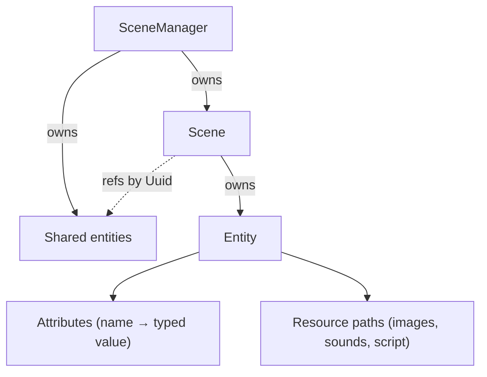

# ECS (`src/ecs/`)

The engine's data model. Despite the name, this is **not** an archetype/columnar ECS — there are no component tables, systems, or queries. It is a serializable containment hierarchy: a `SceneManager` owns `Scene`s, a `Scene` owns `Entity`s, and an `Entity` is a bag of named, typed `Attribute`s plus lists of resource file paths (images, sounds, one script). Everything derives `Serialize`/`Deserialize`, so the whole `SceneManager` round-trips to `scenes/scene_manager.json` via `project_manager`. `IndexMap` is used throughout for deterministic iteration/serialization order.

## Key types

| Type | Responsibility |
|---|---|
| `SceneManager` | Owns all scenes and cross-scene *shared entities*; tracks the active scene |
| `Scene` | Owns local entities and a list of shared-entity refs; auto-creates a `main_camera` entity on construction and tracks it as `default_camera` |
| `Entity` | `id`, `name`, `attributes: IndexMap<Uuid, Attribute>`, plus `images: Vec<PathBuf>`, `sounds: Vec<PathBuf>`, `script: Option<PathBuf>` |
| `Attribute` | `{id, name, data_type: AttributeType, value: AttributeValue}` |
| `AttributeType` / `AttributeValue` | `Integer(i32)`, `Float(f32)`, `String`, `Boolean(bool)`, `Vector2(f32, f32)` |
| `PhysicsProperties` | Plain config struct consumed by `Entity::new_physical` to seed physics attributes. Defaults: `is_movable=false`, `affected_by_gravity=false`, `creates_gravity=false`, `has_collision=true`, `friction=0.5`, `restitution=0.0`, `density=1.0`, `can_rotate=false` |

There is no separate camera or physics entity *type* — specialization is by convention, via attributes:

- Every entity gets protected `x`/`y`/`z` Float attributes at creation (`Entity::new`).
- `Entity::new_camera` adds `width` (800), `height` (600), `zoom` (1.0), `rotation` (0.0), `is_camera` (true).
- `Entity::new_physical` sets the position and adds `is_movable`, `has_gravity`, `creates_gravity`, `has_collision`, `friction`, `restitution`, `density`, `can_rotate`. Note: it does **not** create a `position` Vector2 attribute — only `x`/`y`/`z`.



## Interactions with other modules

- **`game_runtime`** owns the live `SceneManager`, clones it as a dev-state snapshot on play, restores it on stop.
- **`physics_engine`** reads attributes by *name* (`has_gravity`, `friction`, …) to build bodies, and returns `(entity_id, attr_id, AttributeValue)` updates that the runtime applies via `Scene::update_entity_attributes`.
- **`render_engine`** reads `x`/`y`/`z` and `images` to draw.
- **`audio_engine`** reads `Entity::sounds` paths.
- **`lua_scripting`** creates/removes entities and attributes through `SceneManager` bindings.
- **`project_manager`** serializes/deserializes the whole `SceneManager` to JSON and rewrites resource paths on load.

## Public API overview

- **`SceneManager`** — scene CRUD (`create_scene`, `delete_scene`, `list_scene`, `get_scene[_mut]`, `get_scene_by_name`), shared-entity CRUD (same pattern), active-scene management (`set_active_scene`, `get_active_scene[_mut]`, `clear_active_scene`). Deleting the active scene or a still-referenced shared entity is refused.
- **`Scene`** — entity CRUD (`create_entity`, `delete_entity`, `list_entity`, `get_entity[_mut]`), specialized constructors (`create_camera`, `create_physical_entity`), shared-entity refs (`add/remove/list_shared_entity_ref`, `get_shared_entity_ref[_mut]` resolved through the `SceneManager`), `get_all_entities` (local + shared), batch attribute writes (`update_entity_attribute[s]`). Deleting the default camera is refused.
- **`Entity`** — resource management (`add/remove/has/list/get` for images and sounds; `set/remove/has/get_script` — one script max), attribute CRUD (`create_attribute`, `delete_attribute`, `modify_attribute`, `get_attribute[_mut]`, `get_attribute_by_name`, `list_attribute`), position helpers (`get/set_x/y/z`, `get/set_position`), camera helpers (`get/set_camera_width/height/zoom/rotation`, `set_camera_size`, `is_camera`).

### Usage example (verified against source)

```rust
let mut scene_manager = SceneManager::new();
let level_id = scene_manager.create_scene("Level_1")?;
let scene = scene_manager.get_scene_mut(level_id).ok_or("scene not found")?;

let player_id = scene.create_physical_entity(
    "Player",
    (100.0, 100.0, 0.0),
    PhysicsProperties { is_movable: true, affected_by_gravity: true, ..Default::default() },
)?;

let player = scene.get_entity_mut(player_id)?;
player.add_image(PathBuf::from("assets/images/player.png"))?;
player.add_sound(PathBuf::from("assets/sounds/jump.wav"))?;
player.set_script(PathBuf::from("assets/scripts/player.lua"))?;
```

Shared entities (e.g. a HUD used by several scenes):

```rust
let hud_id = scene_manager.create_shared_entity("HealthBar")?;
scene_manager.get_scene_mut(level_id).unwrap().add_shared_entity_ref(hud_id)?;
// later: scene.get_all_entities(&scene_manager) yields local + shared entities
```

## Known limitations / TODO

- **Attribute-map, not ECS.** No systems, no queries, no cache-friendly storage. Fine at current scale, misleading name.
- **O(n) string lookups everywhere.** `get_attribute_by_name` linearly scans the attribute map; `get_x`/`get_y` etc. do this on every call, and the physics step does it per entity per frame.
- **No type validation.** `create_attribute` doesn't check that `value` matches `data_type`, and `modify_attribute` can swap the value to a different variant while `data_type` goes stale. Only `is_camera` is guarded against modification.
- **Silently dropped errors.** `set_x`/`set_y`/`set_z` and the camera setters ignore the `Result` of `modify_attribute`.
- **Name-based attribute protection is fragile.** Physics/camera attributes are only protected from deletion if the entity's *name* contains `"physical"`/`"camera"` (`delete_attribute`); rename the entity and the protection vanishes.
- **`get_x/y/z` return `0.0` on any failure** — missing attribute is indistinguishable from an actual 0.
- **`set_script` errors if a script already exists**; callers must `remove_script` first (asymmetric with `add_image`, which appends).
- **`rayon` is imported but unused** in this module — the old report's "parallel processing via Rayon" claim is aspirational.
- **No `Resource` type** (the old report's class diagrams show one). Resource paths are plain fields; nothing validates that files exist, and paths get rewritten to absolute at project load (see `project_manager` doc).
- Shared-entity refs can dangle if the shared map is mutated directly; `get_all_entities` silently skips unresolvable refs.
