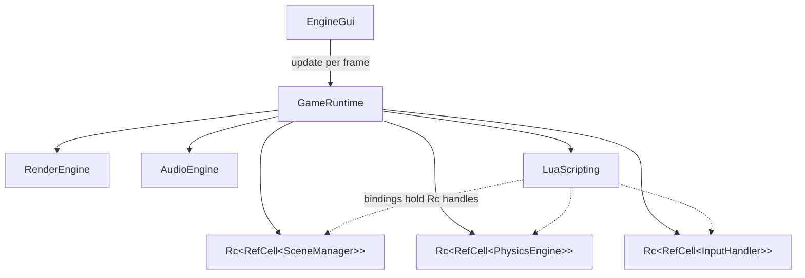

# Game Runtime (`src/game_runtime/`)

Owns play-mode: the state machine (Playing / Paused / Stopped), the per-frame game loop, and the plumbing between ECS, physics, Lua, audio and rendering. Driven by egui's repaint loop — `EngineGui` calls `GameRuntime::update(ctx, ui, viewport_rect)` every frame the viewer is open.

## Ownership

`SceneManager`, `PhysicsEngine` and `InputHandler` are held as `Rc<RefCell<...>>` because Lua bindings keep handles to them (see [lua_scripting.md](lua_scripting.md)). `RenderEngine` and `AudioEngine` are plain fields — scripts don't touch them.

## State machine

| Transition | What happens |
|---|---|
| ▶ Play (`run()`) | Native `Game::init` (if set) → ensure an active scene → `physics.cleanup()` + `load_scene` (fresh world, no leaked bodies) → `lua.start_session(...)` → Playing. A **dev snapshot** of the scene manager is taken on the first Play |
| ⏸ Pause | Stops simulation; the scene keeps rendering (velocities and physics world are preserved) |
| ▶ Resume | Just unpauses — nothing is reloaded |
| ⏹ Stop / Reset | Physics/render/audio cleanup, scene manager restored from the dev snapshot, snapshot dropped (next Play snapshots current editor state), input context back to `EngineUI` |

## Frame order (while Playing)

1. Update render viewport + feed egui input into `InputHandler`
2. Native `Game::update` (optional Rust game hook), dt = `1/target_fps`
3. Lua: advance `accumulated_time`, refresh `keys_pressed`, run entity scripts
4. Physics: `step(scene)` → NaN-filter → write position updates back into entity attributes
5. Audio: reap finished sinks
6. Paint: build render queue, draw sprites (cached GPU textures, viewport-clipped UVs), then collider debug wireframes

Script errors and physics write-back failures are logged to the editor console (`LOGGER`) — they never panic the editor.

## Known limitations / TODO

- Frame rate is tied to the display refresh (`ctx.request_repaint()`), and dt is a fixed `1/target_fps` rather than measured; there's no fixed-timestep accumulator, so simulation speed follows the monitor's refresh rate.
- Collider debug wireframes are always drawn — no toggle.
- Shared entities (`SceneManager::shared_entities`) never reach physics or scripting; only `scene.entities` do.
- The `Game` trait (native Rust game hook) is unused by the editor flow and untested.
- `target_fps` only affects dt, not actual pacing.
