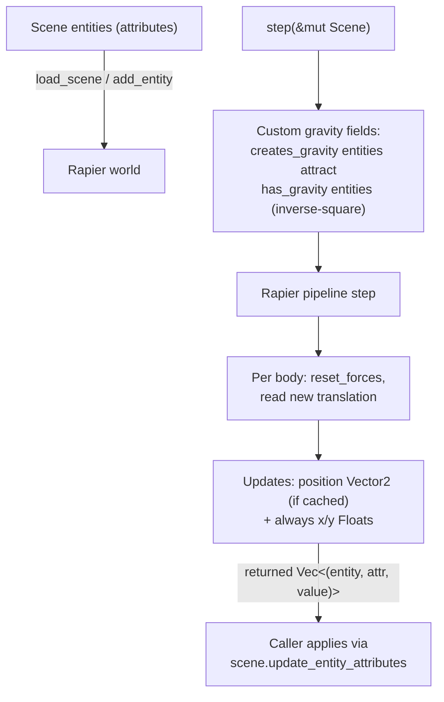

# Physics Engine (`src/physics_engine/`)

A wrapper around [rapier2d](https://crates.io/crates/rapier2d) that mirrors scene entities into a physics world (rigid bodies + colliders), steps the simulation at a fixed timestep (default 60 Hz), and returns a list of attribute updates for the caller to write back into the ECS. Coordinate convention: **+Y is downward in screen space**, so the default global gravity `vector![0.0, 50.0]` pulls entities down the screen.

## Key type

`PhysicsEngine` is the only public type. Internals worth knowing:

| Field | Role |
|---|---|
| `rigid_body_set` / `collider_set` | The rapier world |
| `entity_to_body` / `entity_to_collider` | `Uuid → handle` maps linking ECS entities to rapier objects |
| `entity_position_attrs` | Cache of each entity's `position` Vector2 attribute id, for fast write-back |
| `integration_parameters`, `time_step` | Fixed dt = 1/60 by default; `length_unit: 100.0` tells rapier the world is pixel-scale so sleep/penetration tolerances are scaled correctly |
| `impulse_joint_set`, `multibody_joint_set`, `ccd_solver`, `query_pipeline` | Allocated but effectively unused ("for future") |

## Which entities participate

`add_entity(&Entity)` decides everything from **attributes read by name**:

- Skipped entirely unless the entity has at least one of `has_gravity`, `has_collision`, `creates_gravity`.
- **Idempotent**: re-adding an entity that already has a body removes the old body/collider first (no leaked duplicates on scene reload).
- Spawn position: **always the `x`/`y` Float attributes** (they exist on every entity, the editor edits them, and the renderer draws from them). The optional `position` Vector2 attribute is only synced on write-back — older scene files may carry stale values in it, which is why it is not trusted for spawning.
- Body type: kinematic (velocity-based) if `is_kinematic` — moved only via `set_velocity`, immune to gravity, forces and pushes from dynamic bodies, and **never put to sleep** (a sleeping kinematic body would freeze mid-motion since a constant velocity doesn't wake it); otherwise dynamic if `is_movable` (default false → fixed). `has_gravity` maps to gravity scale 1/0. Rotation locked unless `can_rotate`.
- Collider (if `has_collision`, default true): size comes from explicit `collider_width`/`collider_height` Float attributes when present, otherwise it is **inferred from the entity's first image** — the file is opened and its pixel dimensions read at add time (transparent padding inflates the hitbox). Shape comes from an explicit `collider_shape` String attribute (`"circle"`/`"rectangle"`) when present; otherwise the legacy heuristic applies: aspect ratio within 0.9–1.1 → ball of radius `width/2`, else a cuboid of half the image size. Offset by `(w/2, h/2)` so the collider spans from the entity's x/y. Fallback: ball of radius 0.5 if there's no explicit size and no loadable image. `density`, `friction`, `restitution` come from attributes (defaults 1.0 / 0.5 / 0.0).

## Per-frame flow



`step` returns `Vec<(Uuid, Uuid, AttributeValue)>` rather than mutating positions itself; `game_runtime` filters out NaN values before applying. `reset_forces` is called on every body each step so user-applied and gravity-field forces don't accumulate across frames. `cleanup()` rebuilds the entire world and clears all maps **including the position-attribute cache**.

## Interactions with other modules

- **`game_runtime`**: calls `cleanup()` + `load_scene()` when a game run starts (so repeated runs don't leak bodies), `step(scene)` every frame, and applies the returned updates. Also `cleanup()` on stop/reset.
- **`lua_scripting`**: binds `set_velocity`, `apply_force`/`apply_impulse`, `add_entity_to_physics_engine`, `remove_entity_from_physics_engine`, etc. (via raw pointers into the engine).
- **`ecs`**: source of all configuration (attributes by name) and destination of all results.
- **Editor GUI**: `get_collider_data()` supplies collider outlines (position, size, `"Circle"`/`"Rectangle"`) for debug rendering.

## Public API overview

- **Lifecycle**: `new`, `load_scene`, `add_entity`, `remove_entity`, `step`, `cleanup`
- **Tuning**: `set_time_step`/`get_time_step`, `set_min_ccd_dt`, `set_contact_parameters`, `set_joint_frequency`
- **Body control**: `get_velocity`/`set_velocity`, `apply_force`, `apply_impulse`, `get_angular_velocity`/`set_angular_velocity`, `apply_torque`
- **Queries**: `get_colliding_entities`, `get_collider_data`, `is_moving`/`is_stable`, `is_empty`, `rigid_body_count` (total bodies in the world, useful for leak detection), `has_rigid_body`, `has_collider`

### Usage example (verified against source)

```rust
let mut physics = PhysicsEngine::new();
physics.load_scene(scene);              // adds every qualifying entity

// per frame:
let updates = physics.step(scene_mut);  // simulate + collect position updates
scene_mut.update_entity_attributes(updates)?;

// gameplay:
physics.set_velocity(&entity_id, vector![10.0, 0.0]);
physics.apply_impulse(&entity_id, vector![0.0, -30.0]); // -Y is up
let touching = physics.get_colliding_entities(&entity_id);
```

(The old report's `add_rigid_body([0.0, 5.0], true)` / `handle_collisions()` API does not exist.)

## Known limitations / TODO

- **Colliders are inferred from sprite pixel dimensions.** Physics units are pixels; `image::open` runs synchronously inside `add_entity` for every entity; there is no way to choose a shape or size explicitly, and sprite scale/rotation is ignored. The `(w/2, h/2)` collider offset assumes a top-left sprite origin.
- **No collision events.** `get_colliding_entities` polls narrow-phase contact pairs and maps handles back to entities with a linear scan — O(n) per contact, and easy to miss short-lived contacts between polls.
- **Custom gravity fields are O(n²)** over scene entities per step, with string attribute lookups inside the loop; gravity *sources* must have a `position` Vector2 attribute — entities with only `x`/`y` are silently skipped as sources.
- **String lookups per body per frame**: write-back does `get_attribute_by_name("x")`/`("y")` for every body every step (see ECS doc for why that's O(n)).
- **Global gravity is hardcoded** at construction (`0, 50`); there is no setter.
- **Joints, CCD tuning, and spatial queries are stubs** — the sets/pipelines exist but nothing uses them; no raycasts are exposed.
- `load_scene` only adds a scene's *local* entities; shared entities are not considered.
