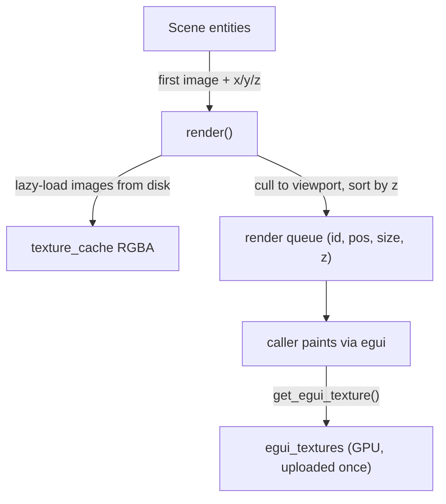

# Render Engine (`src/render_engine/`)

CPU-side scene renderer built on the **egui painter** — there is no wgpu/GPU pipeline. `render(scene)` produces a z-sorted queue of `(texture_id, screen_pos, screen_size, z)` entries; the actual drawing is done by callers (`GameRuntime::paint_scene` for play mode, `EngineGui::render_scene` for the editor viewport) via `ui.painter().image(...)`.

## Key pieces

| Type | Responsibility |
|---|---|
| `Camera` | Pan/zoom; `world_to_screen` maps world coords into the viewport |
| `TextureInfo` | Decoded RGBA bytes + dimensions, cached in `texture_cache: HashMap<Uuid, TextureInfo>` keyed by a SHA-256-of-path pseudo-UUID (`path_to_uuid`) |
| `egui_textures` | GPU-side `egui::TextureHandle` cache — each texture is uploaded **once** via `get_egui_texture(ctx, id)` and the handle is reused every frame |
| `Transform` | position/rotation/scale holder (rotation is parsed from entities but not yet applied to drawing) |
| `Animation` | Frame-sequence struct — currently dead code, never instantiated |

## Frame flow

- Entity sprite = its **first** image (`entity.get_image(0)`); size = image pixel dimensions scaled by camera zoom.
- Culling is a simple AABB test against the viewport.
- Helpers: `get_grid_lines()` (editor grid), `get_game_camera_bounds(scene)` (red camera rect), `render_colliders(&collider_data)` (debug wireframe queue).

## Cache invalidation

`cleanup()` / `clear_cache()` / `unload_texture(path)` clear both the CPU and GPU caches. If an image file changes on disk while the engine runs, it is **not** re-uploaded automatically (the pseudo-UUID only hashes the path).

## Known limitations / TODO

- `rotation` is read from entities and then dropped — sprites never rotate.
- Grid spacing ignores camera zoom, so the grid slides relative to world objects when zoomed.
- Camera zoom pivots on the screen origin rather than the viewport center/cursor.
- `Animation` is dead code; `last_frame_time` is written but never read.
- Same image referenced by relative *and* absolute path = two cache entries (path-string hashing).
- The editor and the game runtime each own a cloned `RenderEngine` (duplicate caches; the runtime's camera is re-synced from the editor camera every frame).
